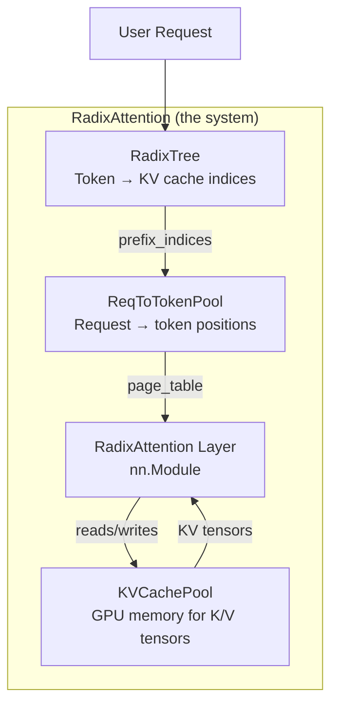
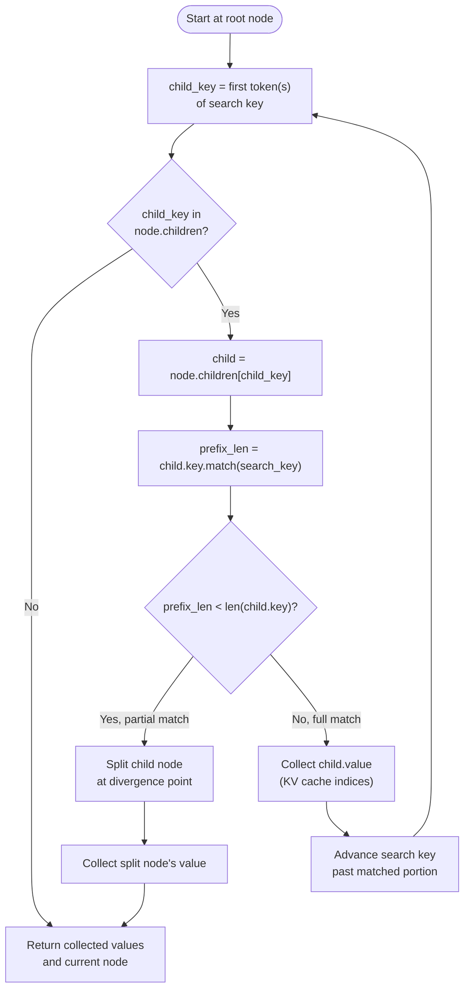
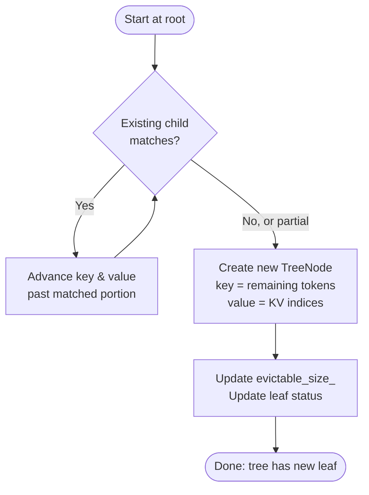
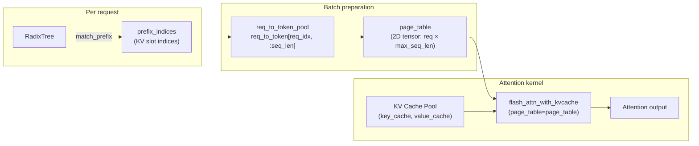
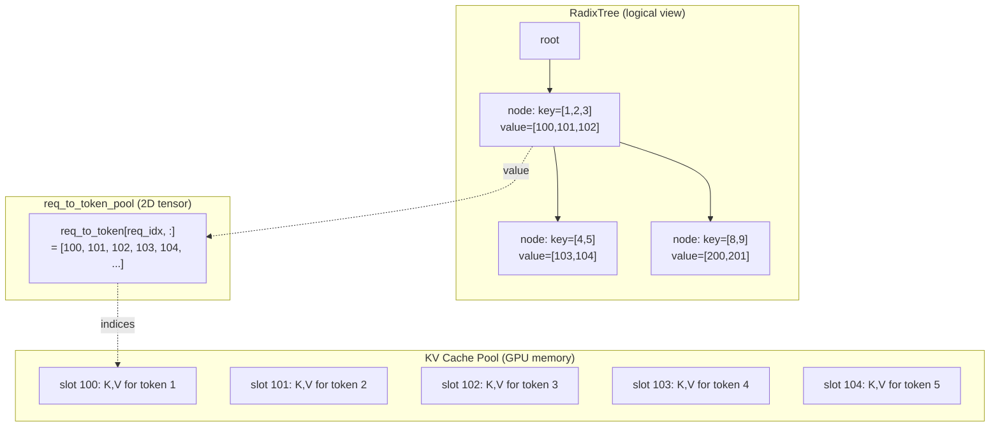
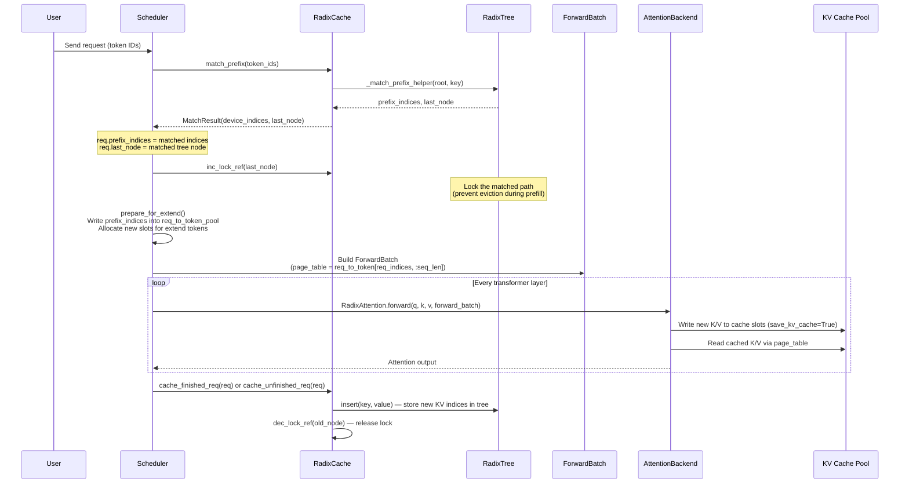
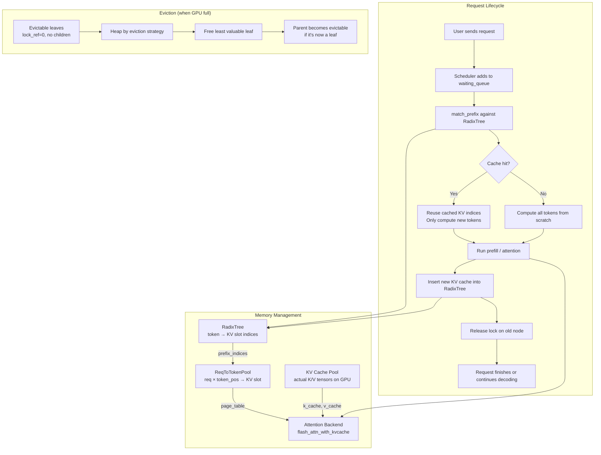

# What Is RadixAttention? — A Beginner's Guide

A code-level explanation of SGLang's RadixAttention, built from the actual codebase.
Every claim references exact file paths and line numbers.

---

## 1. The Problem: Wasted Computation

When an LLM processes a prompt, it computes **KV cache** — key and value tensors for every token. This is the most expensive part of inference. If two requests share the same prefix (e.g., the same system prompt), the second request **recomputes the exact same KV cache** as the first. That is pure waste.

```
Request A: "You are a helpful assistant. What is 2+2?"
Request B: "You are a helpful assistant. What is the weather?"

                ┌─────────────────────────────────┐
                │  "You are a helpful assistant."  │  ← same prefix, same KV cache
                └─────────────────────────────────┘
```

**RadixAttention** is SGLang's solution: a data structure + attention layer that automatically detects shared prefixes and reuses their KV cache, eliminating redundant computation.

---

## 2. RadixAttention = RadixTree + Attention Layer

The name "RadixAttention" refers to **two things** that work together:

1. **The RadixTree** (data structure) — stores KV cache indexed by token sequences, so shared prefixes are shared nodes
2. **The RadixAttention layer** (nn.Module) — the attention layer that reads from and writes to the KV cache pool, which is managed by the RadixTree



Let's look at each piece.

---

## 3. The RadixTree: Storing KV Cache by Token Sequence

### 3.1 The Core Idea

A **radix tree** is a compressed trie. Instead of one node per token, each node stores a **segment** of tokens. Shared prefixes become shared nodes.

```
Token sequences stored:
  [1, 2, 3, 4, 5]
  [1, 2, 3, 8, 9]
  [1, 2, 6, 7]

Tree structure:

root
 └── [1, 2]                    ← shared by all three
      ├── [3]                   ← shared by first two
      │    ├── [4, 5]
      │    └── [8, 9]
      └── [6, 7]
```

Each node stores:
- `key`: the token segment (e.g., `[1, 2]`)
- `value`: GPU memory indices pointing to the KV cache for those tokens

### 3.2 The TreeNode Class

**File**: `python/sglang/srt/mem_cache/radix_cache.py:217-243`

```python
class TreeNode:
    def __init__(self, id=None, priority=0):
        self.children = defaultdict(TreeNode)   # child nodes, keyed by first token(s)
        self.parent: TreeNode = None            # back-pointer for lock/evict walks
        self.key: RadixKey = None               # the token IDs this node represents
        self.value: Optional[torch.Tensor] = None  # KV cache indices for these tokens
        self.lock_ref = 0                       # how many in-flight requests use this node
        self.last_access_time = time.monotonic()  # for LRU eviction
        self.hit_count = 0                        # for LFU eviction
        self.priority = priority                  # for priority-aware eviction
```

**Key idea for beginners**:
- `key` = "what tokens does this node represent?" (e.g., tokens [1, 2])
- `value` = "where in GPU memory are the KV tensors for these tokens?" (e.g., indices [100, 101])
- `lock_ref` = "is a running request using this node?" (if > 0, cannot be evicted)
- `children` = "what token segments come after this one?"

### 3.3 The RadixKey — Token Sequence Wrapper

**File**: `python/sglang/srt/mem_cache/radix_cache.py:60-80`

```python
class RadixKey:
    __slots__ = ("token_ids", "extra_key", "is_bigram", "limit")

    def __init__(self, token_ids, extra_key=None, is_bigram=False, limit=None):
        self.token_ids = token_ids   # the actual token IDs (array("q"))
        self.extra_key = extra_key   # namespace tag (e.g., lora_id) to isolate cache
        self.is_bigram = is_bigram   # EAGLE speculative decoding uses bigram keys
        self.limit = limit           # virtual cap to avoid O(n) slicing
```

Two critical methods:

**`match(other, page_size)`** (line 162) — finds the longest shared prefix between two token sequences using exponential search + binary search:

```python
def match(self, other: RadixKey, page_size: int = 1) -> int:
    """Logical-unit prefix length shared with `other`."""
    t0, t1 = self.token_ids, other.token_ids
    n = min(len(t0), len(t1))

    # Exponential search: gallop in doubling windows, then binary-search
    matched_tokens = n
    lo = 0
    step = 1
    while lo < n:
        hi = lo + step if lo + step < n else n
        if t0[lo:hi] != t1[lo:hi]:        # divergence found in this window
            while hi - lo > 1:              # binary search within the window
                mid = (lo + hi) // 2
                if t0[lo:mid] == t1[lo:mid]:
                    lo = mid
                else:
                    hi = mid
            matched_tokens = lo
            break
        lo = hi
        step *= 2
    return matched_tokens
```

**`child_key(page_size)`** (line 198) — extracts the first token(s) as a hashable dictionary key:

```python
def child_key(self, page_size: int = 1):
    """Hashable dict-key for the first `page_size` tokens."""
    t = self.token_ids
    if page_size == 1:
        plain = t[0]
    else:
        plain = tuple(t[:page_size])
    return plain if self.extra_key is None else (self.extra_key, plain)
```

This is how we look up children: `node.children[key.child_key(page_size)]` gives us the child node whose segment starts with the same token(s).

### 3.4 The RadixCache — Tree Manager

**File**: `python/sglang/srt/mem_cache/radix_cache.py:280-309`

```python
class RadixCache(SessionRadixCacheMixin, KVCacheEventMixin, BasePrefixCache):
    def __init__(self, params: CacheInitParams):
        self.req_to_token_pool = params.req_to_token_pool
        self.token_to_kv_pool_allocator = params.token_to_kv_pool_allocator
        self.page_size = params.page_size
        self.eviction_strategy = get_eviction_strategy(params.eviction_policy)
        self.evictable_leaves = set()
        self.reset()
```

The `reset()` method (line 331) creates the **root node** — the starting point of the tree:

```python
def reset(self):
    self.root_node = TreeNode(priority=-sys.maxsize)
    self.root_node.key = RadixKey(token_ids=array("q"), extra_key=None)
    self.root_node.value = []
    self.root_node.lock_ref = 1  # root is permanently locked
    self.evictable_size_ = 0
    self.protected_size_ = 0
    self.evictable_leaves.clear()
```

The root has empty tokens and is permanently locked. All real data lives in the root's children.

---

## 4. The Two Core Operations: Match and Insert

### 4.1 Match — Finding the Longest Cached Prefix

When a new request arrives, we search the tree for the longest prefix that already has KV cache stored.

**File**: `python/sglang/srt/mem_cache/radix_cache.py:355-413`

```python
def match_prefix(self, params: MatchPrefixParams) -> MatchResult:
    key = params.key
    key = key.page_aligned(self.page_size)  # truncate to page boundary

    value, last_node = self._match_prefix_helper(self.root_node, key)
    if value:
        value = torch.cat(value)
    return MatchResult(
        device_indices=value,           # the KV cache indices for the matched prefix
        last_device_node=last_node,     # the tree node where the match ended
        last_host_node=last_node,
        best_match_node=last_node,
    )
```

**File**: `python/sglang/srt/mem_cache/radix_cache.py:650-674`

```python
def _match_prefix_helper(self, node: TreeNode, key: RadixKey):
    access_time = time.monotonic()
    node.last_access_time = access_time

    child_key = key.child_key(self.page_size)  # first token(s) as dict key

    value = []
    while len(key) > 0 and child_key in node.children.keys():
        child = node.children[child_key]
        child.last_access_time = access_time
        prefix_len = child.key.match(key, page_size=self.page_size)

        if prefix_len < len(child.key):
            # Partial match: key diverges in the middle of this child.
            # Split the child at the divergence point.
            new_node = self._split_node(child.key, child, prefix_len)
            value.append(new_node.value)
            node = new_node
            break
        else:
            # Full match: this child's entire key is a prefix of our search key.
            value.append(child.value)       # collect KV cache indices
            node = child
            key = key[prefix_len:]          # advance past the matched portion
            if len(key):
                child_key = key.child_key(self.page_size)

    return value, node
```

**Step-by-step for beginners**:



### 4.2 Split — Exposing Shared Prefixes

When a search key diverges in the middle of an existing node, we **split** the node to expose the shared prefix as a separate node.

**File**: `python/sglang/srt/mem_cache/radix_cache.py:676-696`

```python
def _split_node(self, key: RadixKey, child: TreeNode, split_len: int):
    # Before:  parent → child [tokens A B C D]
    # After:   parent → new_node [tokens A B] → child [tokens C D]

    new_node = TreeNode(priority=child.priority)
    new_node.children = {key[split_len:].child_key(self.page_size): child}
    new_node.parent = child.parent
    new_node.lock_ref = child.lock_ref
    new_node.key = child.key[:split_len]            # first half (shared prefix)
    new_node.value = child.value[:split_len].clone()
    child.parent = new_node
    child.key = child.key[split_len:]                # second half (remainder)
    child.value = child.value[split_len:].clone()
    new_node.parent.children[key.child_key(self.page_size)] = new_node
    return new_node
```

**Visual example**:

```
Before split:
  root → node{key=[1,2,3,4,5], value=[100,101,102,103,104]}

Search key [1,2,3,8,9] matches only [1,2,3] → split at position 3:

After split:
  root → node_C{key=[1,2,3], value=[100,101,102]}
           └── node_A{key=[4,5], value=[103,104]}

Now [8,9] can be added as another child of node_C.
```

### 4.3 Insert — Storing New KV Cache

After the model computes KV cache for new tokens, we insert them into the tree.

**File**: `python/sglang/srt/mem_cache/radix_cache.py:706-759`

```python
def _insert_helper(self, node, key, value, priority=0, chunked=False):
    node.last_access_time = time.monotonic()
    node.priority = max(node.priority, priority)

    if len(key) == 0:
        return 0, node  # nothing to insert

    child_key = key.child_key(self.page_size)
    total_prefix_length = 0

    # Phase 1: Walk down existing nodes that match (same as _match_prefix_helper)
    while len(key) > 0 and child_key in node.children.keys():
        node = node.children[child_key]
        prefix_len = node.key.match(key, page_size=self.page_size)
        total_prefix_length += prefix_len
        key = key[prefix_len:]       # advance past matched portion
        value = value[prefix_len:]   # advance value too

        if prefix_len < len(node.key):
            # Partial match: split the node
            new_node = self._split_node(node.key, node, prefix_len)
            node = new_node
        if len(key):
            child_key = key.child_key(self.page_size)

    # Phase 2: Create a new leaf node for the remaining unmatched tokens
    if len(key):
        new_node = TreeNode(priority=priority)
        new_node.parent = node
        new_node.key = key
        new_node.value = value.clone()
        node.children[child_key] = new_node
        self.evictable_size_ += len(key)
        self._update_leaf_status(node)
        self._update_leaf_status(new_node)
        node = new_node

    return total_prefix_length, node
```

**Phase 1** is identical to `_match_prefix_helper` — we walk existing nodes, splitting if needed. **Phase 2** creates a brand new leaf for the unmatched tail.



---

## 5. The RadixAttention Layer — Connecting Tree to Attention

### 5.1 The RadixAttention Class

The RadixAttention layer is an `nn.Module` that every transformer layer uses. It does NOT contain the attention math itself — it **dispatches** to a backend (FlashAttention, FlashInfer, etc.) that reads from and writes to the KV cache pool.

**File**: `python/sglang/srt/layers/radix_attention.py:91-253`

```python
class RadixAttention(nn.Module):
    def __init__(self, num_heads, head_dim, scaling, num_kv_heads, layer_id, ...):
        super().__init__()
        self.tp_q_head_num = num_heads
        self.tp_k_head_num = num_kv_heads
        self.tp_v_head_num = num_kv_heads
        self.head_dim = head_dim
        self.layer_id = layer_id        # which transformer layer this is
        self.scaling = scaling           # 1/sqrt(head_dim)
        # ...

    def forward(self, q, k, v, forward_batch, save_kv_cache=True, **kwargs):
        # Dispatch to the attention backend (FlashAttention, FlashInfer, etc.)
        return get_attn_backend().forward(
            q, k, v, self, forward_batch, save_kv_cache, **kwargs
        )
```

**Key insight**: RadixAttention is a **thin wrapper**. The actual attention computation happens in the backend. RadixAttention's job is to:
1. Pass the right metadata (layer_id, head dimensions, scaling) to the backend
2. The backend reads the `page_table` from `forward_batch` to know where KV cache is stored

### 5.2 The Attention Backend — Where KV Cache Is Actually Used

**File**: `python/sglang/srt/layers/attention/base_attn_backend.py:167-210`

```python
class AttentionBackend(ABC):
    @debug_kernel_api
    def forward(self, q, k, v, layer, forward_batch, save_kv_cache=True, **kwargs):
        if forward_batch.forward_mode.is_decode():
            return self.forward_decode(q, k, v, layer, forward_batch, ...)
        else:
            return self.forward_extend(q, k, v, layer, forward_batch, ...)
```

The backend has two paths:
- **forward_extend** (prefill): compute attention for a chunk of new tokens, writing their K/V to the KV cache pool
- **forward_decode** (decode): compute attention for one new token, reading all previous K/V from the KV cache pool

### 5.3 How the Backend Reads KV Cache — The Page Table

The attention backend does NOT directly interact with the RadixTree. Instead, it reads a **page table** from the `forward_batch`, which is built from the `req_to_token_pool`.

**File**: `python/sglang/srt/layers/attention/flashattention_backend.py:625-948`

```python
def init_forward_metadata(self, forward_batch: ForwardBatch):
    metadata = FlashAttentionMetadata()
    # ...

    # The page_table is a slice of req_to_token_pool
    metadata.page_table = self.req_to_token_pool.req_to_token[
        forward_batch.req_pool_indices, : metadata.max_seq_len_k
    ]
```

The `page_table` is literally a view into `req_to_token_pool.req_to_token`, which is a 2D tensor mapping `(request_index, token_position) → KV_cache_slot`.

Then in `forward_extend` (line 1419):

```python
result = flash_attn_with_kvcache(
    q=q,
    k_cache=key_cache,        # the actual K/V tensors in GPU memory
    v_cache=value_cache,
    page_table=page_table,    # which KV slots to read for each request
    cache_seqlens=cache_seqlens,  # how many tokens each request has
    # ...
)
```

The FlashAttention kernel uses `page_table` to look up where each token's K/V is stored, then computes attention.



---

## 6. The Memory Pools — Where KV Cache Actually Lives

### 6.1 ReqToTokenPool — Request → Token Position Mapping

**File**: `python/sglang/srt/mem_cache/memory_pool.py:244-274`

```python
class ReqToTokenPool:
    """A memory pool that maps a request to its token locations."""

    def __init__(self, size, max_context_len, device, enable_memory_saver):
        self.req_to_token = torch.zeros(
            (size + 1, max_context_len), dtype=torch.int32, device=device
        )
        self.free_slots = list(range(1, size + 1))

    def write(self, indices, values):
        self.req_to_token[indices] = values
```

This is a 2D tensor: `req_to_token[request_index, token_position] = kv_cache_slot`.

When a request is admitted, the scheduler writes the prefix indices (from the RadixTree) into this pool:

**File**: `python/sglang/srt/mem_cache/allocation.py:86-101`

```python
for i in range(req_pool_indices_cpu.shape[0]):
    req_idx = req_pool_indices_cpu[i].item()
    prefix_len = prefix_lens_cpu[i].item()
    seq_len = seq_lens_cpu[i].item()
    extend_len = extend_lens_cpu[i].item()

    # Write the cached prefix indices (from RadixTree) into the pool
    req_to_token_pool.write(
        (req_idx, slice(0, prefix_len)),
        prefix_tensors[i],       # = req.prefix_indices (from match_prefix)
    )
    # Write the new token slots (newly allocated) for the extend portion
    req_to_token_pool.write(
        (req_idx, slice(prefix_len, seq_len)),
        out_cache_loc[pt : pt + extend_len],
    )
```

### 6.2 The Full Memory Layout



The RadixTree's `value` (e.g., `[100, 101, 102]`) are indices into the KV Cache Pool. The `req_to_token_pool` maps each request's token positions to these slots. The attention backend reads `req_to_token_pool` as a `page_table` to find where each token's K/V is.

---

## 7. The Complete Flow: From Request to Attention

### 7.1 Step-by-Step



### 7.2 Detailed Code Flow

**Step 1: Request arrives**

**File**: `python/sglang/srt/managers/scheduler.py:2391-2398`

```python
def _add_request_to_queue(self, req, is_retracted=False):
    self._prefetch_kvcache(req)
    self.waiting_queue.append(req)
```

**Step 2: Prefix match against the tree**

**File**: `python/sglang/srt/managers/schedule_batch.py:1241-1251`

```python
match_result = tree_cache.match_prefix(
    MatchPrefixParams(
        key=RadixKey(
            token_ids=token_ids_to_match,
            extra_key=self.extra_key,
            limit=key_limit,
        ),
        req=self,
    )
)
self.prefix_indices = match_result.device_indices  # KV cache indices for matched prefix
self.last_node = match_result.last_device_node      # tree node where match ended
```

**Step 3: Lock the matched path (prevent eviction)**

The scheduler calls `inc_lock_ref(req.last_node)` which walks up from the matched node to the root, incrementing `lock_ref` on every ancestor:

**File**: `python/sglang/srt/mem_cache/radix_cache.py:594-607`

```python
def inc_lock_ref(self, node):
    while node != self.root_node:
        if node.lock_ref == 0:
            self.evictable_size_ -= len(node.key)
            self.protected_size_ += len(node.key)
        node.lock_ref += 1
        node = node.parent  # walk up to root
```

**Step 4: Prepare the batch — write prefix indices into req_to_token_pool**

**File**: `python/sglang/srt/managers/schedule_batch.py:2148-2162`

```python
def prepare_for_extend(self):
    input_ids = [r.get_fill_ids()[len(r.prefix_indices):] for r in reqs]
    prefix_lens = [len(r.prefix_indices) for r in reqs]
    extend_lens = [r.extend_range.length for r in reqs]
    # ...
```

**File**: `python/sglang/srt/mem_cache/allocation.py:86-101`

```python
# Write cached prefix indices (from RadixTree) into the pool
req_to_token_pool.write(
    (req_idx, slice(0, prefix_len)),
    prefix_tensors[i],       # = req.prefix_indices
)
# Write new token slots for the extend portion
req_to_token_pool.write(
    (req_idx, slice(prefix_len, seq_len)),
    out_cache_loc[pt : pt + extend_len],
)
```

**Step 5: Build page_table for the attention backend**

**File**: `python/sglang/srt/layers/attention/flashattention_backend.py:946-948`

```python
metadata.page_table = self.req_to_token_pool.req_to_token[
    forward_batch.req_pool_indices, : metadata.max_seq_len_k
]
```

**Step 6: Run attention — read cached K/V, write new K/V**

**File**: `python/sglang/srt/layers/attention/flashattention_backend.py:1126-1184`

```python
def forward_extend(self, q, k, v, layer, forward_batch, save_kv_cache=True):
    if save_kv_cache:
        cache_loc = forward_batch.out_cache_loc
        # Write new K/V to the KV cache pool
        self.token_to_kv_pool.set_kv_buffer(
            layer, KVWriteLoc(cache_loc, ...), k, v, k_scale, v_scale
        )

    # Read cached K/V via page_table and compute attention
    result = flash_attn_with_kvcache(
        q=q,
        k_cache=key_cache,       # the actual K/V tensors
        v_cache=value_cache,
        page_table=page_table,   # which slots to read for each request
        cache_seqlens=cache_seqlens,
        # ...
    )
```

**Step 7: After prefill — insert new KV cache into the tree**

**File**: `python/sglang/srt/mem_cache/radix_cache.py:437-484`

```python
def cache_finished_req(self, req, is_insert=True, *, kv_len_to_handle):
    token_ids = (req.origin_input_ids + req.output_ids)[:kv_len_to_handle]
    kv_indices = self.req_to_token_pool.req_to_token[req.req_pool_idx, :len(token_ids)]

    radix_key = RadixKey(token_ids, req.extra_key)
    values = kv_indices[:len(radix_key)].to(dtype=torch.int64, copy=True)

    if is_insert:
        result = self.insert(InsertParams(key=radix_key, value=values))
        # Free duplicate indices that were already in the tree
        self.token_to_kv_pool_allocator.free(
            kv_indices[req.cache_protected_len : result.prefix_len]
        )

    # Release the lock from the old match point
    if req.last_node is not None:
        self.dec_lock_ref(req.last_node)
```

---

## 8. Eviction: Freeing Memory When Full

### 8.1 When Does Eviction Happen?

When the GPU runs out of KV cache memory, the scheduler calls `evict_from_tree_cache`:

**File**: `python/sglang/srt/mem_cache/common.py:105-128`

```python
def evict_from_tree_cache(tree_cache, num_tokens):
    allocator = tree_cache.token_to_kv_pool_allocator
    if allocator.available_size() < num_tokens:
        tree_cache.evict(EvictParams(num_tokens=num_tokens))
```

### 8.2 How Eviction Works

**File**: `python/sglang/srt/mem_cache/radix_cache.py:565-592`

```python
def evict(self, params):
    num_tokens = params.num_tokens
    leaves = list(self.evictable_leaves)  # only leaf nodes can be evicted
    eviction_heap = [
        (self.eviction_strategy.get_priority(node), node) for node in leaves
    ]
    heapq.heapify(eviction_heap)

    num_evicted = 0
    while num_evicted < num_tokens and len(eviction_heap):
        _priority, x = heapq.heappop(eviction_heap)

        self.token_to_kv_pool_allocator.free(x.value)  # free GPU memory
        num_evicted += len(x.value)
        self._delete_leaf(x)  # remove from tree

        # If parent is now a leaf and unlocked, it becomes evictable
        if len(x.parent.children) == 0 and x.parent.lock_ref == 0:
            heapq.heappush(eviction_heap, (priority, x.parent))
```

**Key rules**:
- Only **leaf nodes** (no children) can be evicted
- Only **unlocked nodes** (`lock_ref == 0`) can be evicted
- The eviction strategy determines priority (LRU by default = oldest access first)

### 8.3 Eviction Strategies

**File**: `python/sglang/srt/mem_cache/evict_policy.py`

| Policy | get_priority returns | Meaning |
|--------|---------------------|---------|
| LRU (default) | `node.last_access_time` | Oldest access evicted first |
| LFU | `(node.hit_count, node.last_access_time)` | Fewest hits evicted first |
| FIFO | `node.creation_time` | Oldest creation evicted first |
| MRU | `-node.last_access_time` | Most recent access evicted first |
| Priority | `(node.priority, node.last_access_time)` | Lower priority evicted first |

---

## 9. Visual Example: Complete Tree Evolution

### After Request 1: tokens = [1, 2, 3, 4, 5]

```
root (key=[], lock_ref=1)
 └── node_A (key=[1,2,3,4,5], value=[100,101,102,103,104], lock_ref=0)
```

### After Request 2: tokens = [1, 2, 3, 8, 9]

Match phase splits node_A at position 3 (shared prefix [1,2,3]):

```
root (key=[], lock_ref=1)
 └── node_C (key=[1,2,3], value=[100,101,102], lock_ref=0)
      ├── node_A (key=[4,5], value=[103,104], lock_ref=0)
      └── node_B (key=[8,9], value=[200,201], lock_ref=0)  ← NEW
```

### After Request 3: tokens = [1, 2, 3, 4, 5, 10]

Match walks root → node_C (full match) → node_A (full match). Insert adds new child:

```
root (key=[], lock_ref=1)
 └── node_C (key=[1,2,3], value=[100,101,102], lock_ref=0)
      ├── node_A (key=[4,5], value=[103,104], lock_ref=0)
      │    └── node_D (key=[10], value=[300], lock_ref=0)  ← NEW
      └── node_B (key=[8,9], value=[200,201], lock_ref=0)
```

### After Request 4: tokens = [1, 2, 6, 7]

Match: root → node_C. `node_C.key = [1,2,3]`, `match([1,2,6,7])` returns 2. Split at position 2:

```
root (key=[], lock_ref=1)
 └── node_E (key=[1,2], value=[100,101], lock_ref=0)  ← SPLIT from node_C
      ├── node_C (key=[3], value=[102], lock_ref=0)   ← REMAINDER
      │    ├── node_A (key=[4,5], value=[103,104])
      │    │    └── node_D (key=[10], value=[300])
      │    └── node_B (key=[8,9], value=[200,201])
      └── node_F (key=[6,7], value=[400,401], lock_ref=0)  ← NEW
```

### With Locking (during prefill of Request 2)

When Request 2 is being prefilled, its matched path is locked:

```
root (key=[], lock_ref=1)                    ← always locked
 └── node_C (key=[1,2,3], lock_ref=1)        ← LOCKED (Request 2 is using this)
      ├── node_A (key=[4,5], lock_ref=0)
      └── node_B (key=[8,9], lock_ref=0)
```

`node_C` cannot be evicted while Request 2 is running. After the request finishes, `dec_lock_ref` is called and `node_C.lock_ref` returns to 0, making it evictable again.

---

## 10. The Big Picture: How Everything Connects



---

## 11. Key File Reference

| File | What's in it |
|------|-------------|
| `python/sglang/srt/layers/radix_attention.py` | RadixAttention nn.Module — the attention layer wrapper |
| `python/sglang/srt/layers/attention/base_attn_backend.py` | AttentionBackend ABC — dispatches to forward_extend / forward_decode |
| `python/sglang/srt/layers/attention/flashattention_backend.py` | FlashAttentionBackend — the actual attention kernel calls |
| `python/sglang/srt/mem_cache/radix_cache.py` | RadixCache, TreeNode, RadixKey — the RadixTree data structure |
| `python/sglang/srt/mem_cache/base_prefix_cache.py` | BasePrefixCache ABC, MatchPrefixParams, InsertParams, MatchResult |
| `python/sglang/srt/mem_cache/evict_policy.py` | Eviction strategies (LRU, LFU, FIFO, MRU, etc.) |
| `python/sglang/srt/mem_cache/memory_pool.py` | ReqToTokenPool — request → token position → KV slot mapping |
| `python/sglang/srt/mem_cache/allocation.py` | write_cache_indices — writes prefix_indices into req_to_token_pool |
| `python/sglang/srt/mem_cache/common.py` | release_kv_cache, maybe_cache_unfinished_req — scheduler helpers |
| `python/sglang/srt/managers/schedule_batch.py:1241` | Req.init_next_round_input — where match_prefix is called |
| `python/sglang/srt/managers/schedule_batch.py:2148` | ScheduleBatch.prepare_for_extend — builds the forward batch |
| `python/sglang/srt/managers/scheduler.py:2391` | _add_request_to_queue — request entry point |
| `python/sglang/srt/managers/scheduler_components/batch_result_processor.py:238` | Post-prefill: cache_finished_req vs cache_unfinished_req |

---

## 12. Summary

**RadixAttention** is SGLang's system for automatic KV cache reuse. It consists of three layers:

1. **RadixTree** (`radix_cache.py`) — A radix tree (compressed trie) that stores KV cache indices indexed by token sequences. Shared prefixes are shared nodes. Two operations: `match_prefix` (find cached prefix) and `insert` (store new KV cache).

2. **RadixAttention layer** (`radix_attention.py`) — A thin `nn.Module` wrapper that every transformer layer uses. It dispatches to an attention backend (FlashAttention, FlashInfer, etc.) which reads the `page_table` to find where KV cache is stored.

3. **Memory pools** (`memory_pool.py`) — `ReqToTokenPool` maps each request's token positions to KV cache slots. The attention backend reads this as a `page_table`. The RadixTree's `value` (KV slot indices) are written into this pool during batch preparation.

The flow is:
1. Request arrives → `match_prefix` finds cached prefix in the RadixTree
2. Matched KV indices are written into `req_to_token_pool`
3. `req_to_token_pool` becomes the `page_table` for the attention backend
4. Attention backend reads cached K/V via `page_table`, writes new K/V to the KV cache pool
5. After prefill, new KV indices are inserted into the RadixTree
6. When GPU is full, least valuable leaf nodes are evicted (LRU by default)

The locking mechanism (`inc_lock_ref` / `dec_lock_ref`) ensures that nodes being used by in-flight requests are never evicted. The eviction mechanism (heap-based, strategy-driven) frees the least valuable leaf nodes when GPU memory is needed.
