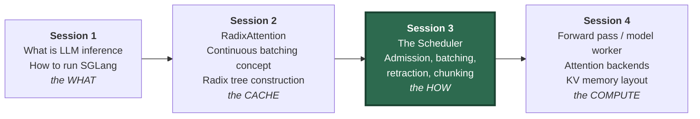
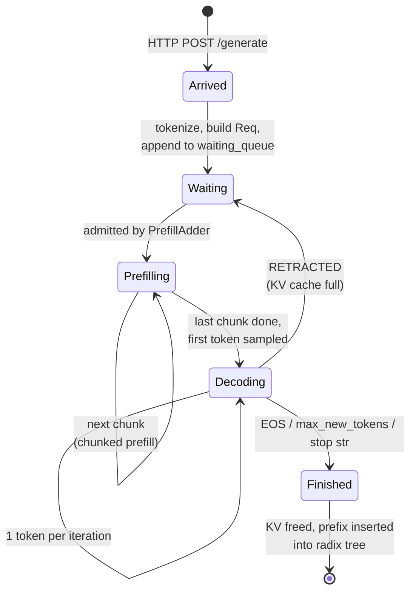
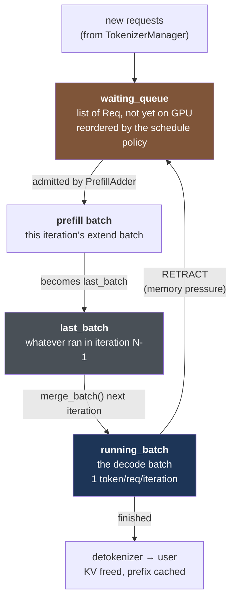
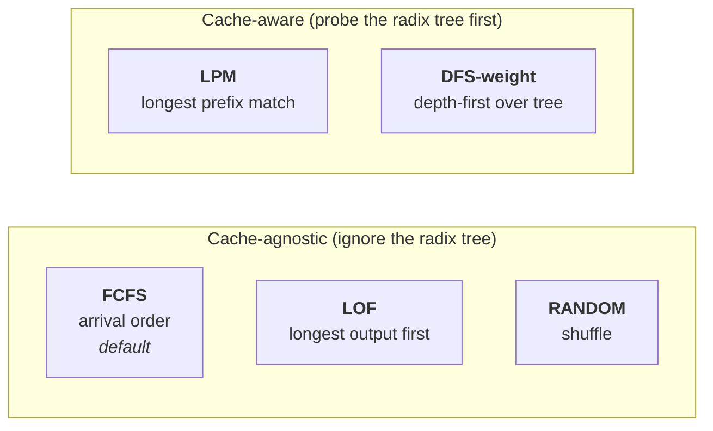
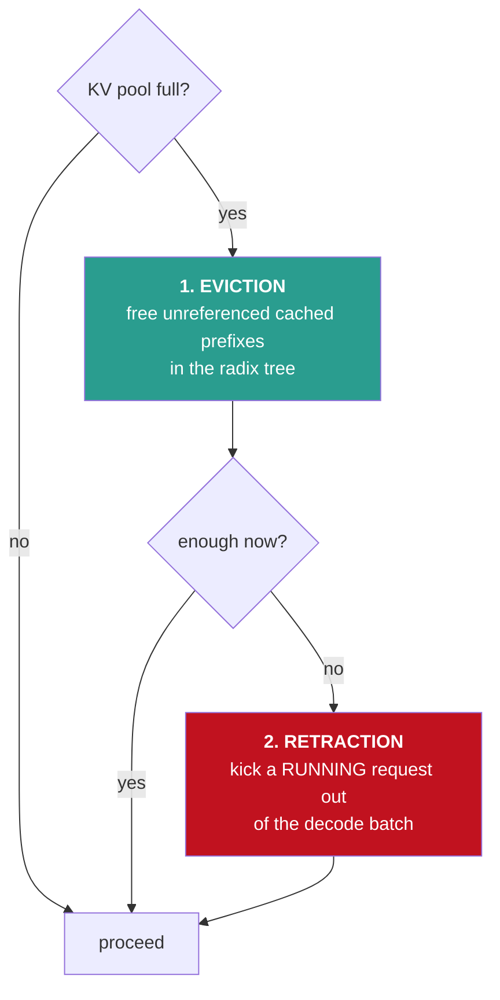
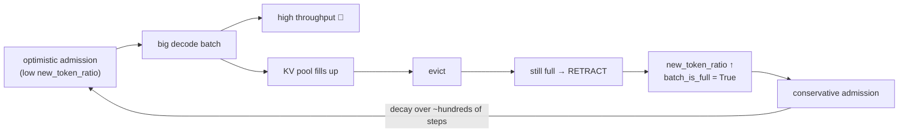
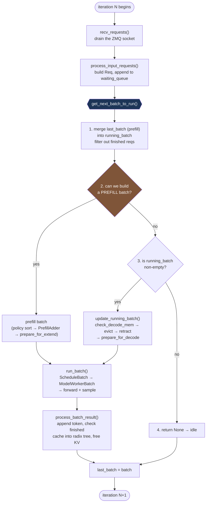

# Session 3 — Part 1: The Scheduler Engine (Theory)

> **How continuous batching actually runs**
> Seminar material, ~60–70 minutes. Diagrams are Mermaid + ASCII, so this file
> renders on GitHub, GitLab, Obsidian, VS Code, Typora, and most static site generators.

---

## Table of contents & timing

| # | Section | Time | Cumulative |
|---|---------|------|-----------|
| 0 | Where we are: recap & roadmap | 4 min | 0:04 |
| 1 | The scheduling problem in LLM serving | 14 min | 0:18 |
| 2 | Scheduling policies | 10 min | 0:28 |
| 3 | Admission control | 11 min | 0:39 |
| 4 | Memory pressure: eviction vs retraction | 11 min | 0:50 |
| 5 | Chunked prefill | 9 min | 0:59 |
| 6 | Overlap scheduling (CPU/GPU pipeline) | 8 min | 1:07 |
| 7 | Putting it together: one iteration, end to end | 4 min | 1:11 |
| 8 | Discussion questions & self-check | 5 min | 1:16 |

**Learning objectives.** By the end of Part 1 you should be able to:

1. Explain why prefill and decode have opposite hardware bottlenecks, and why that
   asymmetry is the root cause of every design decision in the scheduler.
2. Name the three queues the scheduler maintains and describe what moves between them.
3. Predict the admission decision for a set of requests given a token budget.
4. Distinguish eviction from retraction, and say why one is cheap and one is expensive.
5. Explain what chunked prefill buys you and what it costs.
6. Read a `Prefill batch. ... / Decode batch. ...` log line and say what the server is doing.

---

## 0. Where we are: recap & roadmap (4 min)



Session 2 answered: *"given a set of sequences, how do we avoid recomputing shared prefixes?"*
Session 3 answers the question that comes logically **before** it:

> *"Which requests are even in the batch this iteration, and who decided that?"*

The one-sentence summary of the whole session:

> **The SGLang server is a single `while True:` loop. Every iteration it asks one question —
> "what should the GPU run next?" — and the answer is one batch. Everything else is bookkeeping.**

---

## 1. The scheduling problem in LLM serving (14 min)

### 1.1 The lifecycle of one request



Two things to notice already, because they drive the rest of the session:

* **`Waiting → Prefilling` is a decision.** Something must *choose*. That something is
  admission control (§3).
* **`Decoding → Waiting` is a real edge.** A request that is already running on the GPU can be
  kicked back out. That is retraction (§4), and it is the part people are most surprised by.

### 1.2 Prefill and decode are different workloads

This is the single most important slide of the session.

**Prefill** processes all *P* prompt tokens at once. The attention/MLP matmuls are
matrix–matrix (GEMM): every weight you load from HBM gets reused across *P* tokens.

**Decode** processes exactly *1* new token per sequence. The matmuls are matrix–vector
(GEMV): you load the entire model weights from HBM to produce a single token per sequence.

Arithmetic intensity — FLOPs performed per byte moved — tells the story:

```
                 arithmetic intensity (FLOP/byte)
                 ^
     compute     |                       ####  PREFILL  (P = 2048 tokens)
     bound       |                     ##      -> hundreds of FLOP/byte
                 |                   ##        -> GPU is at 60-80% of peak FLOPS
   -- ridge ---- | ---------------- ## -------------------------------------
     point       |               ##
     memory      |   #  DECODE (batch size 1)
     bound       |   #  -> ~2 FLOP/byte
                 |   #  -> GPU is at ~1-3% of peak FLOPS, HBM bandwidth saturated
                 +--------------------------------------------------------> 
```

A concrete feel for the numbers on a single H100 (80 GB, ~3.35 TB/s HBM, ~990 TFLOPS BF16)
serving a 7B model in BF16 (~14 GB of weights):

| | Prefill, 2048 tokens | Decode, batch size 1 | Decode, batch size 64 |
|---|---|---|---|
| Bytes of weights read per step | ~14 GB | ~14 GB | ~14 GB |
| Useful tokens produced | 2048 | 1 | 64 |
| Bottleneck | FLOPS | HBM bandwidth | HBM bandwidth |
| Rough GPU utilization | high | terrible | decent |

**The two consequences that define the scheduler:**

1. **Decode must be batched to be efficient.** The weight read is amortized across the batch.
   Going from batch 1 → 64 costs almost nothing extra in time but produces 64× the tokens.
   *Therefore: keep the running batch as large as memory allows.*
2. **Prefill saturates the GPU by itself.** One 4K-token prefill already keeps the SMs busy.
   *Therefore: don't waste an iteration doing a tiny decode when a prefill is pending.*

> ⚠️ Point 2 is exactly why **prefill has priority over decode** in `get_next_batch_to_run`.
> The scheduler always asks "can I build a prefill batch?" first, and only falls through to
> decode when the answer is no.

### 1.3 The metrics we are trading off

```
Request timeline:

  arrival        admitted        first token                       last token
     |               |                |                                 |
     v               v                v                                 v
     |---queueing----|----prefill-----|---decode---decode---...---decode-|
     |<------------ TTFT ------------>|<-ITL->|
     |<--------------------------- E2E latency ------------------------>|
```

| Metric | Definition | Who cares |
|---|---|---|
| **TTFT** (time to first token) | arrival → first token emitted | Interactive chat; a user staring at a blank box |
| **ITL / TPOT** (inter-token latency) | steady-state gap between output tokens | Perceived "typing speed"; must beat reading speed (~20–30 tok/s feels fine) |
| **Throughput** | total output tokens/s across all requests | Whoever pays the GPU bill |
| **Goodput** | throughput *counting only requests that met their SLO* | The honest metric |

**The fundamental tension:**

```
   larger batch  --->  higher throughput, higher ITL, more KV memory, more retraction risk
   smaller batch --->  lower ITL, wasted GPU, lower throughput
   prefill first --->  better GPU utilization + throughput, WORSE ITL for decoders
   decode first  --->  smooth ITL, but the queue backs up and TTFT explodes
```

There is no setting that wins on every axis. The scheduler's job is to pick a point on this
surface, and the knobs we study today (`--schedule-policy`, `--chunked-prefill-size`,
`--schedule-conservativeness`, `--max-running-requests`) are how you move along it.

### 1.4 Static batching vs continuous batching (quick recap of Session 2)

**Static batching** — form a batch, run it to completion, then form the next one:

```
req A |=P=|--d--d--d--d--d--d--d--END
req B |=P=|--d--d--END......................    <- padding / idle slot
req C |=P=|--d--d--d--d--END..................   <- padding / idle slot
req D ..................................|=P=|--d--...   <- waits for the whole batch
      ^                                  ^
      batch 1 starts                     batch 2 can finally start
```

**Continuous batching (iteration-level scheduling)** — the batch membership is recomputed
*every single forward pass*:

```
iteration:   1    2    3    4    5    6    7    8    9
req A       P    d    d    d    d    END
req B       P    d    d    END
req C            P    d    d    d    d    d    END
req D                      P    d    d    d    d    d
req E                                     P    d    d
             ^         ^              ^
             |         B finishes,    D admitted into the very next
             |         its slot is    iteration after C's prefill
             |         freed mid-flight
```

Continuous batching is *not* a data structure — it is a consequence of re-running the
scheduling decision at every step. Everything in Part 2 is the machinery that makes that
per-iteration decision fast enough to be worth doing.

### 1.5 The three queues



| Queue | Type | Meaning |
|---|---|---|
| `waiting_queue` | `list[Req]` | Admitted to the server, not yet on the GPU. No KV cache allocated. |
| `running_batch` | `ScheduleBatch` | The decode batch. These requests own KV cache slots. |
| `last_batch` | `ScheduleBatch \| None` | What ran in the previous iteration — needed because a prefill batch only becomes part of `running_batch` *after* its results are processed. |

The subtlety worth stating out loud in the seminar: **`last_batch` exists because the loop is
pipelined in time.** When you launch a prefill batch you don't yet know which of those requests
finished immediately (e.g. hit EOS on token 1). So you can't merge it into the decode batch
until the next iteration, after `process_batch_result` has run. `last_batch` is the one-iteration
memory that makes that possible.

---

## 2. Scheduling policies (10 min)

The policy controls **the order of `waiting_queue`** — nothing else. It does not decide *how
many* requests are admitted (that is §3); it decides *who gets considered first*.



### 2.1 The policies

**FCFS — First Come First Serve (default).**
Queue order = arrival order. Fair, predictable, no starvation, zero computation.
Worst-case behaviour: a 100K-token prompt at the head of the queue blocks everyone behind it
(mitigated by chunked prefill, §5).

**LPM — Longest Prefix Match (cache-aware).**
Before ordering, probe the radix tree for every waiting request and sort by *descending matched
prefix length*. The request that can reuse the most already-computed KV goes first.

*Why it works:* prefill cost is proportional to the number of tokens you actually have to
compute (`extend_input_len = len(fill_ids) - len(prefix_indices)`). Serving the biggest cache
hit first means the cheapest requests clear the queue fastest, and it keeps the hot prefix
"locked" and un-evictable while a burst of siblings drains.

*When to use:* many requests sharing a long system prompt, few-shot template, or a
multi-turn conversation replayed from history. RAG-style workloads with a shared instruction
block. Agent loops that re-send a growing conversation.

*The failure mode:* **starvation.** Under sustained load, a stream of requests with a long
shared prefix will keep jumping ahead of the poor request whose prompt matches nothing. A
cold-prefix request can sit in the queue indefinitely.

**LOF — Longest Output First.**
Sort by descending `max_new_tokens`. Rationale: long generators should start early because
they define the makespan; starting a 2000-token generation last means the batch tail is long
and the GPU runs at low occupancy at the end. Useful for offline/batch jobs where you control
`max_new_tokens` and care about total completion time, not per-request latency.

**RANDOM.**
Shuffle. Mostly a research/ablation baseline — it gives you a fairness floor without the
computation of a real fair scheduler.

**DFS-weight.**
Order the queue by a depth-first traversal of the radix tree, weighting nodes by how many
waiting requests sit under them. Intuition: LPM is greedy per request; DFS-weight tries to
finish an entire subtree of the cache before moving on, so a hot branch is touched once and
released, instead of being re-locked repeatedly.

**Priority / routing-key style extensions.**
Recent SGLang versions add explicit priority scheduling (a per-request `priority` field, with
optional preemption of lower-priority running requests) and routing keys used by the router in
multi-replica deployments to send requests with the same prefix to the same worker. Worth a
mention as "the same idea, one level up: the router does prefix-aware load balancing across
GPUs, the scheduler does it within one GPU."

### 2.2 A concrete ordering example

Radix tree currently caches the 1000-token system prompt `SYS` (from earlier traffic).

| Req | Prompt | Matched prefix | Tokens to compute | `max_new_tokens` | Arrival |
|---|---|---|---|---|---|
| A | cold, 300 tok | 0 | 300 | 512 | t=0 |
| B | `SYS` + 40 tok | 1000 | 40 | 64 | t=1 |
| C | `SYS` + 90 tok | 1000 | 90 | 64 | t=2 |
| D | cold, 2000 tok | 0 | 2000 | 2000 | t=3 |

```
FCFS  order:  A(300)  B(40)   C(90)   D(2000)      -> 2430 tokens of compute
LPM   order:  B(40)   C(90)   A(300)  D(2000)      -> 2430 tokens, but the two
                                                       cheap cache hits finish first
LOF   order:  D(2000) A(300)  B(64)   C(64)        -> longest generator starts first
```

Discussion prompt for the room: *total* compute is identical under FCFS and LPM. So where does
the LPM win actually come from? (Answers: earlier completion of cheap requests → shorter mean
queueing delay; the hot node is locked once instead of being evicted and rebuilt between A and
D; and B/C become decode-batch members sooner, which raises decode batch size and therefore
throughput.)

### 2.3 One more wrinkle: in-batch prefix caching

There is a second-order effect specific to cache-aware policies. Suppose 50 identical requests
arrive at once with a prefix that is **not yet in the tree**. LPM sees prefix match = 0 for all
50, admits all 50, and every one of them prefills the same tokens independently. The cache hit
happens *after* the batch, which is exactly one iteration too late.

SGLang handles this by detecting requests in the same admission round that share a not-yet-cached
prefix and *temporarily deprioritizing* the duplicates, so the first one populates the tree and
the rest hit it on the following iteration. We'll see the thresholds in Part 2.

There is also a queue-length guard: computing prefix matches for every waiting request is O(queue
length) tree probes, so above a large queue size the policy can fall back to plain FCFS rather
than pay the sorting cost every iteration.

---

## 3. Admission control (11 min)

### 3.1 Why you can't just admit everything

GPU memory is a fixed pie:

```
+--------------------------------------------------------------+
|  model weights (fixed)   |  activations  |     KV CACHE POOL  |
|  e.g. 14 GB for 7B bf16  |   (transient) |   everything left  |
+--------------------------------------------------------------+
                                            ^
                                            this is the resource
                                            the scheduler manages
```

The KV pool is expressed in **tokens**, not requests. One token of KV for a 7B model
(32 layers, 32 heads → 8 KV heads with GQA, head_dim 128, BF16) is:

```
2 (K and V) x layers x kv_heads x head_dim x 2 bytes
= 2 x 32 x 8 x 128 x 2  =  131,072 bytes  =  128 KB per token
```

So an 80 GB H100 with ~60 GB free after weights and activations holds roughly
`60 GB / 128 KB ≈ 480,000 tokens`. That sounds like a lot until you notice a single
32K-context request with 2K of output consumes ~34K of it — about 14 concurrent long-context
requests and you are out.

**The hard part: a request's memory footprint grows as it decodes.** At admission time you know
the input length exactly; you do *not* know the output length. You only know the ceiling,
`max_new_tokens`, which is usually a wild over-estimate (most requests stop at EOS long before it).

```
 tokens of KV held
   ^
   |                                   .-- max_new_tokens ceiling (rarely reached)
   |                        ..........´
   |                 ......´
   |          ......´                  <- actual, ends at EOS
   |    _____´
   |   |
   +---+-------------------------------------> time
       admission (input_len known)
```

Admit purely on `input_len` → you over-admit and hit the wall mid-decode (retraction storms).
Admit on `input_len + max_new_tokens` → you are absurdly conservative and run tiny batches.

### 3.2 The token budget

Admission maintains several running budgets simultaneously. A request is admitted only if it
passes all of them.

| Budget | Meaning | Typical source |
|---|---|---|
| `rem_total_tokens` | KV pool space left, *after* reserving projected decode growth for everything already running | free pool + evictable tree − reserved |
| `rem_input_tokens` | Max prompt tokens allowed in a single prefill batch | `--max-prefill-tokens` |
| `rem_chunk_tokens` | Max tokens per chunk when chunked prefill is on | `--chunked-prefill-size` |
| running-request count | Hard cap on concurrent sequences | `--max-running-requests` |

The interesting one is the first, because of the reservation term:

```
rem_total_tokens
      = free_KV_tokens
      + evictable_tokens_in_radix_tree          (can be reclaimed if needed)
      - SUM over running requests of
            (remaining_max_new_tokens x new_token_ratio)
      - tokens already committed to this prefill batch
```

### 3.3 `new_token_ratio`: the adaptive pessimism dial

`new_token_ratio ∈ (0, 1]` is the fraction of each running request's *remaining*
`max_new_tokens` that the scheduler pretends it will actually use.

* `new_token_ratio = 1.0` → "assume every request generates to its full ceiling." Maximally safe,
  minimal batch size, wasted GPU.
* `new_token_ratio = 0.1` → "assume requests stop early." Big batches, high throughput,
  occasional retraction.

SGLang makes it **adaptive** with a decay-and-reset controller:

```
   new_token_ratio
      ^
 init |\                          /\                         <- reset on retraction
      | \                        /  \
      |  \                      /    \
      |   \____________________/      \___________
  min |------------------------------------------------  floor
      +--------------------------------------------------> iterations
        decays a little every                RETRACTION happened:
        decode step (optimism                jump back up (be pessimistic
        grows while nothing                  again for a while)
        goes wrong)
```

Behaviourally this is AIMD, the same shape as TCP congestion control: *gently get greedier while
nothing breaks; back off sharply the moment it does.*

Defaults live in `global_config.py` and are scaled by `--schedule-conservativeness`:
initial ratio around `0.7`, floor around 14% of that, decaying over a few hundred steps.
Raising `--schedule-conservativeness` above 1.0 makes the server more cautious (fewer
retractions, smaller batches); lowering it makes it greedier.

### 3.4 `batch_is_full`

When admission fails specifically because there is **no token budget left**, the scheduler sets a
flag meaning "don't even try to build a prefill batch until something frees up." This is an
optimization: without it, every iteration would re-sort the queue and re-probe the radix tree
just to discover again that nothing fits. The flag is cleared when the running batch shrinks
(a request finished) or when new memory becomes available.

Note the asymmetry in failure reasons:

* **out of KV tokens** → `NO_TOKEN` → stop admitting, mark the batch full, **and stop the loop**
  (nothing further in the queue can fit either).
* **out of per-batch input/chunk budget** → "this batch is big enough" → stop the loop but do
  **not** mark the server as full; the next iteration will happily admit more.

### 3.5 Worked example

Setup: KV pool has **4096** free tokens, radix tree has 0 evictable, nothing running,
`new_token_ratio = 0.7`, `max_prefill_tokens = 16384`, chunked prefill off.

```
waiting_queue = [ A: input 500,  max_new_tokens 256
                  B: input 2000, max_new_tokens 512 ]
```

| Step | Check | Result |
|---|---|---|
| init | `rem_total_tokens = 4096 - 0 = 4096` | |
| A | needs `500 + 256 = 756`; `756 < 4096` ✓ | **admit**; `rem_total_tokens = 3340` |
| B | needs `2000 + 512 = 2512`; `2512 < 3340` ✓ | **admit**; `rem_total_tokens = 828` |
| end | budget still positive | batch = [A, B], `#new-token: 2500` |

Now change one number: the pool has only **2048** free tokens.

| Step | Check | Result |
|---|---|---|
| init | `rem_total_tokens = 2048` | |
| A | `756 < 2048` ✓ | **admit**; `rem_total_tokens = 1292` |
| B | `2512 > 1292` ✗ | **`NO_TOKEN`** → `batch_is_full = True`, break |
| end | | batch = [A] only; B stays in `waiting_queue` |

Third variant — same as the first, but there are already **10 requests decoding**, each with
400 remaining `max_new_tokens`:

```
reservation = 10 x 400 x 0.7 = 2800 tokens
rem_total_tokens = 4096 - 2800 = 1296
A: 756 < 1296  -> admit, rem = 540
B: 2512 > 540  -> NO_TOKEN, batch_is_full = True
```

Same free memory, completely different admission decision — because the scheduler is protecting
the requests that are already in flight. **This is the whole point of admission control: it is not
about the new request, it is about not destroying the ones you already accepted.**

---

## 4. Memory pressure: eviction vs retraction (11 min)

Two very different responses to "the KV pool is full", and conflating them is the most common
misunderstanding of this subsystem.



### 4.1 Eviction — cheap, invisible

The radix tree holds KV for prefixes of *finished* requests, kept purely speculatively in case a
future request shares them. Each node carries a **reference count**: >0 means some running
request is currently reading it, and it must not be touched.

Eviction frees the LRU nodes with `ref_count == 0`.

```
Radix tree (leaf-first LRU eviction)

           [root]
              |
        "You are a helpful"          ref=3   <- LOCKED, 3 running reqs use it
         /            \
   "assistant. "     "bot. "         ref=0, ref=0
      /      \                 
 "Q: sky"  "Q: sea"                  ref=0, last used 40s ago  <-- evict these first
```

Cost of an eviction: **zero recomputation for anything currently running.** You only lose a
*possible* future cache hit. That is why it is always tried first.

### 4.2 Retraction — expensive, last resort

If eviction cannot free enough, the scheduler removes a request that is **actively decoding**:

```
 before                                  after retraction of req C
 ------------------------------          ------------------------------
 running_batch: [A, B, C, D]             running_batch: [A, B, D]
 C has generated 37 tokens               waiting_queue: [..., C]
 C holds 1200 + 37 tokens of KV          those 1237 tokens are FREED
```

What is preserved and what is thrown away:

| Preserved | Discarded |
|---|---|
| `origin_input_ids` (the prompt) | its KV cache blocks |
| `output_ids` generated so far (all 37 tokens) | `prefix_indices`, `last_node`, `req_pool_idx` |
| sampling params, request id | its position in the running batch |

So the user-visible output is **not** lost or restarted — the request resumes generating token 38
after re-prefill. What is lost is the *compute*: when C is admitted again, its new prompt is
`origin_input_ids + output_ids` (1237 tokens) and that must be prefilled again.

**The consolation prize:** on re-prefill, C's prompt is looked up in the radix tree like any
other. If C's original prefix is still cached (very likely — it was just there, and eviction is
LRU), it gets a large prefix hit and only the freshly generated tokens need recomputing. So
retraction is expensive, but usually far from the full cost of starting over.

### 4.3 Who gets retracted?

The scheduler sorts the running batch and pops victims from one end. The ordering intent is:

1. **Prefer requests that have generated the fewest tokens** — retracting them destroys the least
   accumulated work.
2. **Among those, prefer the ones holding the most KV** (longest input) — retracting one of them
   frees the most memory, so you need fewer victims.

It retracts in a loop until there is enough headroom for the next decode step (plus a small
lookahead of several steps, so you don't retract again immediately), and it **always keeps at
least one request running** — otherwise the server would deadlock, unable to make progress and
unable to free anything.

Newer versions add priority-aware retraction: with priority scheduling enabled, low-priority
requests are chosen as victims first.

### 4.4 The feedback loop

Retraction is also a *signal*. When it happens, the scheduler concludes that its
`new_token_ratio` estimate was too optimistic and resets it upward, so the next few hundred
iterations admit more conservatively. That is the "reset" spike in the AIMD graph in §3.3.



**Rule of thumb for operators:** occasional retraction in the log is healthy — it means you are
using your memory. Continuous retraction is thrashing: raise `--schedule-conservativeness`,
lower `--max-running-requests`, or reduce `--mem-fraction-static` pressure elsewhere.

---

## 5. Chunked prefill (9 min)

### 5.1 The problem

A 32K-token prompt is a single enormous forward pass. On a mid-size model it takes on the order
of a second or more. During that entire time, **no decode happens**, so every one of the 60
requests currently generating simply stalls.

```
without chunked prefill
-----------------------
iteration:  ...  |=========== 32K PREFILL (1.2 s) ===========|  d   d   d
decoders:   d d d |<---------- 1.2 s of nothing ------------>|  ^
                                                                 first token
                                                                 in 1.2 s
   -> one user's long prompt froze 60 other users' token streams.
   -> ITL spike of >1 second. This is the classic "head-of-line blocking" of LLM serving.
```

### 5.2 The solution

Split the prefill into chunks of at most `--chunked-prefill-size` tokens and process one chunk
per iteration, **mixed into the same batch as the decode tokens**:

```
with chunked prefill (chunk = 2048)
-----------------------------------
iter 1: [chunk 1/16: 2048 prefill tok] + [60 decode tok]   ~90 ms
iter 2: [chunk 2/16: 2048 prefill tok] + [60 decode tok]   ~90 ms
...
iter 16:[chunk 16/16: 2048 prefill tok] + [60 decode tok]  ~90 ms -> first token emitted
        ^                                  ^
        the long prompt still takes         but decoders keep ticking
        ~1.4 s total (slightly more)        the whole time: ITL stays ~90 ms
```

The trade:

| | Gain | Cost |
|---|---|---|
| Decoders | ITL stays bounded and smooth | slightly slower per step (batch is bigger) |
| The long prompt | doesn't monopolize the GPU | TTFT slightly worse (more kernel launches, some re-reading of KV) |
| Whole server | no latency cliffs, predictable p99 | small throughput overhead (a few %) |

This is why chunked prefill is **on by default** in modern SGLang: it converts a rare
catastrophic latency spike into a small constant tax.

### 5.3 Mixed batches

A "mixed" batch contains both extend (prefill) and decode tokens in the same forward pass:

```
 token layout in one mixed forward batch

 |<------ prefill chunk of req X ------>|<- 1 tok ->|<- 1 tok ->|<- 1 tok ->|
 | x1 x2 x3 ... x2048                   |    A_n    |    B_n    |    C_n    |
   attention: causal within chunk +       attention: 1 query vs
   attends to X's previously cached       that request's full
   chunks                                 KV history
```

Two practical consequences worth mentioning:

* The attention backend must support a batch whose sequences have wildly different query lengths
  (2048 vs 1). This is why chunked prefill support is a per-backend property, and why some exotic
  backends or speculative-decoding modes disable it.
* Decode tokens in a mixed batch are *not free* — they occupy budget. The admission code
  therefore starts the prefill budget already debited by the decode tokens it plans to mix in.

### 5.4 Choosing the chunk size

```
   small chunk (512)                       large chunk (8192)
   ------------------                      ------------------
 + very smooth ITL                       + fewer iterations, better prefill throughput
 + fast reaction to new decodes          + less per-iteration overhead
 - many iterations -> worse TTFT         - bigger ITL bumps for decoders
 - kernel launch overhead dominates      - approaches the no-chunking behaviour
```

Defaults depend on version and available memory (commonly 8192, smaller on constrained GPUs);
check `server_args.py` for the exact default on your branch, and note that setting
`--chunked-prefill-size -1` disables chunking entirely.

**Dynamic chunking.** Rather than a fixed size, the scheduler can predict the next chunk size
from recent history — if recent iterations were fast and the decode batch is small, take a bigger
bite; if decode pressure is high, take a smaller one. Same idea as an adaptive read-ahead window.

### 5.5 The state machine

Only one chunked request can be in flight at a time (`self.chunked_req`). Its lifecycle:

```mermaid
sequenceDiagram
    participant Q as waiting_queue
    participant A as PrefillAdder
    participant S as scheduler.chunked_req
    participant T as radix tree
    Q->>A: req X (32K tokens), budget only 2048
    A->>A: truncate: extend_input_len = 2048
    A->>S: set as chunked_req
    Note over S: iteration N: chunk 1 runs
    S->>T: cache_unfinished_req(chunked=True)<br/>keep KV, lock the node
    Note over S: iteration N+1: init_next_round_input()<br/>prefix now matches chunk 1
    S->>S: chunk 2 ... chunk 16
    Note over S: last chunk: extend_input_len fits fully
    S->>Q: chunked_req = None; X joins running_batch as a normal decoder
```

The critical detail: the intermediate KV of a partially prefilled request is stored in the radix
tree and **locked** so it cannot be evicted between chunks. Without that lock, chunk 3 could evict
chunk 1's KV and the request would be corrupt.

---

## 6. Overlap scheduling — the CPU/GPU pipeline (8 min)

### 6.1 The problem: CPU work is not free

Every iteration involves real CPU work around the GPU kernel:

```
 CPU: [recv requests][build batch][launch]  ....GPU busy....  [sample][detok][send][sched]
                                             ^
                                             during all of this the CPU has nothing to do,
                                             and during the CPU phases the GPU is IDLE
```

For a large model with 100 ms forward passes, a 10 ms CPU tail costs you 10%. For a small model
or a heavily-sharded setup where the forward pass is 8 ms, a 5 ms CPU tail costs you **38%** of
your throughput. Small models are where this matters most.

### 6.2 Normal mode vs overlap mode

**Normal mode** (`event_loop_normal`) — strictly serialized:

```
time ->
CPU  [sched N][launch]........................[result N][sched N+1][launch]...............
GPU  ..........[========= forward N =========].................[====== forward N+1 ======]
     |<--gap-->|                              |<---- gap ---->|
```

**Overlap mode** (`event_loop_overlap`) — a 1-batch software pipeline:

```
time ->
CPU  [sched N][launch N][process result N-1][sched N+1][launch N+1][process result N]......
GPU  ..........[========= forward N ==========][========= forward N+1 ==========].........
                          ^
                          CPU is doing batch N-1's bookkeeping while
                          the GPU chews on batch N. The GPU never waits.
```

The depth is exactly **one batch**. The scheduler launches batch N, then immediately pops batch
N−1's results off a queue and processes them. `last_batch` and a `result_queue` deque are what
make that legal.

### 6.3 The awkward part: you schedule before you know the results

If you are building batch N+1 while batch N's sampled tokens are still on the GPU, you don't know:

* which requests hit EOS in batch N (so should be removed),
* what the sampled token IDs are (needed to build the next input).

SGLang resolves this with **future tokens**: batch N+1 is built using placeholder token slots
(implemented as negative indices into a future-token buffer) that get resolved on the GPU once
batch N's sampling completes. The CPU never blocks on `.cpu()` for the token values. This is the
same trick as a dataflow future — the *shape* of the work is known even when the *values* are not.

Nuance to flag in the seminar: because of this, a request that finishes in batch N may still be
"in" batch N+1 for one extra step; the correction happens when the results are finally processed.
This is a source of small accounting differences you'll see in the code (e.g. filtering with an
exclusion set).

### 6.4 When overlap is turned off

Overlap is disabled for specific batches, most notably **consecutive prefill batches**.

Why: if batch N is a prefill and batch N+1 is also a prefill, pipelining them means the first
prefill's tokens are still in flight while the second launches. For the *first* prefill, TTFT is
measured from arrival to the token being actually available to the user — and the pipeline delays
that observation by one full iteration. Since prefill batches are long anyway (so the CPU tail is a
small fraction), the throughput gain is small while the TTFT cost is a whole iteration. So the
scheduler disables overlap for that case.

**Summary of the trade:**

| | Normal | Overlap |
|---|---|---|
| Throughput | lower | higher (CPU hidden) |
| Code complexity | trivial | future tokens, result queue |
| Debuggability | easy — breakpoints work naturally | harder — results lag one iteration |
| Best for | debugging, huge models | production, small/medium models |

> For Part 2, we will read `event_loop_normal` **first** and treat `event_loop_overlap` as
> "the same thing, shifted by one." That is genuinely the easiest way to learn it.

---

## 7. Putting it together: one iteration, end to end (4 min)



Four things to carry into Part 2:

1. **Prefill is checked before decode.** Always. `get_new_batch_prefill()` runs first, and decode
   only happens if it returns `None`.
2. **The radix tree insert happens in `process_batch_result`,** after the forward pass — which is
   exactly where Session 2 ended. That is the seam between the two sessions.
3. **`waiting_queue` is a list, not a queue.** It gets *reordered* every iteration by the policy.
4. **Memory decisions bracket every step:** admission reserves it, `check_decode_mem` verifies it,
   eviction and retraction reclaim it, `cache_finished_req` returns it.

---

## 8. Discussion questions & self-check (5 min)

**Conceptual**

1. Why does prefill get priority over decode, given that prefill *hurts* decode ITL? Under what
   workload would you want to invert that rule?
2. The scheduler reserves `remaining_max_new_tokens × new_token_ratio` per running request. Which
   direction does the error go if `new_token_ratio` is too low? Too high? Which failure is worse?
3. Eviction and retraction both free KV cache. Give one scenario where eviction is impossible but
   retraction is not, and one where the reverse is true.
4. Under LPM, construct an arrival pattern that starves a specific request forever. What is the
   simplest mitigation you'd add?
5. Chunked prefill makes TTFT slightly worse and ITL much better. Name a workload where you'd
   turn it off.
6. Overlap scheduling gives a bigger relative win on small models than on large ones. Why?

**Predict the behaviour**

7. `--max-running-requests 256` on a GPU whose KV pool holds 100K tokens, with 4K-token prompts.
   What actually limits concurrency? What will the log show?
8. You see this in the log, repeatedly, once a second:
   `KV cache pool is full. Retract requests. #retracted_reqs: 8, #new_token_ratio: 0.71`
   List three knobs you'd try, in order, and say what each one trades away.
9. A user reports "the first token takes 4 seconds but then it's fast." Which subsystem do you
   suspect, and which log field confirms it?

**Reading the logs** — decode these two lines before Part 2:

```
Prefill batch. #new-seq: 5, #new-token: 1234, #cached-token: 4096, token usage: 0.31, #running-req: 12, #queue-req: 40
Decode batch.  #running-req: 17, #token: 8931, token usage: 0.44, gen throughput (token/s): 1820, #queue-req: 40
```

* Which of the 5 new sequences were cache hits, and how much compute did the tree save?
* Why is `#running-req: 12` on the prefill line but `17` on the decode line?
* `#queue-req: 40` is unchanged across both. What does that tell you about the token budget?

---

## Appendix A — Glossary

| Term | Meaning |
|---|---|
| **Prefill / extend** | Processing prompt tokens; compute-bound; produces the first output token |
| **Decode** | Producing one token per sequence per iteration; memory-bandwidth-bound |
| **Iteration / step** | One forward pass = one turn of the event loop |
| **TTFT / ITL / TPOT** | Time to first token / inter-token latency / time per output token |
| **KV pool** | Preallocated GPU buffer holding all key/value tensors, measured in tokens |
| **Page** | Allocation granularity in the KV pool (`--page-size`); token counts are rounded up to it |
| **Eviction** | Freeing unreferenced cached prefixes from the radix tree |
| **Retraction** | Removing a *running* request from the decode batch and re-queueing it |
| **Chunked prefill** | Splitting a long prompt across iterations, mixed with decode |
| **Mixed batch** | One forward pass containing both extend and decode tokens |
| **Overlap scheduling** | Running CPU bookkeeping for batch N−1 while the GPU runs batch N |
| **`new_token_ratio`** | Adaptive estimate of how much of `max_new_tokens` requests will actually use |
| **`batch_is_full`** | Flag meaning "don't bother trying to admit; no KV budget" |

## Appendix B — The knobs, and what they move

| Flag | Effect | Raise it when | Lower it when |
|---|---|---|---|
| `--schedule-policy {fcfs,lpm,lof,random,dfs-weight}` | queue ordering | shared prefixes → `lpm` | fairness matters → `fcfs` |
| `--schedule-conservativeness` | scales `new_token_ratio` | retraction thrashing | GPU underutilized |
| `--max-running-requests` | hard concurrency cap | throughput-oriented | ITL/p99-oriented |
| `--chunked-prefill-size` | tokens per prefill chunk | prefill throughput matters | ITL spikes from long prompts |
| `--max-prefill-tokens` | tokens per prefill batch | batching many prompts | TTFT jitter |
| `--mem-fraction-static` | share of VRAM for weights+static | OOM at startup | KV pool too small |
| `--disable-overlap-schedule` | turn off the pipeline | debugging | (default on = keep it) |
| `--disable-radix-cache` | no prefix reuse | measuring cache benefit | (normally keep it on) |

## Appendix C — Further reading

* Orca (OSDI '22) — the paper that introduced iteration-level (continuous) batching.
* vLLM / PagedAttention (SOSP '23) — paged KV allocation; the memory model chunked prefill assumes.
* SGLang / RadixAttention (2024) — the prefix cache we covered in Session 2.
* Sarathi-Serve (OSDI '24) — chunked prefill and "stall-free batching"; the clearest analysis of
  the prefill/decode interference problem in §5.
* DistServe (OSDI '24) — the opposite conclusion: separate prefill and decode onto *different*
  GPUs entirely. Good contrast material for the discussion in §1.3.
