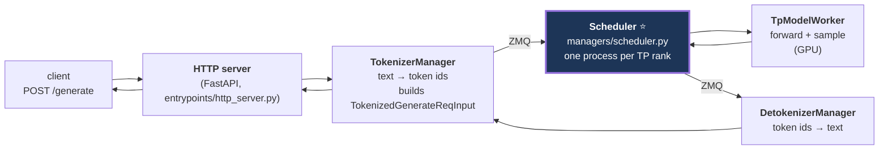
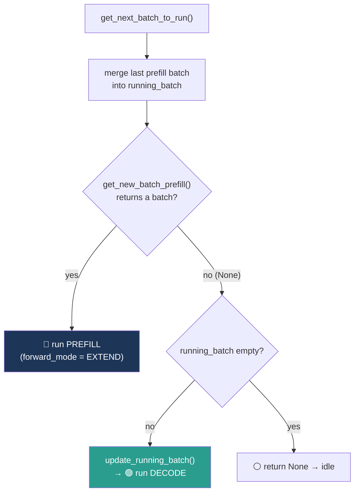
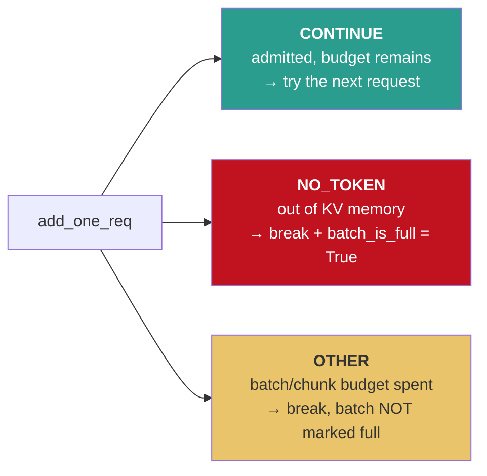

# Session 3 — Part 2: Codebase Tutorial

> **Following a request through the SGLang scheduler, line by line**
> ~50 minutes. Everything below is `python/sglang/srt/...` unless stated otherwise.

---

## 0. How to use this document

### 0.1 Line numbers drift — verify them first

All `file:line` references match the branch the Session 3 proposal was written against. SGLang
moves fast; the *function names* are stable, the *line numbers* are not. Run this once before the
session and patch the numbers on your own checkout:

```bash
cd python/sglang/srt/managers

# The event loop and the decision function
grep -n "def event_loop_normal\|def event_loop_overlap\|def is_disable_overlap_for_batch" scheduler.py
grep -n "def get_next_batch_to_run\|def get_new_batch_prefill\|def update_running_batch" scheduler.py
grep -n "def run_batch\|def process_batch_result\|def recv_requests\|def process_input_requests" scheduler.py
grep -n "def handle_generate_request" scheduler.py

# Admission control and policy
grep -n "class PrefillAdder\|class SchedulePolicy\|class AddReqResult" schedule_policy.py
grep -n "def add_one_req\|def add_chunked_req\|def budget_state\|def rem_total_tokens\|def calc_priority" schedule_policy.py

# Batch mechanics
grep -n "class ScheduleBatch\|class Req\b" schedule_batch.py
grep -n "def prepare_for_extend\|def prepare_for_decode\|def filter_batch\|def merge_batch" schedule_batch.py
grep -n "def retract_decode\|def check_decode_mem\|def init_next_round_input\|def reset_for_retract" schedule_batch.py

# Result processing
grep -n "def process_batch_result_prefill\|def process_batch_result_decode" batch_result_processor.py
```

### 0.2 The map

| File | What lives there |
|---|---|
| `managers/scheduler.py` | `Scheduler` class: event loops, `get_next_batch_to_run`, `run_batch`, request intake |
| `managers/schedule_policy.py` | `SchedulePolicy` (queue ordering), `PrefillAdder` (admission), `AddReqResult` |
| `managers/schedule_batch.py` | `Req` (one request), `ScheduleBatch` (a batch), `retract_decode`, `filter/merge` |
| `managers/batch_result_processor.py` | `process_batch_result_prefill` / `_decode` — post-forward bookkeeping |
| `managers/tp_worker.py`, `tp_worker_overlap_thread.py` | the model worker the scheduler calls into |
| `mem_cache/radix_cache.py` | `match_prefix`, `cache_unfinished_req`, `cache_finished_req`, `evict` (Session 2) |
| `mem_cache/allocator.py`, `memory_pool.py` | `token_to_kv_pool_allocator`, `req_to_token_pool` |
| `server_args.py` | defaults for `schedule_policy`, `chunked_prefill_size`, `max_running_requests`, … |
| `global_config.py` | `new_token_ratio` constants, `retract_decode_steps` |

### 0.3 Reading conventions used below

Code blocks are **abridged**: error handling, distributed/TP branches, disaggregation (PD)
branches, LoRA, speculative decoding, and metrics are stripped so the control flow is visible.
Where I've compressed several lines, the block says `# ...`. Always read the real file next to
this document — the point of the tutorial is to give you a map, not to replace the source.

---

## 1. The process architecture (5 min)

Before the scheduler, know who talks to it. SGLang runs **separate OS processes** connected by
ZeroMQ, not threads:



Why this matters for today: **the scheduler process is single-threaded and CPU-bound between GPU
launches.** Every microsecond spent sorting the queue or probing the radix tree is a microsecond
the GPU may be idle. That constraint explains a lot of the code's shape — the `batch_is_full`
short-circuit, the queue-length fallback in the policy, the whole existence of overlap mode.

---

## 2. A request arrives: intake (5 min)

### 2.1 `recv_requests` and `process_input_requests`

`scheduler.py`

```python
def recv_requests(self) -> List[Req]:
    # Only TP rank 0 (and the attention-DP head) actually reads the socket;
    # the result is then broadcast to the other ranks so every rank
    # runs an IDENTICAL schedule. This is important: scheduling is
    # replicated, not distributed.
    if self.attn_tp_rank == 0:
        recv_reqs = []
        while True:
            try:
                recv_req = self.recv_from_tokenizer.recv_pyobj(zmq.NOBLOCK)
            except zmq.ZMQError:
                break
            recv_reqs.append(recv_req)
    else:
        recv_reqs = None
    # ... broadcast_pyobj to other TP ranks ...
    return recv_reqs

def process_input_requests(self, recv_reqs: List):
    for recv_req in recv_reqs:
        # dispatcher maps request type -> handler
        output = self._request_dispatcher(recv_req)
        # TokenizedGenerateReqInput -> handle_generate_request
```

Two facts to state explicitly:

* The socket is drained **non-blocking** at the top of every iteration. If nothing arrived, the
  loop proceeds immediately with whatever is already running. No request ever "wakes up" the loop.
* All TP ranks execute the same scheduling code on the same inputs. There is no leader/follower
  scheduling protocol — determinism does the job.

### 2.2 `handle_generate_request` — the `Req` object is born

```python
def handle_generate_request(self, recv_req: TokenizedGenerateReqInput):
    req = Req(
        rid=recv_req.rid,
        origin_input_text=recv_req.input_text,
        origin_input_ids=recv_req.input_ids,      # the prompt, as token ids
        sampling_params=recv_req.sampling_params,
        return_logprob=recv_req.return_logprob,
        stream=recv_req.stream,
        eos_token_ids=self.model_config.hf_eos_token_id,
        # ...
    )
    req.tokenizer = self.tokenizer

    # truncate over-long prompts against the model's context length
    if len(req.origin_input_ids) > self.max_req_input_len:
        # ... error out or truncate ...

    self._add_request_to_queue(req)   # -> self.waiting_queue.append(req)
```

`Req` fields you must know for the rest of the session (`schedule_batch.py`):

| Field | Meaning |
|---|---|
| `origin_input_ids` | The prompt. Never changes. |
| `output_ids` | Tokens generated so far. Survives retraction. |
| `fill_ids` | `origin_input_ids + output_ids` — what needs to exist in KV cache |
| `prefix_indices` | KV pool indices already cached for this request's prefix (from radix `match_prefix`) |
| `extend_input_len` | `len(fill_ids) - len(prefix_indices)` — tokens we must actually compute |
| `last_node` | The radix tree node the prefix match ended at; must be locked during prefill |
| `req_pool_idx` | Slot in `req_to_token_pool`; assigned at prefill, released at finish/retract |
| `sampling_params.max_new_tokens` | The output ceiling used by admission accounting |
| `is_retracted` | Set by `reset_for_retract()` |

> ⚠️ Note what is **not** allocated here: no KV cache, no `req_pool_idx`, no GPU state.
> A queued request costs a few hundred bytes of host RAM. That is why the waiting queue can
> hold thousands of requests without trouble.

---

## 3. The event loop (7 min)

### 3.1 `event_loop_normal` — scheduler.py:1520

**This is the entire server.** Read it once and everything else is a subroutine.

```python
@torch.no_grad()
def event_loop_normal(self):
    while True:
        recv_reqs = self.recv_requests()             # 1. drain socket
        self.process_input_requests(recv_reqs)       # 2. queue new Reqs

        batch = self.get_next_batch_to_run()          # 3. THE DECISION  <-- §4
        self.cur_batch = batch

        if batch:
            result = self.run_batch(batch)            # 4. GPU forward + sample
            self.process_batch_result(batch, result)  # 5. bookkeeping    <-- §8
        else:
            self.self_check_during_idle()             # nothing to do

        self.last_batch = batch                       # 6. remember for next iteration
```

Teaching points:

1. **One iteration == one forward pass.** "Step", "iteration", and "batch" are the same thing.
2. `batch` may be a *prefill* batch or a *decode* batch — never both as separate objects (a mixed
   batch is a single prefill batch that also carries decode tokens).
3. `self.last_batch = batch` at the bottom is what makes step 1 of `get_next_batch_to_run`
   possible next iteration.
4. There is no priority inversion, no preemption timer, no thread pool. The simplicity is
   deliberate: the loop body must be a few hundred microseconds.

### 3.2 `event_loop_overlap` — scheduler.py:1554

Same loop, shifted by one:

```python
@torch.no_grad()
def event_loop_overlap(self):
    self.result_queue = deque()

    while True:
        recv_reqs = self.recv_requests()
        self.process_input_requests(recv_reqs)

        batch = self.get_next_batch_to_run()
        self.cur_batch = batch

        if batch:
            batch.launch_done = threading.Event()
            result = self.run_batch(batch)              # returns FUTURE token ids
            self.result_queue.append((batch.copy(), result))

            if self.last_batch is None:
                # prime the pipeline with a dummy so the first real result
                # is processed on the following iteration
                tmp_batch = ScheduleBatch(
                    reqs=None,
                    forward_mode=ForwardMode.DUMMY_FIRST,
                    next_batch_sampling_info=self.tp_worker.cur_sampling_info,
                )
                self.process_batch_result(tmp_batch, None, batch.launch_done)

        if self.last_batch:
            # process the PREVIOUS batch while the GPU chews on this one
            tmp_batch, tmp_result = self.result_queue.popleft()
            self.process_batch_result(
                tmp_batch, tmp_result, batch.launch_done if batch else None
            )
        elif batch is None:
            self.self_check_during_idle()

        self.last_batch = batch
```

The three differences, and why each exists:

| | normal | overlap |
|---|---|---|
| `run_batch` return | real token ids (implies a GPU sync) | **future** token ids (negative placeholder indices) — no sync |
| result processing | immediately, same iteration | one iteration later, via `result_queue` |
| `batch.copy()` | not needed | needed: the live batch object mutates before its results are consumed |

The `DUMMY_FIRST` batch is pure pipeline priming: on iteration 1 there is no `last_batch`, so
without it the `if self.last_batch:` branch would never fire and the queue would grow forever.

### 3.3 `is_disable_overlap_for_batch` — scheduler.py:1627

```python
def is_disable_overlap_for_batch(self, batch) -> bool:
    # Disable overlap when the current AND previous batches are both prefill.
    # Pipelining two consecutive prefills delays the first one's token
    # by a full iteration, hurting TTFT, while the throughput gain is small
    # (prefill batches are long, so the CPU tail is already well amortized).
    if batch.forward_mode.is_extend() and self.last_batch is not None \
            and self.last_batch.forward_mode.is_extend():
        return True
    return False
```

Verify the exact predicate on your branch — the *rationale* is stable, the condition has picked up
extra cases (speculative decoding, PD-disaggregation) over time.

### 3.4 Recommendation for the live session

Run the demo with `--disable-overlap-schedule` when you set breakpoints. In overlap mode the
result you're inspecting belongs to the *previous* batch, and that confuses everyone the first
time. Switch overlap back on for the throughput demo.

---

## 4. `get_next_batch_to_run` — scheduler.py:2687 (8 min)

The most important 60 lines in the codebase.

```python
def get_next_batch_to_run(self) -> Optional[ScheduleBatch]:
    # ---------- STEP 1: merge the previous prefill batch into running_batch ----------
    #            (scheduler.py:2739-2764)
    chunked_req_to_exclude = set()

    if self.chunked_req:
        # The in-flight chunked request must NOT be merged into the decode batch:
        # it is not finished prefilling. Persist its partial KV into the tree
        # (locked, so it survives eviction) and exclude it.
        chunked_req_to_exclude.add(self.chunked_req)
        self.tree_cache.cache_unfinished_req(self.chunked_req, chunked=True)

    if self.last_batch and self.last_batch.forward_mode.is_extend():
        if self.chunked_req is not None:
            chunked_req_to_exclude.add(self.chunked_req)

        # drop finished reqs + the chunked req from the prefill batch
        self.last_batch.filter_batch(chunked_req_to_exclude=list(chunked_req_to_exclude))

        if not self.last_batch.is_empty():
            if self.running_batch.is_empty():
                self.running_batch = self.last_batch      # first decoders
            else:
                self.running_batch.merge_batch(self.last_batch)   # append rows

    # ---------- STEP 2: prefill has priority ----------  (scheduler.py:2779)
    new_batch = self.get_new_batch_prefill()
    if new_batch is not None:
        return new_batch

    # ---------- STEP 3: otherwise decode ----------  (scheduler.py:2801)
    if not self.running_batch.is_empty():
        self.running_batch = self.update_running_batch(self.running_batch)
        return self.running_batch if not self.running_batch.is_empty() else None

    # ---------- STEP 4: nothing to do ----------
    return None
```

### 4.1 Why step 1 exists at all

A prefill batch computes the prompt **and samples the first output token**. Only after
`process_batch_result_prefill` runs do we know whether that first token was EOS. So the batch
cannot join the decode batch in the same iteration it ran — hence "merge the batch that ran last
iteration, now that its results have been processed."

`filter_batch` (schedule_batch.py) removes finished requests by rebuilding the batch's tensors
with a keep-index list:

```python
def filter_batch(self, chunked_req_to_exclude=None, keep_indices=None):
    if keep_indices is None:
        keep_indices = [
            i for i in range(len(self.reqs))
            if not self.reqs[i].finished()
               and self.reqs[i] not in chunked_req_to_exclude
        ]
    # ... rebuild self.reqs, req_pool_indices, seq_lens, out_cache_loc,
    #     output_ids, sampling_info by indexing with keep_indices ...
```

`merge_batch` concatenates the tensors of two batches (and merges their `sampling_info`):

```python
def merge_batch(self, other: "ScheduleBatch"):
    self.sampling_info.merge_batch(other.sampling_info)
    self.req_pool_indices = torch.cat([self.req_pool_indices, other.req_pool_indices])
    self.seq_lens = torch.cat([self.seq_lens, other.seq_lens])
    self.out_cache_loc = None            # will be reallocated in prepare_for_decode
    self.reqs.extend(other.reqs)
    # ...
```

### 4.2 The decision, as a picture



`get_new_batch_prefill()` returns `None` when: the waiting queue is empty **and** there's no
chunked request; or `batch_is_full` is set; or `running_bs >= max_running_requests`; or no request
in the queue fits the budget.

### 4.3 Trace A — 3 decoding, 2 new requests arrive

`running_batch = [R1, R2, R3]` (decoding), then `req_D` and `req_E` arrive during iteration 10.

| Iter | `last_batch` | Step 1 (merge) | Step 2 (prefill?) | Returned | Log line |
|---|---|---|---|---|---|
| 10 | decode | nothing (last was decode) | queue empty → `None` | decode `[R1,R2,R3]` | `Decode batch. #running-req: 3` |
| 11 | decode | nothing | D, E now queued → **build prefill [D,E]** | prefill `[D,E]` | `Prefill batch. #new-seq: 2, #running-req: 3` |
| 12 | **prefill** | filter (neither finished) → `merge_batch` → running = `[R1,R2,R3,D,E]` | queue empty → `None` | decode `[R1..E]` | `Decode batch. #running-req: 5` |
| 13 | decode | nothing | `None` | decode `[R1..E]` | `Decode batch. #running-req: 5` |

Points to hammer in the room:

* **R1–R3 skipped a decode step in iteration 11.** That is the ITL cost of prefill priority, and it
  is precisely what chunked prefill + mixed batches soften.
* **D and E's first token was produced in iteration 11**, by the prefill batch itself — not by a
  decode step. The prefill batch's output token *is* the first token.
* The merge in iteration 12 is why `#running-req` jumps 3 → 5 one iteration after the prefill.

---

## 5. Building a prefill batch: policy + `PrefillAdder` (12 min)

### 5.1 `get_new_batch_prefill` — the skeleton

```python
def get_new_batch_prefill(self) -> Optional[ScheduleBatch]:
    # (a) fast exits
    if self.grammar_queue:
        self.move_ready_grammar_requests()
    if len(self.waiting_queue) == 0 and self.chunked_req is None:
        return None

    running_bs = len(self.running_batch.reqs)
    if running_bs >= self.max_running_requests:
        self.batch_is_full = True
        return None
    if self.batch_is_full:
        return None

    # (b) ORDER the queue according to the policy          -> §5.2
    self.policy.calc_priority(self.waiting_queue)

    # (c) build the admission budget                        -> §5.3
    adder = PrefillAdder(
        page_size=self.page_size,
        tree_cache=self.tree_cache,
        token_to_kv_pool_allocator=self.token_to_kv_pool_allocator,
        running_batch=self.running_batch,
        new_token_ratio=self.new_token_ratio,
        rem_input_tokens=self.max_prefill_tokens,
        rem_chunk_tokens=self.chunked_prefill_size,
        mixed_with_decode_tokens=(running_bs if self.is_mixed_chunk else 0),
    )

    # (d) the in-flight chunked request always goes first
    if self.chunked_req is not None:
        self.chunked_req.init_next_round_input()
        self.chunked_req = adder.add_chunked_req(self.chunked_req)

    # (e) THE ADMISSION LOOP  (scheduler.py:2955)           -> §5.4
    for req in self.waiting_queue:
        if len(adder.can_run_list) + running_bs >= self.max_running_requests:
            self.batch_is_full = True
            break

        req.init_next_round_input(self.tree_cache)      # radix match_prefix here!
        res = adder.add_one_req(req, has_chunked_req=(self.chunked_req is not None))

        if res != AddReqResult.CONTINUE:
            if res == AddReqResult.NO_TOKEN:
                self.batch_is_full = True
            break

    if len(adder.can_run_list) == 0:
        return None

    # (f) remove admitted requests from the waiting queue
    can_run_list = adder.can_run_list
    self.waiting_queue = [x for x in self.waiting_queue if x not in set(can_run_list)]

    if adder.new_chunked_req is not None:
        self.chunked_req = adder.new_chunked_req
    if self.chunked_req:
        self.chunked_req.is_chunked += 1

    # (g) build and materialize the batch
    new_batch = ScheduleBatch.init_new(
        can_run_list, self.req_to_token_pool, self.token_to_kv_pool_allocator,
        self.tree_cache, self.model_config, self.enable_overlap, self.spec_algorithm,
    )
    new_batch.prepare_for_extend()          # allocates KV, builds tensors

    # (h) log
    self.log_prefill_stats(adder, can_run_list, running_bs)
    return new_batch
```

### 5.2 `SchedulePolicy.calc_priority` — schedule_policy.py:163

```python
class CacheAwarePolicy(Enum):
    LPM = "lpm"
    DFS_WEIGHT = "dfs-weight"

class CacheAgnosticPolicy(Enum):
    FCFS = "fcfs"
    LOF = "lof"
    RANDOM = "random"

class SchedulePolicy:
    def calc_priority(self, waiting_queue: List[Req]):
        policy = self._determine_active_policy(waiting_queue)

        if isinstance(policy, CacheAwarePolicy):
            # probe the radix tree for EVERY waiting request
            temporary_deprioritized = self._compute_prefix_matches(waiting_queue, policy)
            if policy == CacheAwarePolicy.LPM:
                SchedulePolicy._sort_by_longest_prefix(waiting_queue, temporary_deprioritized)
            elif policy == CacheAwarePolicy.DFS_WEIGHT:
                SchedulePolicy._sort_by_dfs_weight(waiting_queue, self.tree_cache)
        else:
            if policy == CacheAgnosticPolicy.FCFS:
                pass                                        # already in arrival order
            elif policy == CacheAgnosticPolicy.LOF:
                SchedulePolicy._sort_by_longest_output(waiting_queue)
            elif policy == CacheAgnosticPolicy.RANDOM:
                SchedulePolicy._sort_randomly(waiting_queue)
```

Three details worth pausing on:

**(1) FCFS is literally a no-op.** That's why it's the default: zero cost per iteration.

**(2) `_determine_active_policy` degrades LPM to FCFS above a large queue length.** LPM costs one
radix probe per waiting request *per iteration*. With 5000 queued requests that is 5000 tree
walks in the loop that is supposed to take microseconds. Above the threshold, the code falls back
to FCFS.

**(3) In-batch prefix caching / temporary deprioritization.** Inside `_compute_prefix_matches`:

```python
IN_BATCH_PREFIX_CACHING_THRESHOLD = 32
IN_BATCH_PREFIX_CACHING_DEPRIORITIZE_THRESHOLD = 32

def _compute_prefix_matches(self, waiting_queue, policy):
    temporary_deprioritized = set()
    self.waiting_queue_radix_tree.reset()

    for r in waiting_queue:
        prefix_ids = r.adjust_max_prefix_ids()
        match_result = self.tree_cache.match_prefix(rid=r.rid, key=prefix_ids)
        r.prefix_indices, r.last_node = match_result.device_indices, match_result.last_device_node

        # If this request's real cache hit is small, check whether ANOTHER
        # request in this same queue would create that prefix. If so, defer
        # this one so the sibling populates the tree first.
        if len(r.prefix_indices) <= IN_BATCH_PREFIX_CACHING_THRESHOLD:
            in_batch_matching_prefixes, _ = \
                self.waiting_queue_radix_tree.match_prefix(rid=r.rid, key=prefix_ids)
            if len(in_batch_matching_prefixes) >= IN_BATCH_PREFIX_CACHING_DEPRIORITIZE_THRESHOLD:
                temporary_deprioritized.add(r.rid)
            else:
                self.waiting_queue_radix_tree.insert(prefix_ids, torch.empty(len(prefix_ids)))
    return temporary_deprioritized
```

This is the mechanism from §2.3 of Part 1: 50 identical cold requests do **not** all prefill the
same prefix in the same batch.

**(4) The side effect that matters.** `calc_priority` already wrote `r.prefix_indices` and
`r.last_node` for every waiting request. That's why the scheduler passes `prefix_computed` down
into `init_next_round_input` — under a cache-aware policy the match has already been done and
must not be redone.

### 5.3 `PrefillAdder.__init__` — schedule_policy.py:442

```python
class PrefillAdder:
    def __init__(self, page_size, tree_cache, token_to_kv_pool_allocator,
                 running_batch, new_token_ratio, rem_input_tokens,
                 rem_chunk_tokens, mixed_with_decode_tokens=0):
        self.page_size = page_size
        self.tree_cache = tree_cache
        self.token_to_kv_pool_allocator = token_to_kv_pool_allocator

        # budgets
        self.rem_total_token_offset = mixed_with_decode_tokens
        self.cur_rem_token_offset  = mixed_with_decode_tokens
        self.rem_input_tokens = rem_input_tokens - mixed_with_decode_tokens
        self.rem_chunk_tokens = rem_chunk_tokens
        if self.rem_chunk_tokens is not None:
            self.rem_chunk_tokens -= mixed_with_decode_tokens

        # >>> RESERVE FUTURE DECODE MEMORY FOR EVERYTHING ALREADY RUNNING <<<
        if running_batch is not None:
            self.rem_total_token_offset += sum(
                min(r.sampling_params.max_new_tokens - len(r.output_ids),
                    CLIP_MAX_NEW_TOKENS) * new_token_ratio
                for r in running_batch.reqs
            )

        self.can_run_list = []
        self.new_chunked_req = None
        self.log_hit_tokens = 0        # tokens saved by the radix tree
        self.log_input_tokens = 0      # tokens actually computed

    @property
    def rem_total_tokens(self):
        available = self.token_to_kv_pool_allocator.available_size()
        evictable = self.tree_cache.evictable_size()
        return available + evictable - self.rem_total_token_offset

    @property
    def cur_rem_tokens(self):
        available = self.token_to_kv_pool_allocator.available_size()
        evictable = self.tree_cache.evictable_size()
        return available + evictable - self.cur_rem_token_offset
```

**The single most important expression in admission control:**

```
rem_total_tokens = free_KV + evictable_radix_KV
                   - Σ_running (remaining_max_new_tokens × new_token_ratio)
                   - Σ_this_batch (extend_input_len + max_new_tokens)
```

Two things people get wrong on first read:

* **`evictable_size()` counts as available.** Cached prefixes with `ref_count == 0` are considered
  reclaimable memory. The scheduler is willing to sacrifice cache hits to admit work. That's the
  eviction-before-retraction principle, encoded directly in the budget.
* **`rem_total_tokens` is a *property*, recomputed on every access**, because the allocator's free
  count changes as the loop runs. `rem_total_token_offset` is the accumulator that `_prefill_one_req`
  increments.

`new_token_ratio` is threaded in from the scheduler, where it's maintained by the AIMD controller
described in Part 1 §3.3 (`init_new_token_ratio`, `min_new_token_ratio`, `new_token_ratio_decay`
in `global_config.py`, scaled by `--schedule-conservativeness`).

### 5.4 `Req.init_next_round_input` — where the radix tree is consulted

```python
def init_next_round_input(self, tree_cache=None):
    self.fill_ids = self.origin_input_ids + self.output_ids
    if tree_cache is not None:
        match_result = tree_cache.match_prefix(
            rid=self.rid, key=self.adjust_max_prefix_ids()
        )
        self.prefix_indices = match_result.device_indices
        self.last_node = match_result.last_device_node
        # (host-side / hierarchical cache fields elided)
    self.extend_input_len = len(self.fill_ids) - len(self.prefix_indices)
```

Note `fill_ids = origin_input_ids + output_ids`. For a fresh request, `output_ids` is empty and
this is just the prompt. **For a retracted request it is prompt + everything it already
generated** — which is exactly how a retracted request resumes instead of restarting.

### 5.5 `PrefillAdder.add_one_req` — the per-request decision

```python
def add_one_req(self, req: Req, has_chunked_req: bool, truncation_align_size=None):
    # (0) special case: ignore_eos with no radix cache -> different accounting path
    # ...

    total_tokens  = req.extend_input_len + \
                    min(req.sampling_params.max_new_tokens, CLIP_MAX_NEW_TOKENS)
    input_tokens  = self.ceil_paged_tokens(req.extend_input_len)   # round up to page_size
    prefix_len    = len(req.prefix_indices)

    # (1) HARD budget check: does the whole request (prompt + worst-case output) fit?
    if total_tokens >= self.rem_total_tokens:
        return AddReqResult.NO_TOKEN

    # (2) SOFT batch-size check: is this prefill batch already big enough?
    if input_tokens > self.rem_input_tokens and len(self.can_run_list) != 0:
        return AddReqResult.OTHER

    # (3) LOCK the matched prefix so it cannot be evicted while we prefill
    with self._lock_node(req.last_node):
        # (4) RE-CHECK: locking may have reduced evictable_size(), shrinking
        #     rem_total_tokens between (1) and here.
        if total_tokens > self.rem_total_tokens:
            return AddReqResult.NO_TOKEN

        if (self.rem_chunk_tokens is None            # chunking disabled
                or input_tokens <= self.rem_chunk_tokens
                or (req.return_logprob and req.normalized_prompt_logprob is None)):
            # ---- FULL prefill in this batch ----
            self.can_run_list.append(req)
            self._prefill_one_req(
                prefix_len, req.extend_input_len,
                min(req.sampling_params.max_new_tokens, CLIP_MAX_NEW_TOKENS),
            )
        else:
            # ---- CHUNKED prefill: take only what fits ----
            if self.rem_chunk_tokens == 0:
                return AddReqResult.OTHER
            trunc_len = self.rem_chunk_tokens
            # (page alignment / truncation_align_size handling elided)
            req.extend_input_len = trunc_len
            req.fill_ids = req.fill_ids[:len(req.prefix_indices) + trunc_len]
            self.can_run_list.append(req)
            self.new_chunked_req = req
            self._prefill_one_req(prefix_len, trunc_len, 0)   # max_new_tokens=0: not generating yet

    return self.budget_state()


def _prefill_one_req(self, prefix_len, extend_input_len, max_new_tokens):
    self.rem_total_token_offset += extend_input_len + max_new_tokens
    self.cur_rem_token_offset   += extend_input_len
    self.rem_input_tokens       -= extend_input_len
    if self.rem_chunk_tokens is not None:
        self.rem_chunk_tokens   -= extend_input_len
    self.log_hit_tokens   += prefix_len          # -> "#cached-token" in the log
    self.log_input_tokens += extend_input_len    # -> "#new-token"    in the log


def budget_state(self):
    if self.rem_total_tokens <= 0 or self.cur_rem_tokens <= 0:
        return AddReqResult.NO_TOKEN     # out of KV memory: STOP, mark batch full
    if self.rem_input_tokens <= 0 or \
       (self.rem_chunk_tokens is not None and self.rem_chunk_tokens <= 0):
        return AddReqResult.OTHER        # batch big enough: STOP, but not "full"
    return AddReqResult.CONTINUE
```

#### The three return values



The `NO_TOKEN` vs `OTHER` distinction is the whole reason the server doesn't stall: `OTHER` just
means "this batch is full enough, come back next iteration", while `NO_TOKEN` means "the machine
is out of memory, stop trying until something frees up."

#### Why lock, then re-check (steps 3 and 4)

`rem_total_tokens` includes `tree_cache.evictable_size()`. Locking `req.last_node` calls
`inc_lock_ref` up the path to the root, which makes those nodes **non-evictable** — so
`evictable_size()` drops by the size of the locked prefix, and `rem_total_tokens` shrinks between
line (1) and line (4). Skipping the re-check would let you admit a request whose own prefix lock
just consumed the headroom you were counting on. Subtle, and a good exam question.

### 5.6 The admission loop — scheduler.py:2955

```python
for req in self.waiting_queue:
    if len(adder.can_run_list) + running_bs >= self.max_running_requests:
        self.batch_is_full = True
        break

    req.init_next_round_input(self.tree_cache)
    res = adder.add_one_req(req, has_chunked_req=(self.chunked_req is not None))

    if res != AddReqResult.CONTINUE:
        if res == AddReqResult.NO_TOKEN:
            self.batch_is_full = True
        break
```

> **This loop `break`s — it does not `continue`.** The queue is in policy order, so the first
> request that doesn't fit stops admission entirely. There is no "skip the big one and admit the
> small one behind it" (that would be a backfill policy, and it would break the ordering guarantee
> the policy just established). Consequence: a single huge request at the head of the queue blocks
> admission of everything behind it until enough memory frees up — head-of-line blocking at the
> admission layer. Chunked prefill is what keeps that from being fatal, since the huge request gets
> admitted in slices rather than waiting for its full footprint.

### 5.7 Trace B — two requests, cold cache

```
waiting_queue = [ A: 500 prompt tokens,  max_new_tokens=256
                  B: 2000 prompt tokens, max_new_tokens=512 ]
free KV = 4096 tokens, tree empty, running_batch empty, new_token_ratio = 0.7
max_prefill_tokens = 16384, chunked_prefill_size = 8192, page_size = 1
```

| # | Code point | Computation | State after |
|---|---|---|---|
| 1 | `calc_priority` | FCFS → no-op | queue `[A, B]` |
| 2 | `PrefillAdder.__init__` | running_batch empty → offset 0 | `rem_total_tokens = 4096 + 0 - 0 = 4096`<br/>`rem_input_tokens = 16384`, `rem_chunk_tokens = 8192` |
| 3 | `A.init_next_round_input` | `match_prefix` → miss | `prefix_indices=[]`, `extend_input_len=500` |
| 4 | `add_one_req(A)` | `total = 500+256 = 756 < 4096` ✓<br/>`input_tokens = 500 ≤ 16384` ✓<br/>`500 ≤ 8192` → full prefill | `can_run_list=[A]`<br/>offset `+756` → `rem_total_tokens = 3340`<br/>`rem_input = 15884`, `rem_chunk = 7692` |
| 5 | `budget_state()` | all positive | `CONTINUE` |
| 6 | `B.init_next_round_input` | miss | `extend_input_len = 2000` |
| 7 | `add_one_req(B)` | `total = 2000+512 = 2512 < 3340` ✓<br/>`2000 ≤ 7692` → full prefill | `can_run_list=[A,B]`<br/>`rem_total_tokens = 828`, `rem_chunk = 5692` |
| 8 | `budget_state()` | positive | `CONTINUE` → loop ends (queue exhausted) |
| 9 | `prepare_for_extend` | allocate 2500 KV slots | |

Log:
```
Prefill batch. #new-seq: 2, #new-token: 2500, #cached-token: 0, token usage: 0.61, #running-req: 0, #queue-req: 0
```

**Same setup, but free KV = 2048:**

| # | | |
|---|---|---|
| 4 | `add_one_req(A)`: `756 < 2048` ✓ | admitted, `rem_total_tokens = 1292` |
| 7 | `add_one_req(B)`: `2512 >= 1292` ✗ | **`NO_TOKEN`** |
| — | scheduler: `batch_is_full = True; break` | B stays in `waiting_queue` |

```
Prefill batch. #new-seq: 1, #new-token: 500, #cached-token: 0, token usage: 0.24, #running-req: 0, #queue-req: 1
```

B will not even be *considered* again until `batch_is_full` is cleared — which happens in
`update_running_batch` when the running batch shrinks.

### 5.8 Trace C — five requests sharing a system prompt: FCFS vs LPM

Radix tree already contains the 1000-token `SYS` prefix (`ref_count = 0`, evictable).

```
waiting_queue (arrival order):
  P  : cold, 3000 tokens,  max_new = 1000
  Q1 : SYS + 50,           max_new = 100
  Q2 : SYS + 60,           max_new = 100
  Q3 : SYS + 70,           max_new = 100
  Q4 : SYS + 80,           max_new = 100

free KV = 3000 tokens, evictable = 1000 (the SYS prefix), running_batch empty
=> rem_total_tokens starts at 3000 + 1000 = 4000
```

**FCFS** (`calc_priority` no-op, order `P, Q1..Q4`):

```
add_one_req(P):  extend=3000, total = 3000 + 1000 = 4000
                 4000 >= 4000  -> NO_TOKEN     (note: the check is >=, not >)
                 batch_is_full = True; break
```

Result: **nothing is admitted at all.** Four cheap cache-hitting requests sit behind one fat cold
request. Log: `#new-seq: 0` … the iteration falls through to decode (or idle).

**LPM** (`_sort_by_longest_prefix` → order `Q1, Q2, Q3, Q4, P`):

| step | check | after |
|---|---|---|
| Q1 | `extend = 50`, `total = 50+100 = 150 < 4000` ✓; lock `SYS` node → `evictable` drops by 1000 → `rem_total_tokens = 3000 - 150 = 2850` | `can_run_list=[Q1]` |
| Q2 | prefix already locked; `total = 160 < 2850` ✓ | `rem = 2690` |
| Q3 | `total = 170` ✓ | `rem = 2520` |
| Q4 | `total = 180` ✓ | `rem = 2340` |
| P | `total = 4000 >= 2340` ✗ | `NO_TOKEN` → break |

Log:
```
Prefill batch. #new-seq: 4, #new-token: 260, #cached-token: 4000, token usage: 0.15, #running-req: 0, #queue-req: 1
```

**260 tokens of compute instead of 4000.** `#cached-token: 4000` is `log_hit_tokens` = 4 × 1000,
i.e. the radix tree did the work of four 1000-token prefills for free.

Watch the interaction between locking and the budget: once Q1 locks the `SYS` path,
`evictable_size()` drops by 1000, so `rem_total_tokens` fell by more than Q1's own 150 tokens.
Q2–Q4 then benefit — the path is already locked, so *their* admission doesn't shrink it further.
This is the mechanism by which **LPM naturally batches siblings together**.

And the fairness cost is visible right there: P was at the head of the queue and got pushed to the
back. Repeat this arrival pattern and P starves.

### 5.9 `prepare_for_extend` — materializing the batch

```python
def prepare_for_extend(self):
    self.forward_mode = ForwardMode.EXTEND

    # 1. one req_to_token_pool slot per request
    req_pool_indices = self.alloc_req_slots(len(self.reqs))

    for i, req in enumerate(self.reqs):
        req.req_pool_idx = req_pool_indices[i]
        pre_len, seq_len = len(req.prefix_indices), len(req.fill_ids)
        # 2. splice the CACHED prefix indices into this req's token map
        self.req_to_token_pool.write((req.req_pool_idx, slice(0, pre_len)), req.prefix_indices)
        # 3. the tree node stays locked for the duration of the forward pass
        self.tree_cache.inc_lock_ref(req.last_node)
        # ...

    # 4. allocate NEW KV slots only for the tokens we must actually compute
    out_cache_loc = self.alloc_token_slots(extend_num_tokens)

    # 5. build the GPU tensors: input_ids, seq_lens, extend_lens, positions, sampling_info
    # ...
```

Step 2 and step 4 together are RadixAttention in action: the prefix rows point at **already
populated** KV slots, and only `extend_input_len` fresh slots are allocated. Session 2's tree walk
becomes this splice.

---

## 6. `run_batch` (3 min)

```python
def run_batch(self, batch: ScheduleBatch):
    self.forward_ct += 1

    if self.is_generation:
        # ScheduleBatch (scheduler-side, python objects)
        #   -> ModelWorkerBatch (flat tensors, no Req objects)
        model_worker_batch = batch.get_model_worker_batch()

        # -> TpModelWorker (normal) or TpModelWorkerClient (overlap)
        #    which builds a ForwardBatch and runs the model
        batch_result = self.tp_worker.forward_batch_generation(model_worker_batch)

        # in OVERLAP mode next_token_ids are FUTURE ids (negative placeholders);
        # in NORMAL mode they are real ids already synced to the CPU
        batch.output_ids = batch_result.next_token_ids
        return batch_result
```

The layering is worth one slide:

```
ScheduleBatch        scheduler's view: list[Req] + tensors, mutable across iterations
      |  get_model_worker_batch()
ModelWorkerBatch     a flat, picklable snapshot: input_ids, seq_lens, out_cache_loc, ...
      |  ForwardBatch.init_new()
ForwardBatch         model's view: attention metadata, positions, page tables (Session 4)
```

Everything after `get_model_worker_batch()` is Session 4 territory. For today, treat
`forward_batch_generation` as "returns one sampled token id per sequence."

---

## 7. `update_running_batch` — decode + retraction (10 min)

Reached only when no prefill batch could be built.

```python
def update_running_batch(self, batch: ScheduleBatch) -> Optional[ScheduleBatch]:
    initial_bs = batch.batch_size()

    # 1. drop finished requests
    batch.filter_batch()
    if batch.is_empty():
        self.batch_is_full = False
        return batch

    # 2. IS THERE ENOUGH KV FOR THE NEXT DECODE STEP?
    if not batch.check_decode_mem(self.decode_mem_cache_buf_multiplier) \
            or (TEST_RETRACT and batch.batch_size() > 10):
        old_ratio = self.new_token_ratio

        # 3. LAST RESORT: kick requests out
        retracted_reqs, new_token_ratio = batch.retract_decode(self.server_args)
        self.new_token_ratio = new_token_ratio            # reset UP (pessimism)

        logger.info(
            "KV cache pool is full. Retract requests. "
            f"#retracted_reqs: {len(retracted_reqs)}, "
            f"#new_token_ratio: {old_ratio:.4f} -> {self.new_token_ratio:.4f}"
        )
        self._extend_requests_to_queue(retracted_reqs)     # back to waiting_queue
    else:
        # 4. nothing went wrong -> get a little greedier
        self.new_token_ratio = max(
            self.new_token_ratio - self.new_token_ratio_decay,
            self.min_new_token_ratio,
        )

    # 5. the batch shrank -> we may be able to admit again
    if batch.batch_size() < initial_bs:
        self.batch_is_full = False

    # 6. allocate one KV slot per sequence and build decode tensors
    batch.prepare_for_decode()
    return batch
```

Note the two places `batch_is_full` is cleared (steps 1 and 5) — both are "the running batch got
smaller." That is the release valve for the flag set in §5.6.

### 7.1 `check_decode_mem`

```python
def check_decode_mem(self, buf_multiplier=1):
    tokens_required = self.new_page_count_next_decode() * buf_multiplier
    if self.token_to_kv_pool_allocator.available_size() >= tokens_required:
        return True

    # try EVICTION first -- free unreferenced radix nodes
    self.tree_cache.evict(tokens_required)

    return self.token_to_kv_pool_allocator.available_size() >= tokens_required
```

With `page_size = 1`, `new_page_count_next_decode()` is just the batch size — one new token per
sequence per step. With paging, only sequences whose length is about to cross a page boundary
need a new page, so it is usually much smaller.

**This is the eviction-before-retraction rule, in four lines of code.** `tree_cache.evict()` frees
LRU nodes with `ref_count == 0`, costing nothing to running requests. Only if that still isn't
enough do we fall through to retraction.

### 7.2 `retract_decode` — schedule_batch.py:2599

```python
def retract_decode(self, server_args):
    sorted_indices = list(range(len(self.reqs)))

    # ORDER: retract the request with the FEWEST generated tokens
    # (least work destroyed) and, as a tiebreak, the LONGEST input
    # (frees the most KV per victim).
    sorted_indices.sort(
        key=lambda i: (len(self.reqs[i].output_ids),
                       -len(self.reqs[i].origin_input_ids)),
        reverse=True,
    )
    # reverse=True + pop() from the END => pop the smallest key first

    retracted_reqs = []
    first_iter = True
    while (self.token_to_kv_pool_allocator.available_size()
           < len(sorted_indices) * global_config.retract_decode_steps) or first_iter:
        if len(sorted_indices) == 1:
            break                      # NEVER retract the last request -> deadlock
        first_iter = False

        idx = sorted_indices.pop()
        req = self.reqs[idx]
        retracted_reqs.append(req)

        # free this request's KV cache
        # ... token_to_kv_pool_allocator.free(...) / tree_cache.dec_lock_ref(req.last_node) ...
        req.reset_for_retract()

    # keep only the survivors
    self.filter_batch(keep_indices=sorted_indices)

    # feedback: how optimistic can we still afford to be?
    total_decoded_tokens = sum(len(r.output_ids) for r in self.reqs)
    total_max_new_tokens = sum(r.sampling_params.max_new_tokens for r in self.reqs)
    new_estimate_ratio = (
        (total_decoded_tokens + global_config.retract_decode_steps * len(self.reqs))
        / total_max_new_tokens
    )
    new_estimate_ratio = min(1.0, new_estimate_ratio)

    return retracted_reqs, new_estimate_ratio
```

```python
def reset_for_retract(self):
    self.prefix_indices = []          # forget the radix match
    self.last_node = None
    self.extend_input_len = 0
    self.is_retracted = True
    self.req_pool_idx = None
    # NOTE: origin_input_ids and output_ids are PRESERVED
    # ... reset streaming offsets (surr_offset / read_offset) ...
```

Three things to say out loud:

1. **`while ... or first_iter`** guarantees at least one retraction. If you're here, the memory
   check already failed; retracting zero requests would loop forever.
2. **`retract_decode_steps`** (a `global_config` constant, ~20) is lookahead: free enough for
   ~20 future decode steps, not just the next one, so you don't retract again next iteration.
3. **`if len(sorted_indices) == 1: break`** — never retract the last survivor. With one request
   left, retracting it frees memory but leaves nothing to make progress, and the request would be
   immediately re-admitted into the same wall. Livelock. So the invariant is: **the decode batch
   never goes below 1 request due to retraction.**

### 7.3 Trace D — memory pressure, end to end

```
running_batch = [X, Y, Z, W]
  X: input 4000, generated 200
  Y: input 3000, generated 5
  Z: input 6000, generated 3
  W: input  500, generated 150
KV pool: 40000 total, ~39990 used, 10 free. Radix tree: 800 evictable.
```

**Iteration N:**

```
update_running_batch:
  filter_batch()              -> nobody finished
  check_decode_mem(1):
      tokens_required = 4 (one per sequence)
      available_size() = 10 >= 4      -> True, no eviction needed
  new_token_ratio -= decay
  prepare_for_decode()        -> allocate 4 slots. available_size() = 6
```

**Iterations N+1: same, available drops 6 → 2.**

**Iteration N+2:**

```
  check_decode_mem(1):
      tokens_required = 4, available_size() = 2   -> not enough
      tree_cache.evict(4)      -> frees 800 evictable tokens   ✅ EVICTION
      available_size() = 802 >= 4  -> True
```

The 800 tokens of cached prefixes are gone (future requests lose those cache hits), but **no
running request was disturbed.** This is the common case, and it is invisible in the logs.

**~200 iterations later**, eviction has nothing left to give:

```
  check_decode_mem(1):
      available = 1, required = 4
      tree_cache.evict(4)  -> evictable_size() == 0, frees nothing
      available = 1 < 4    -> False                 ❌ RETRACTION TIME

  retract_decode:
    sort key (len(output_ids), -len(origin_input_ids)), reverse=True:
        Z: (3, -6000)     <- smallest key: fewest tokens generated, longest input
        Y: (5, -3000)
        W: (150,  -500)
        X: (200, -4000)
    sorted (descending) = [X, W, Y, Z];  pop() takes from the end -> Z first

    loop 1 (first_iter): pop Z
        free 6003 tokens of KV. available = 6004
        Z.reset_for_retract(); Z.output_ids (3 tokens) PRESERVED
        condition: 6004 < 3 * 20 = 60 ?  No -> exit loop

    filter_batch(keep_indices=[X, W, Y])
    new_estimate_ratio = (200+150+5 + 20*3) / (max_new_tokens sum)
    -> new_token_ratio jumps UP
```

Log:
```
KV cache pool is full. Retract requests. #retracted_reqs: 1, #new_token_ratio: 0.1043 -> 0.4312
```

Then `batch.batch_size() (3) < initial_bs (4)` → **`batch_is_full = False`**, and
`waiting_queue = [..., Z]`.

**The very next iteration**, `get_new_batch_prefill` runs and finds Z in the queue:

```
Z.init_next_round_input(tree_cache):
    fill_ids = origin_input_ids (6000) + output_ids (3) = 6003 tokens
    match_prefix -> Z's own 6000-token prefix is (probably) STILL IN THE TREE
                    -> prefix_indices = 6000 indices
    extend_input_len = 6003 - 6000 = 3        <-- only 3 tokens to recompute!
```

```
Prefill batch. #new-seq: 1, #new-token: 3, #cached-token: 6000, ...
```

**This is the punchline of the whole retraction design.** Z lost 6003 tokens of KV, but it only
recomputes 3, because it re-enters through the radix tree. Retraction is expensive in the worst
case and nearly free in the common one — provided the tree still holds the prefix.

Corollary for the demo: `--disable-radix-cache` turns that `#new-token: 3` into `#new-token: 6003`.
Show both. That contrast is the single best demonstration of why Session 2 and Session 3 belong
together.

But the danger is also visible: `new_token_ratio` jumped from 0.10 to 0.43, so the *next* few
hundred admissions reserve ~4× more memory per running request. If you see that number pinned
high, your server is thrashing, not serving.

### 7.4 `prepare_for_decode`

```python
def prepare_for_decode(self):
    self.forward_mode = ForwardMode.DECODE

    # last iteration's sampled tokens become this iteration's input
    self.input_ids = self.output_ids
    self.output_ids = None

    # one new KV slot per sequence
    self.out_cache_loc = self.alloc_token_slots(bs)

    # record where each sequence's new token lives, and advance seq_lens
    self.req_to_token_pool.write(
        (self.req_pool_indices, self.seq_lens), self.out_cache_loc.to(torch.int32)
    )
    self.seq_lens.add_(1)
```

`self.input_ids = self.output_ids` is the entire autoregressive loop, in one line.

---

## 8. `process_batch_result` — scheduler.py:3562 (7 min)

```python
def process_batch_result(self, batch, result, launch_done=None):
    if batch.forward_mode.is_decode():
        self.process_batch_result_decode(batch, result, launch_done)
    elif batch.forward_mode.is_extend():
        self.process_batch_result_prefill(batch, result, launch_done)
    elif batch.forward_mode.is_idle():
        # overlap mode still needs to resolve futures / copy done events
        ...
    elif batch.forward_mode.is_dummy_first():
        self.set_next_batch_sampling_info_done(batch)
```

### 8.1 `process_batch_result_prefill` — batch_result_processor.py:180

```python
def process_batch_result_prefill(self, batch, result, launch_done=None):
    next_token_ids = result.next_token_ids
    if self.enable_overlap:
        logits_output, next_token_ids, _ = self.tp_worker.resolve_last_batch_result(launch_done)
    next_token_ids = next_token_ids.tolist()      # <-- the GPU->CPU sync point

    for i, (req, next_token_id) in enumerate(zip(batch.reqs, next_token_ids)):
        if req.is_chunked <= 0:
            # ---- this request FINISHED its prefill ----
            req.output_ids.append(next_token_id)
            req.check_finished()                  # EOS? max_new_tokens? stop string?

            if req.finished():
                self.tree_cache.cache_finished_req(req)   # insert full seq, free KV
            elif not batch.decoding_reqs or req not in batch.decoding_reqs:
                self.tree_cache.cache_unfinished_req(req) # insert prefix, KEEP KV locked

            # ... logprobs, streaming output ...
        else:
            # ---- still chunked: DO NOT emit a token ----
            req.is_chunked -= 1
            # the KV computed for this chunk is retained via cache_unfinished_req
            # (called from get_next_batch_to_run for self.chunked_req)

    self.stream_output(batch.reqs, batch.return_logprob)
```

**Session 2's radix insert lives right here.** The tree is not updated when the batch is built; it
is updated *after* the forward pass, because only then does the KV actually exist.

The distinction:

| | `cache_unfinished_req` | `cache_finished_req` |
|---|---|---|
| when | request will keep decoding | request is done |
| tree | insert prefix; node stays locked (`ref_count` held by this req) | insert full sequence; **`dec_lock_ref`** |
| KV | retained, still owned by the request | released to the pool (but reachable via the tree until evicted) |
| `req_pool_idx` | kept | freed |

### 8.2 `process_batch_result_decode` — batch_result_processor.py:651

```python
def process_batch_result_decode(self, batch, result, launch_done=None):
    next_token_ids = result.next_token_ids
    if self.enable_overlap:
        logits_output, next_token_ids, _ = self.tp_worker.resolve_last_batch_result(launch_done)
    next_token_ids = next_token_ids.tolist()

    self.token_to_kv_pool_allocator.free_group_begin()   # batch the frees

    for i, (req, next_token_id) in enumerate(zip(batch.reqs, next_token_ids)):
        if req.is_retracted:
            continue                                     # retracted mid-flight; skip

        req.output_ids.append(next_token_id)
        req.check_finished()

        if req.finished():
            self.tree_cache.cache_finished_req(req)      # free KV, insert into tree
        # if NOT finished: nothing to do. Its KV stays; it decodes again next iteration.

    self.token_to_kv_pool_allocator.free_group_end()

    self.stream_output(batch.reqs, batch.return_logprob)
    # ... periodic decode logging (log_decode_stats) ...
```

Decode is the simpler of the two: append a token, check termination, and if finished, hand the
memory back. Notice there is **no tree insert for unfinished decoders** — inserting on every token
would thrash the tree. The sequence enters the cache once, at completion.

---

## 9. Chunked prefill in code (5 min)

State lives in one scheduler field: `self.chunked_req: Optional[Req]` — at most one at a time.

```mermaid
sequenceDiagram
    autonumber
    participant GNB as get_next_batch_to_run
    participant GNP as get_new_batch_prefill
    participant AD as PrefillAdder
    participant T as tree_cache
    participant PR as process_batch_result_prefill

    Note over GNP: iteration N (first chunk)
    GNP->>AD: add_one_req(X): extend=32000 > rem_chunk_tokens=2048
    AD->>AD: trunc_len = 2048<br/>X.extend_input_len = 2048<br/>X.fill_ids = fill_ids[:prefix+2048]<br/>_prefill_one_req(..., max_new_tokens=0)
    AD-->>GNP: new_chunked_req = X
    GNP->>GNP: self.chunked_req = X; X.is_chunked += 1
    Note over PR: after forward: is_chunked > 0 → NO token emitted, is_chunked -= 1

    Note over GNB: iteration N+1
    GNB->>T: cache_unfinished_req(X, chunked=True)<br/>persist chunk 1's KV, LOCK the node
    GNB->>GNP: (X excluded from merge into running_batch)
    GNP->>GNP: X.init_next_round_input()<br/>fill_ids = full 32000 again<br/>prefix now matches 2048 → extend = 29952
    GNP->>AD: add_chunked_req(X) → truncate to next 2048
    Note over GNP: ... repeat 16x ...

    Note over GNP: final chunk: extend_input_len ≤ rem_chunk_tokens
    AD->>AD: FULL prefill path; new_chunked_req stays None
    GNP->>GNP: self.chunked_req = None
    PR->>PR: is_chunked == 0 → append first output token,<br/>X joins running_batch next iteration
```

Key code points:

**`add_chunked_req`** — the in-flight chunked request is admitted **before** the loop over the
waiting queue, so it always gets budget first. Starving your own half-finished prefill would waste
everything computed so far.

**`cache_unfinished_req(chunked=True)`** in `get_next_batch_to_run` — this is what makes chunk N+1
see chunk N's KV as a prefix match. Without it, `init_next_round_input` would find nothing and
recompute from token 0 every chunk.

**The exclusion from `merge_batch`** — a chunked request must not be added to `running_batch`,
because it isn't decoding yet. That's what `chunked_req_to_exclude` is for.

**Mixed chunked prefill** — when `self.is_mixed_chunk` is set, `PrefillAdder` is constructed with
`mixed_with_decode_tokens=running_bs`, debiting the budget for the decode tokens that will ride
along in the same forward pass. That's how decoders keep ticking during a 32K prefill.

**Dynamic chunk size** — instead of a fixed `chunked_prefill_size`, a predictor (`predict_next_chunk_size`
or equivalent on your branch) adapts the chunk from recent iteration timings and decode-batch size.
Grep for it; the exact name has changed across versions.

### 9.1 Trace E — 32K prompt + 60 decoders

`chunked_prefill_size = 2048`, `is_mixed_chunk = True`, `running_batch` has 60 requests.

| Iteration | `get_next_batch_to_run` | Batch contents | `#new-token` |
|---|---|---|---|
| N | prefill wins; adder truncates X to 2048 | 2048 prefill + 60 decode | 2048 |
| N+1 | `cache_unfinished_req(X, chunked=True)`; X excluded from merge; `add_chunked_req` → next 2048 | 2048 prefill + 60 decode | 2048 |
| … | … | … | … |
| N+15 | final chunk: `extend_input_len = 32000 - 15*2048 = 1280 ≤ 2048` → full path, `chunked_req = None` | 1280 prefill + 60 decode | 1280 |
| N+16 | last_batch was extend → merge X into `running_batch` | 61 decode | — |

The 60 decoders each produced 16 tokens while X prefilled. Without chunking, they'd have produced
**zero** and waited a full second.

---

## 10. Reading the logs (3 min)

```
Prefill batch. #new-seq: 5, #new-token: 1234, #cached-token: 4096, token usage: 0.31, #running-req: 12, #queue-req: 40
```

| Field | Source | Meaning |
|---|---|---|
| `#new-seq` | `len(adder.can_run_list)` | requests admitted this iteration |
| `#new-token` | `adder.log_input_tokens` | tokens actually computed |
| `#cached-token` | `adder.log_hit_tokens` | tokens supplied by the radix tree (free) |
| `token usage` | `1 - available_size()/total` | KV pool occupancy |
| `#running-req` | `len(running_batch.reqs)` | decoders — **not yet including these 5** |
| `#queue-req` | `len(self.waiting_queue)` | still waiting |

Cache hit rate here: `4096 / (4096 + 1234) = 77%`.

```
Decode batch. #running-req: 17, #token: 8931, token usage: 0.44, gen throughput (token/s): 1820, #queue-req: 40
```

| Field | Meaning |
|---|---|
| `#running-req` | sequences decoding in this batch |
| `#token` | total KV tokens held by the batch |
| `gen throughput` | tokens/s since the last decode log |
| `#queue-req` | waiting queue depth |

**Diagnostics cheat sheet:**

| Symptom | Likely cause |
|---|---|
| `#queue-req` high, `token usage` low | `--max-running-requests` too low, or a fat request head-of-line blocking admission (§5.6) |
| `#queue-req` high, `token usage` > 0.9 | genuinely memory-bound; you need more GPU or shorter contexts |
| Repeated `Retract requests` | over-admission → raise `--schedule-conservativeness` |
| `#cached-token` ≈ 0 with shared prompts | radix cache disabled, or prefixes being evicted → check `token usage` |
| `gen throughput` low with high `#running-req` | check `cuda graph: False` in the log; a fallback path is in play |

---

## 11. Live demo script (for Part 3)

```bash
# Terminal 1 — baseline, FCFS
python -m sglang.launch_server --model-path meta-llama/Llama-3.1-8B-Instruct \
    --port 30000 --schedule-policy fcfs --log-level info

# Terminal 2 — 20 requests sharing a 1000-token system prompt
python bench_shared_prefix.py --num-requests 20 --shared-prefix-len 1000

# Restart with LPM and compare #cached-token / #new-token in the prefill lines
python -m sglang.launch_server ... --schedule-policy lpm

# Force retraction: small KV pool + long generations
python -m sglang.launch_server ... --mem-fraction-static 0.60 --max-running-requests 256
# then fire 200 concurrent requests with max_new_tokens=2048 and watch for
#   "KV cache pool is full. Retract requests."

# Show what the radix cache saves on re-prefill after retraction
python -m sglang.launch_server ... --disable-radix-cache   # <- #new-token explodes

# Chunked prefill on/off with a 32K prompt while 50 requests decode
python -m sglang.launch_server ... --chunked-prefill-size 2048
python -m sglang.launch_server ... --chunked-prefill-size -1    # watch ITL spike
```

Useful breakpoints (run with `--disable-overlap-schedule`):

```python
# scheduler.py, in get_next_batch_to_run
breakpoint()  # inspect: len(self.waiting_queue), self.running_batch.batch_size(),
              #          self.last_batch.forward_mode, self.batch_is_full,
              #          self.new_token_ratio, self.chunked_req

# schedule_policy.py, at the top of add_one_req
breakpoint()  # inspect: req.extend_input_len, len(req.prefix_indices),
              #          self.rem_total_tokens, self.rem_chunk_tokens

# schedule_batch.py, at the top of retract_decode
breakpoint()  # inspect: [(len(r.output_ids), len(r.origin_input_ids)) for r in self.reqs]
```

---

## 12. Exercises

1. **Trace it yourself.** 4 requests arrive simultaneously: 100/8000/150/200 prompt tokens, all
   `max_new_tokens=128`, KV pool has 9000 free tokens, FCFS. Which are admitted in iteration 1?
   Now switch to LPM with an empty tree — does anything change? (Careful: LPM with an empty tree
   is not the same as FCFS. Why not? Hint: `_sort_by_longest_prefix` is a stable sort on a
   tie, but `_compute_prefix_matches` also runs the in-batch dedup.)
2. **Break it.** Construct an arrival pattern that makes `batch_is_full` stick for many iterations
   while `token usage` stays below 0.5. What is the fix?
3. **Read the source.** Find the exact predicate in `add_one_req` that decides full vs chunked
   prefill, and explain why the `return_logprob` clause is there. (Hint: prompt logprobs need the
   whole prompt in one pass.)
4. **Verify the retraction order** on your branch: print the sort key for a batch under
   `TEST_RETRACT` and confirm which request is popped first. Does it match §7.2?
5. **Measure.** Run the shared-prefix benchmark under FCFS and LPM. Compare total `#new-token`
   summed over all prefill batches. Then explain any gap between the token saving and the
   wall-clock saving.
6. **Follow one token.** Pick a request id and trace `output_ids` growing from
   `process_batch_result_prefill` → `prepare_for_decode` → `process_batch_result_decode` →
   `cache_finished_req`. Where exactly does its KV get freed?

---

## Appendix — Function index

| Function | File | Line (verify) | Role |
|---|---|---|---|
| `event_loop_normal` | scheduler.py | 1520 | the server |
| `event_loop_overlap` | scheduler.py | 1554 | pipelined server |
| `is_disable_overlap_for_batch` | scheduler.py | 1627 | TTFT guard for consecutive prefills |
| `get_next_batch_to_run` | scheduler.py | 2687 | **the decision** |
| — merge last batch | scheduler.py | 2739–2764 | prefill → running_batch |
| — try prefill | scheduler.py | 2779 | prefill priority |
| — else decode | scheduler.py | 2801 | fall through |
| `get_new_batch_prefill` | scheduler.py | ~2900 | policy + adder + build |
| — admission loop | scheduler.py | 2955 | iterate waiting_queue |
| `update_running_batch` | scheduler.py | 3140 | decode + retraction |
| `process_batch_result` | scheduler.py | 3562 | dispatch by forward_mode |
| `SchedulePolicy` | schedule_policy.py | 163 | queue ordering |
| `PrefillAdder` | schedule_policy.py | 441 | admission control |
| `PrefillAdder.__init__` | schedule_policy.py | 442 | budget construction |
| `add_one_req` | schedule_policy.py | ~1001 | per-request admission |
| `retract_decode` | schedule_batch.py | 2599 | last-resort eviction of runners |
| `process_batch_result_prefill` | batch_result_processor.py | 180 | first token + radix insert |
| `process_batch_result_decode` | batch_result_processor.py | 651 | token append + free |

---

## Bridge to Session 4

We stopped at `batch.get_model_worker_batch()`. Session 4 picks up exactly there:
`ModelWorkerBatch` → `ForwardBatch` → attention backend (FlashInfer / FA3 / Triton) → how
`out_cache_loc` and `req_to_token` become page tables → CUDA graph capture and replay for decode.

The handoff line for the end of the session:

> *Session 2 gave us the cache. Session 3 gave us the batch. Session 4 asks what the GPU actually
> does with it.*
