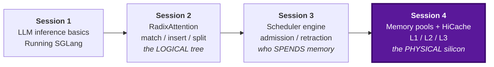
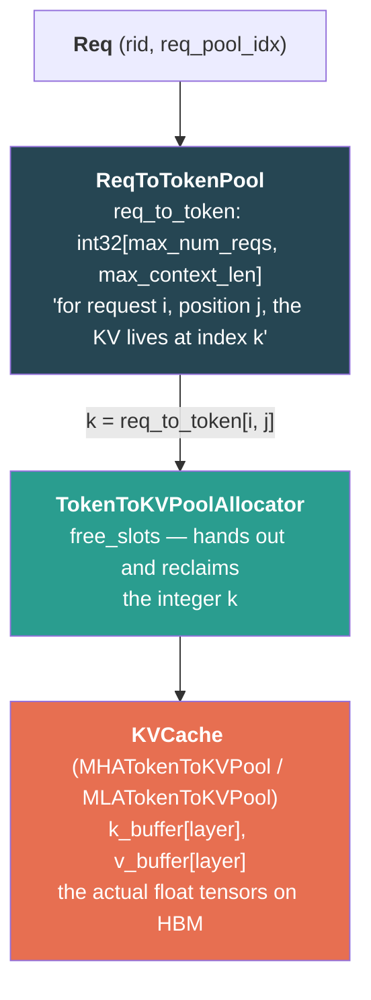
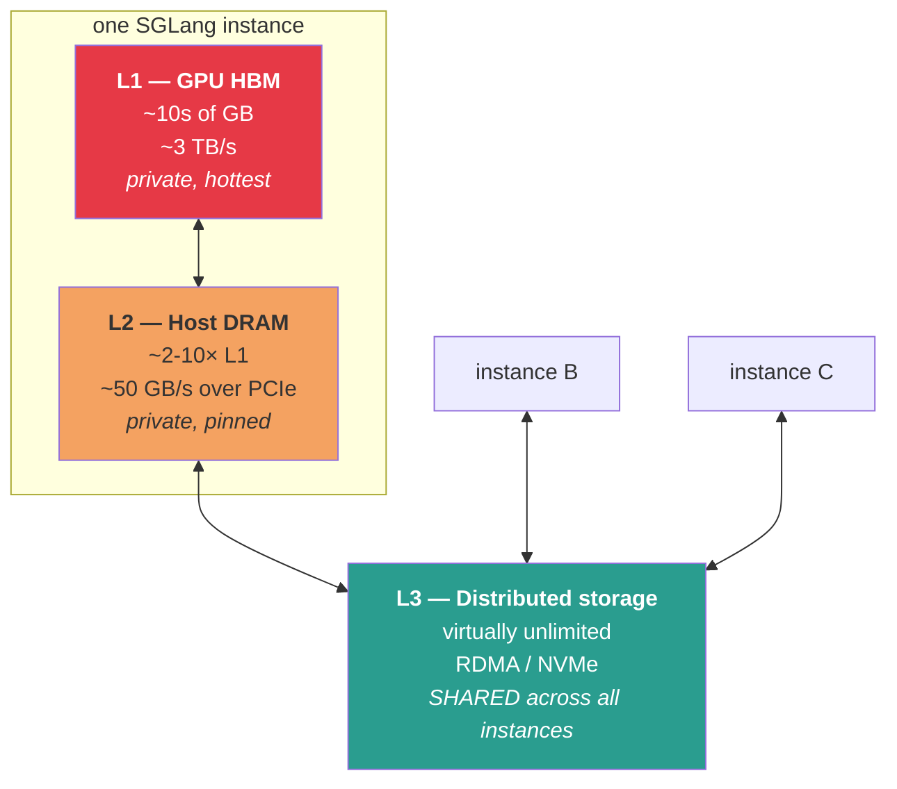
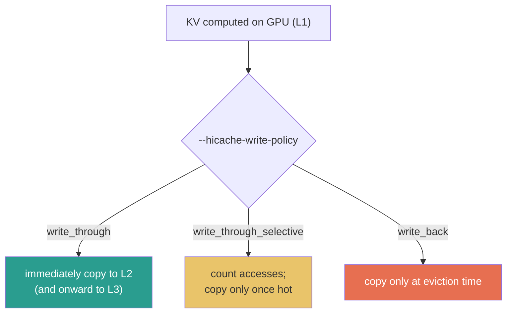
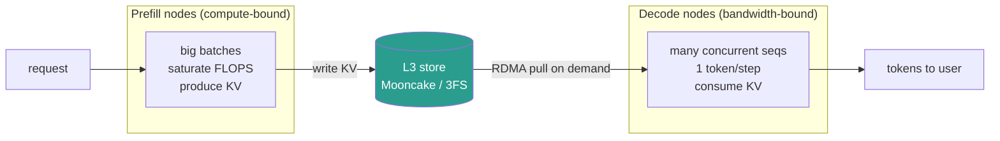

# Session 4 — Part 1: Memory Management & HiCache (Theoretical Seminar)

> **Mapping Logical Pointers to Physical Silicon**
> Seminar material, ~70 minutes.
> Companion to Session 2 (`radix_tree_construction.md` — the logical tree) and
> Session 3 (the scheduler that spends the memory this session accounts for).

---

## Table of Contents & Timing

| # | Section | Time | Cumulative |
|---|---------|------|-----------|
| 0 | Where we are: recap & roadmap | 4 min | 0:04 |
| 1 | Physical vs logical: the two-level memory pool | 16 min | 0:20 |
| 2 | Why HBM is no longer enough | 13 min | 0:33 |
| 3 | HiRadixTree: the multi-tier page table | 11 min | 0:44 |
| 4 | Eviction, spilling, and write policies | 9 min | 0:53 |
| 5 | The real bottleneck: I/O kernels and memory layouts | 13 min | 1:06 |
| 6 | Scaling out: L3, RDMA, and PD-disaggregation | 9 min | 1:15 |
| 7 | Configuration decision guide | 4 min | 1:19 |
| 8 | Discussion questions & self-check | 6 min | 1:25 |

**Learning objectives.** By the end of Part 1 you should be able to:

1. Draw the full indirection chain from a request ID to a physical KV tensor slice.
2. Explain why SGLang separates `ReqToTokenPool` from `TokenToKVPool`, and what `page_size` trades.
3. State the capacity argument for HiCache in numbers, not adjectives.
4. Describe what a HiRadixTree node knows that a RadixTree node does not.
5. Choose between `write_through`, `write_through_selective`, and `write_back` for a given workload.
6. Explain why `layer_first`, `page_first`, and `page_first_direct` exist, and which transfer each optimizes.
7. Compute whether fetching a prefix from L2/L3 beats recomputing it.

---

## 0. Where We Are: Recap & Roadmap (4 min)



Three loose threads from earlier sessions get tied off today:

| Loose thread | Where it was left | Today's resolution |
|---|---|---|
| `TreeNode.value` holds "KV cache indices" | Session 2 §2.1 — but *indices into what?* | §1: into `TokenToKVPool`, via a second pool |
| `evictable_size()` counts as available budget | Session 3 §3.2 — evicted data is simply **gone** | §4: it doesn't have to be. It can spill to L2 |
| Retraction is cheap *if the prefix is still cached* | Session 3 §7.3 — a big *if* under memory pressure | §2: HiCache makes that "if" hold far more often |

The framing sentence for the whole session:

> **Session 2 gave us a tree of token sequences. That tree stores integers, not tensors.
> Today we follow those integers down to the bytes, and then extend the tree past the edge of the GPU.**

---

## 1. Physical vs Logical: The Two-Level Memory Pool (16 min)

### 1.1 Two different things called "the KV cache"

SGLang keeps a strict separation:

| | Logical | Physical |
|---|---|---|
| What | Which *token sequences* are cached | Where the *float tensors* actually live |
| Structure | RadixTree (Session 2) | Two-level memory pool |
| Contents | token IDs + integer indices | `torch.Tensor` buffers on GPU |
| File | `mem_cache/radix_cache.py` | `mem_cache/memory_pool.py`, `mem_cache/allocator.py` |

A `TreeNode` holds `key` (token IDs) and `value` (**integer indices**). It never holds a tensor.
This is the whole reason prefix sharing is free: two requests sharing a prefix share the same
*integers*, and those integers point at one copy of the tensors.

### 1.2 The two pools

`memory_pool.py` opens by stating the design: a request maps to token locations, an allocator
manages indices into the KV data, and a `KVCache` object holds the actual tensors.



**`ReqToTokenPool`** — the request-side map.

```python
self.req_to_token = torch.zeros((size, max_context_len), dtype=torch.int32, device=device)
self.free_slots = list(range(size))
```

A 2-D table: row = request slot, column = token position, value = index into the KV pool.
Each running request occupies exactly one row, obtained in `prepare_for_extend` (Session 3 §5.9)
and released at completion or retraction.

Note the cost: `max_num_reqs × max_context_len × 4 bytes`. At 256 requests × 128K context that is
128 MB of GPU memory *just for the index table* — before a single KV byte. This is one of the
hidden costs of raising `--max-running-requests` or `--context-length`.

**`TokenToKVPoolAllocator`** — the token-side allocator. Owns `free_slots`, exposes
`alloc(need_size)`, `free(indices)`, `available_size()`. Session 3's entire token budget
(`rem_total_tokens`) is arithmetic on this object's free count. The paged variant
(`PagedTokenToKVPoolAllocator`) hands out whole pages instead of individual tokens.

**`KVCache`** — the physical tensors, one buffer per layer. Subclasses handle the different
attention shapes: `MHATokenToKVPool` (separate K and V), `MLATokenToKVPool` (a single latent
buffer), plus SWA and double-sparsity variants.

### 1.3 The full indirection chain

Follow one token, end to end:

```
  Req(rid="abc123")
      │  req_pool_idx = 7                    ← assigned in prepare_for_extend
      ▼
  req_to_token[7, 0:1024] = [901, 902, 903, ..., 1924]
      │                        ▲
      │                        └── these integers came from either
      │                            (a) radix tree prefix_indices  (cache hit — Session 2)
      │                            (b) allocator.alloc()          (cache miss)
      │  token position 5 → index 906
      ▼
  MHATokenToKVPool.k_buffer[layer_id][906]   →  tensor[kv_heads, head_dim]
  MHATokenToKVPool.v_buffer[layer_id][906]   →  tensor[kv_heads, head_dim]
```

**Why the extra hop?** Because it makes the KV pool **non-contiguous per request**. Request 7's
tokens can live at indices 901, 45, 3302, 88 — scattered anywhere. That is what allows:

* two requests to share prefix indices without copying anything,
* a freed request's slots to be reused immediately, without compaction,
* eviction of arbitrary interior nodes of the radix tree.

The price is one indirection per token per layer, which the attention kernels absorb as a
gather. This is the same idea as PagedAttention, arrived at from the prefix-sharing direction.

### 1.4 How much is a token, physically?

**MHA / GQA** (per token, all layers):

```
2 (K and V) × n_layers × n_kv_heads × head_dim × dtype_bytes
```

| Model | Layers | KV heads | head_dim | dtype | Bytes/token |
|---|---|---|---|---|---|
| Llama-3.1-8B | 32 | 8 | 128 | BF16 | 128 KB |
| Llama-3.1-70B | 80 | 8 | 128 | BF16 | 320 KB |
| Llama-3.1-8B | 32 | 8 | 128 | FP8 | 64 KB |

**MLA** (Multi-head Latent Attention — DeepSeek-style) stores one compressed latent instead of
per-head K and V:

```
n_layers × (kv_lora_rank + qk_rope_head_dim) × dtype_bytes
= 61 × (512 + 64) × 2  ≈  70 KB/token   for DeepSeek-V3
```

A 671B model with a *smaller* per-token KV footprint than a 70B MHA model. That asymmetry matters
later: §4 has an MLA-specific write-back optimization precisely because every TP rank holds the
same latent.

> **Exercise for the room.** Your GPU has 60 GB free for KV after weights. How many tokens fit for
> each row above? Now divide by a 32K-token agentic context. How many concurrent sessions?
> (Llama-70B: ~196K tokens ≈ **6 sessions**. This is the entire motivation for §2.)

### 1.5 `page_size`: the granularity dial

Historically SGLang aligned at **1-token granularity**, which is ideal for radix matching — a
prefix can be shared down to the exact token. Larger pages are now supported.

```
page_size = 1                          page_size = 64
------------------------------         ------------------------------
+ maximum prefix-match precision       + 64× fewer index entries
+ best hit rate on diverse prefixes    + far better I/O efficiency (§5)
- one index entry per token            + fewer metadata ops
- tiny scattered I/O to L2/L3          - a 63-token match rounds DOWN to 0 pages
                                       - wasted tail within a page
```

The tension is exact: **matching wants small pages; moving data wants big pages.** Session 2's
`page_aligned()` calls in `match_prefix` and `insert` are where the rounding happens, and
Session 3's `ceil_paged_tokens` is where the admission budget pays for the waste.

Once HiCache enters the picture, the I/O side of that trade gets much heavier — L3 backends store
and transfer at **page** granularity, so `page_size = 1` means one network object per token.
This is why HiCache deployments typically run `--page-size 64` while pure-GPU deployments
happily run 1.

---

## 2. Why HBM Is No Longer Enough (13 min)

### 2.1 The capacity bottleneck

RadixAttention works beautifully — until the tree doesn't fit. Session 3 §4 showed what happens
then: `evict()` frees the LRU leaves, and that KV is **gone**. Recomputing it costs a full prefill.

The workloads that break this are exactly the ones people now care about:

| Workload | Context growth | What happens without HiCache |
|---|---|---|
| Agentic coding | 25K+ tokens by turn 8 | Every turn's history evicted before the user replies |
| Multi-turn chat | grows monotonically | Cache hit rate decays with session age |
| RAG with long instructions | fixed but large | Shared prefix competes with per-request context |
| Tool-calling loops | full history re-sent each step | Pure recomputation, every step |

LMSYS reported the concrete shape of this from a Qwen3-Coder-480B coding-agent deployment:
dialogues commonly ran past 25K tokens by around turn 8, and without full KV retention nearly
every request paid the recomputation cost. Adding HiCache with DeepSeek 3FS as the storage tier
cut average TTFT by 56%, doubled throughput, and moved the hit rate from 40% to 80%.

**The key insight**: the cache hit rate isn't limited by the *algorithm* — RadixAttention already
finds every shareable prefix. It's limited by **capacity**. So add capacity.

### 2.2 The CPU cache analogy



The analogy is deliberate and exact in one respect worth emphasizing:

> **L1 and L2 are private to one inference instance. L3 is shared across the whole cluster** —
> just as a CPU's L1/L2 are per-core while L3 is shared across cores.

That sharing is the point. A system prompt prefilled once on node A becomes a cache hit for
nodes B, C, and D. It also survives instance restarts.

### 2.3 The numbers that decide everything

| Tier | Capacity (typical) | Bandwidth | Latency |
|---|---|---|---|
| L1 — HBM3 | 40–80 GB free | ~3 TB/s | ns |
| L2 — pinned DRAM | 100 GB – 1 TB | ~50 GB/s (PCIe 5 ×16) | µs |
| L3 — RDMA remote DRAM | 10s of TB | ~25–50 GB/s (400 GbE) | 10s of µs |
| L3 — NVMe / 3FS | 100s of TB | ~7 GB/s per drive | 100s of µs |

### 2.4 The break-even rule

This is the single most useful piece of arithmetic in the session.

> **Fetching a cached prefix is worth it only if the transfer is faster than recomputing it.**

For 1000 tokens of Llama-3.1-8B KV:

```
RECOMPUTE:  prefill at ~20,000 tok/s on H100  →  1000 / 20000  =  50 ms
TRANSFER:   1000 × 128 KB = 128 MB
            over PCIe 5 at ~50 GB/s           →  128 MB / 50 GB/s  =  2.6 ms

           → transfer wins by ~20×.  HiCache is obviously correct.
```

**But that 20× margin is theoretical, and it is easy to lose all of it:**

* At `page_size = 1`, that transfer is **1000 separate scattered copies**, not one 128 MB copy.
  Per-operation overhead dominates and effective bandwidth collapses.
* A naive `cudaMemcpyAsync` per page cannot saturate PCIe with small transfers.
* If the transfer is synchronous, the GPU sits idle for its duration — the 2.6 ms becomes 2.6 ms
  of *lost compute*, not overlapped time.

So the entire engineering effort in §5 — custom kernels, layout decoupling, layer-wise overlap —
exists to **protect a margin that already exists in theory.** State this explicitly; it reframes
the whole second half of the session from "optimization trivia" to "defending the core premise."

> Note the corollary: for a **larger** model, recompute is slower (good for HiCache) but the KV is
> also bigger (bad). Work out which effect wins for a 70B model as an exercise.

---

## 3. HiRadixTree: The Multi-Tier Page Table (11 min)

### 3.1 What changes in the node

In RadixAttention, a node's `value` is a tensor of **device** indices. That's it — the node
implicitly asserts "this data is in GPU memory."

HiRadixTree generalizes the node into a **page-table entry**: it records not just *what* tokens
it covers but *where that KV currently resides* — GPU, host, external storage, or several of
those at once. For local tiers it keeps precise metadata including exact addresses.

```
RadixTree node                     HiRadixTree node
------------------                 --------------------------------
key   = [tok, tok, ...]            key        = [tok, tok, ...]
value = device indices             value      = device indices  (L1, may be None)
lock_ref                           host_value = host indices    (L2, may be None)
last_access_time                   hash_value = page hashes     (L3 lookup keys)
                                   lock_ref, loading, writing   (in-flight state)
                                   last_access_time
```

A node can therefore be in several states:

```
  L1 only      ████░░░░░░   just computed, not yet backed up
  L1 + L2      ████████░░   written through; eviction from L1 is now FREE
  L2 only      ░░░░████░░   evicted from GPU, still resident on host
  L2 + L3      ░░░░████████ backed up to cluster storage
  L3 only      ░░░░░░░░████ cold; must be prefetched before use
```

**The state that pays for everything is `L1 + L2`.** When a node is mirrored on the host,
evicting it from the GPU costs *nothing at all* — no recomputation, no data loss, just a pointer
update. Session 3's eviction goes from "lose a future cache hit" to "demote a tier."

### 3.2 L3 is deliberately not tracked in the tree

A design decision worth dwelling on: HiRadixTree does **not** store or continuously synchronize
metadata for L3 contents. Instead it queries the backend in real time when L3 access is needed.

Why:

* L3 is shared cluster-wide and changes constantly from other instances' writes. Any local mirror
  would be stale immediately.
* Keeping a local index of a multi-terabyte shared store costs memory and synchronization traffic
  for data you may never touch.
* The backend already has the metadata. Ask it.

The consequence: an L3 hit costs a **network round trip just to find out whether it's a hit**.
That is why the prefetch path has a *threshold* (§6.2) — it is not worth querying and fetching L3
for a 20-token match.

### 3.3 Local matching returns two segments

The matcher walks the HiRadixTree exactly as in Session 2 — same descent, same node splitting on
partial match, same page-granularity comparison when `page_size > 1`. What differs is the return:

```
request tokens:  [=================== 4096 tokens ===================]

match result:    [==== 1200 in L1 ====][==== 1800 in L2 ====][== 1096 miss ==]
                  ▲                     ▲                     ▲
                  ready to use          must be LOADED         try L3 prefetch,
                  immediately           host → device          else recompute
```

The algorithm returns **one continuous prefix**, with the front part in L1 and the latter part in
L2. It is always L1-then-L2, never interleaved — a consequence of eviction always moving
downward from the front of the tree's hot path.

Because this only walks local metadata and copies no data, local matching stays extremely fast —
the same microsecond-scale operation the scheduler calls once per waiting request (Session 3 §5.2).

### 3.4 Multi-rank synchronization

Under tensor parallelism, every rank runs the same scheduling code on the same inputs
(Session 3 §2.1) — but with HiCache, the ranks can *disagree about the world*. Rank 3's host pool
might hold a prefix that rank 5's does not; an L3 query might succeed on one rank and time out on
another.

If ranks disagree about how many tokens are cached, they will build **different batch shapes**,
and the collective operations inside the model will deadlock or corrupt.

The fix is consensus by minimum:

```
        rank 0 : L3 reports 3072 tokens available
        rank 1 : L3 reports 3072
        rank 2 : L3 reports 2048     ← slowest / partial
        rank 3 : L3 reports 3072
                    │
                    ▼  all_reduce(op=min)
        every rank agrees:  2048
```

`all_reduce(op=min)` is used at (at least) two points:

1. **Before prefetching** — so all ranks agree on the number of L3 hits, and therefore agree on
   whether the prefetch threshold was reached at all.
2. **After prefetching completes or terminates** — so all ranks agree on the prefix length that was
   *successfully* retrieved.

Why `min` and not `max` or a broadcast from rank 0: `min` is the only choice that is guaranteed
**safe**. Any rank claiming more than it actually has would read garbage. Taking the minimum means
the consensus length is one that *every* rank can genuinely serve. It sacrifices a few tokens of
cache hit for correctness — the right trade every time.

---

## 4. Eviction, Spilling, and Write Policies (9 min)

### 4.1 Batch LRU eviction (Session 2, revisited)

Recall from Session 2 §6: eviction gathers `evictable_leaves`, builds a min-heap ordered by the
eviction strategy's `get_priority(node)`, and pops until enough tokens are freed.

Worth re-emphasizing *why* it's shaped that way, since this session is about hardware:

> A textbook LRU keeps a doubly-linked list and moves a node to the head on **every access**.
> In LLM serving, "every access" means every token of every sequence in the batch, every
> iteration — tens of thousands of pointer updates per forward pass, on the critical path of a
> single-threaded scheduler loop (Session 3 §1).
>
> SGLang instead updates only `last_access_time` (a single float write) during the hot path, and
> pays the O(n log n) heapify **once, in a batch, only when eviction is actually needed.**

This is a classic amortization: make the frequent operation O(1) and the rare operation
O(n log n), rather than the reverse.

### 4.2 Hierarchical spilling

The change HiCache makes is small in code and large in consequence:

```
  RadixAttention:     evict leaf  →  allocator.free(indices)  →  DATA GONE
  HiCache:            evict leaf  →  is it already on host?
                                     ├─ yes → just free the device indices (FREE!)
                                     └─ no  → is the write policy write_back?
                                              ├─ yes → spill to L2 first, then free
                                              └─ no  → free (accept the loss)
```

Eviction becomes **demotion**, not deletion. Under `write_through`, the common case is the first
branch — the data is already on the host, so evicting from L1 is nearly free.

### 4.3 The three write policies



| Policy | When data moves down | Best when | Cost |
|---|---|---|---|
| `write_through` | immediately on every access | bandwidth is plentiful; you want maximum hit rate | constant PCIe traffic, including for data never reused |
| `write_through_selective` | after access count crosses a threshold | bus bandwidth is contended; traffic is skewed (a few hot prefixes) | first reuse of a prefix still misses |
| `write_back` | only when evicted from the upper tier | storage capacity is limited; you want maximum memory utilization | eviction becomes slow (a copy on the critical path) |

The intuition mirrors CPU cache design exactly, and the failure modes do too:

* **`write_through` wastes bandwidth** on one-shot prefixes — a unique 30K-token document that
  will never be seen again still gets copied to host memory.
* **`write_through_selective`** is the pragmatic default for mixed traffic: hit-count tracking
  means the shared system prompt gets backed up and the one-off documents don't.
* **`write_back` moves work onto the eviction path**, which is exactly the moment you were
  already under memory pressure. It maximizes capacity efficiency at the cost of latency spikes.

### 4.4 The MLA write-back optimization

A neat consequence of §1.4's shape analysis:

```
MHA under TP=8:   each rank holds 1/8 of each token's KV  →  all 8 ranks must write back
                  ┌──┬──┬──┬──┬──┬──┬──┬──┐
                  │r0│r1│r2│r3│r4│r5│r6│r7│   8 partial writes, all needed
                  └──┴──┴──┴──┴──┴──┴──┴──┘

MLA under TP=8:   every rank holds the SAME complete latent
                  ┌────────────────────────┐
                  │      identical ×8      │   → only ONE rank writes back
                  └────────────────────────┘     7/8 of the traffic eliminated
```

HiCache detects this and has a single rank initiate the write-back for MLA models, avoiding
storing eight identical copies. For a DeepSeek-class deployment this is an 8× reduction in
write-back traffic — not a micro-optimization.

---

## 5. The Real Bottleneck: I/O Kernels and Memory Layouts (13 min)

> Restating §2.4, because this section only makes sense in its light:
> **offloading is pointless if fetching back is slower than recomputing.**
> Everything here defends a margin that theory already granted us.

### 5.1 Two transfer paths, two different problems

```
   L3  ←──────────→  L2  ←──────────→  L1
       (network,          (PCIe,
        RDMA)              cudaMemcpy or custom kernel)

   wants: large contiguous     wants: layer-by-layer access,
          objects, zero-copy          because that's how the GPU computes
```

These two wishes **conflict**, and the conflict is the entire reason three memory layouts exist.

### 5.2 Why the GPU wants `layer_first`

Attention runs layer by layer. When computing layer 7, the kernel needs the K and V for *all*
tokens at layer 7 — and nothing from layer 8 yet. So the natural GPU layout groups by layer:

```
layer_first  (the GPU's native layout)

  layer 0 : [tok0][tok1][tok2] ... [tokN]
  layer 1 : [tok0][tok1][tok2] ... [tokN]
  ...
  layer L : [tok0][tok1][tok2] ... [tokN]
            └──────── contiguous within a layer ────────┘
```

This is also what enables **compute-transfer overlap** (§5.5): you can load layer *N+1* while
computing layer *N*, because layer *N+1*'s data is one contiguous region.

### 5.3 Why storage wants `page_first`

L3 backends store and transfer at **page** granularity. A page is a fixed number of tokens.
Under `layer_first`, one page's data is scattered across *L* separate regions — one per layer. To
ship a page to Mooncake you would need `L` separate reads gathered into a buffer, which defeats
zero-copy entirely.

```
page_first  (the storage layout)

  page 0 : [L0][L1][L2] ... [LN]     ← ALL layers of this page, contiguous
  page 1 : [L0][L1][L2] ... [LN]
           └──── one object, one zero-copy transfer to L3 ────┘
```

Now a page is a single contiguous object. HiCache hands its address and size straight to the
backend, and RDMA moves it with no intermediate copy.

**But this breaks the GPU direction.** With `page_first`, transferring L2 → GPU has to move data
at a granularity of one token per layer — tiny scattered transfers, exactly what §2.4 warned
destroys the bandwidth margin.

### 5.4 `page_first_direct`: the compromise

```
page_first_direct

  page 0 : [L0: tok0 tok1 ... tokP][L1: tok0 tok1 ... tokP] ... [LN: ...]
            └──── all tokens of layer 0 within this page, grouped ────┘
```

All tokens of a *given layer* within a page are grouped together. This keeps the page contiguous
as a whole (good for L3) **and** lets L2→GPU transfers be aggregated at the page-layer level
rather than per-token (good for PCIe).

| Layout | L2 → L3 transfer | L2 → GPU transfer | Use when |
|---|---|---|---|
| `layer_first` | poor (scattered per page) | best (matches GPU) | no L3 backend configured |
| `page_first` | best (one object/page) | poor (per-token granularity) | L3-heavy, transfers dominated by network |
| `page_first_direct` | good | good (page-layer aggregated) | L3 configured — the balanced choice |

The deep point: **HiCache decouples the host pool's layout from the GPU's layout.** The host
memory pool is not required to mirror the device pool's arrangement. That decoupling is what makes
the three-way choice possible at all.

### 5.5 GPU-assisted I/O kernels

`--hicache-io-backend` picks how bytes actually cross PCIe:

| Value | Mechanism | Notes |
|---|---|---|
| `direct` | standard CUDA memory copies (`cudaMemcpyAsync`) | simple, portable, baseline |
| `kernel` | custom GPU-assisted I/O kernels | **up to 3× higher throughput**; recommended |

Why a kernel beats `cudaMemcpyAsync` here: the copy engine is optimized for *one large contiguous
region*. KV transfer is inherently a **gather/scatter over many small, non-contiguous slices**
(remember §1.3 — indices are scattered by design). A custom kernel launches many GPU threads that
each handle a slice in parallel, using the GPU's massive thread parallelism to hide per-slice
latency — turning a latency-bound problem into a bandwidth-bound one.

This is the same structural trick as §4.1's batch heapify: reshape the problem so the hardware's
strength applies.

### 5.6 Compute-transfer overlap

The final piece: don't let the transfer cost wall-clock time at all.

```
without overlap
---------------
  [── load all layers from host ──][── compute layer 0..L ──]
   GPU idle during load                  bus idle during compute

with layer-wise overlap
-----------------------
  load:     [L0][L1][L2][L3][L4] ...
  compute:      [L0][L1][L2][L3] ...
                 ▲
                 computing layer N while layer N+1 streams in
   → transfer latency is hidden behind compute; only L0's load is exposed
```

During prefill, HiCache concurrently loads layer *N+1*'s KV while the GPU computes layer *N*.
Structurally identical to Session 3 §6's overlap scheduling — same idea (pipeline two resources
that would otherwise serialize), different resources (PCIe and SMs instead of CPU and GPU).

> **Pattern worth naming for the room.** Session 3 overlapped CPU with GPU. Session 4 overlaps
> PCIe with GPU. Both are one-deep software pipelines built on the same observation: *if two
> resources are idle at different times, shift one's work into the other's idle window.*

---

## 6. Scaling Out: L3, RDMA, and PD-Disaggregation (9 min)

### 6.1 The unified storage interface

All L3 read/write/query operations sit behind one abstract base class, `HiCacheStorage`. Adding a
backend means implementing that interface — nothing above it changes.

| Backend | What it is | Good for |
|---|---|---|
| **Mooncake** | RDMA-based distributed KV store, multi-NIC, zero-copy | large clusters with RDMA fabric |
| **DeepSeek 3FS (HF3FS)** | Kubernetes-native distributed filesystem | K8s deployments, huge historical caches |
| **NIXL** | unified API over plugins (3FS, GPU Direct Storage, S3-compatible) | heterogeneous or cloud storage |
| **AIBrix KVCache** | production offloading framework with cross-engine reuse | multi-engine environments |
| **file** | simple local-file backend | demos and testing — start here |

(LMCache exists as an *alternative* hierarchical-cache solution via `--enable-lmcache`, rather
than as an L3 backend under HiCache.)

### 6.2 Prefetch: the L3 read path

Because L3 lookups cost a round trip (§3.2), fetching is *speculative* and needs a policy.

**Trigger.** After local matching, HiCache queries L3 for the continuation. If the L3 hit exceeds
a threshold — **default 256 tokens**, configurable — a prefetch is launched.

**Termination policy** (`--hicache-storage-prefetch-policy`):

| Policy | Behaviour | Choose when |
|---|---|---|
| `best_effort` | stop as soon as the GPU could start prefill; never wait | latency is sacred |
| `wait_complete` | wait for the full prefetch | hit rate is sacred; throughput-oriented |
| `timeout` | stop at a deadline or on completion | production — bounds the tail |

The timeout is length-aware rather than a flat constant:

```python
timeout = min(
    prefetch_timeout_max,                        # default 30 s
    prefetch_timeout_base                        # default 2 s
    + prefetch_timeout_per_ki_token * num_token_to_fetch / 1024,   # default 0.1 s / 1Ki tokens
)
```

A base term for fixed overhead (scheduling, synchronization), a linear term proportional to the
data, and a hard cap so a 500K-token prompt can't wait forever. Sensible control design worth
pointing out — it's the same shape as a TCP retransmission timeout.

Whatever arrived by the deadline is used; the rest is recomputed. Partial prefetch is still a win.

### 6.3 Zero-copy RDMA

```
   traditional path                          RDMA zero-copy path
   -------------------------------           -------------------------------
   remote DRAM                               remote DRAM
     → NIC → kernel socket buffer              → NIC ──────────┐
     → user buffer                                             │ (bypasses OS kernel,
     → pinned host buffer                                      │  no CPU involvement)
     → GPU                                     pinned host buffer (L2)
                                                 → GPU
   4+ copies, CPU in the loop                  1 network transfer, CPU idle
```

HiCache passes raw addresses and sizes directly to the backend, which hands them to the NIC. The
`page_first` layouts (§5.3) are what make those addresses describe **one contiguous object** —
without them, there is nothing to pass zero-copy.

> Practical caveat worth mentioning: this requires the host pool to be **RDMA-registered**, and
> some fabrics (e.g. eRDMA) cap total registerable memory. Mooncake's docs note that exceeding
> that limit causes registration failure, fixed by reducing either the segment size or the HiCache
> host pool. A good example of a hardware constraint leaking into a config file.

### 6.4 PD-disaggregation

The cluster-scale architecture that all of this enables:



Session 3 §1.2 established that prefill and decode have **opposite hardware bottlenecks**, and
Session 3 §1.3 noted DistServe's conclusion: if they fight, stop making them share a GPU.
PD-disaggregation is that conclusion in production, and L3 is the medium that makes it practical —
prefill nodes write KV to L3, decode nodes pull chunks on demand over RDMA.

HiCache can be enabled on **both** sides. On decode nodes, the decode output is also written back
to L3, so the next turn of a conversation hits cache no matter which node serves it.

This closes the loop on the whole four-session arc:

> Session 2 shared prefixes **between requests on one GPU**.
> Session 4 shares them **between nodes across a cluster, and across restarts.**
> Same tree, same match/insert, five orders of magnitude more capacity.

---

## 7. Configuration Decision Guide (4 min)

Start here, adjust from measurement:

```bash
# Level 0 — no HiCache. Baseline. Always measure this first.
python -m sglang.launch_server --model-path <model>

# Level 1 — L2 only (host DRAM). Single instance, moderate context.
#           The fastest way to see whether HiCache helps you at all.
python -m sglang.launch_server --model-path <model> \
  --enable-hierarchical-cache \
  --hicache-ratio 2 \
  --hicache-io-backend kernel

# Level 2 — L2 + L3 with a local file backend. Validates the L3 path
#           without needing a cluster.
python -m sglang.launch_server --model-path <model> \
  --enable-hierarchical-cache --hicache-ratio 2 \
  --hicache-io-backend kernel \
  --page-size 64 \
  --hicache-mem-layout page_first_direct \
  --hicache-storage-backend file \
  --hicache-storage-prefetch-policy timeout

# Level 3 — production cluster with Mooncake over RDMA.
python -m sglang.launch_server --model-path <model> --tp 8 \
  --enable-hierarchical-cache --hicache-ratio 2 \
  --hicache-io-backend kernel \
  --page-size 64 \
  --hicache-mem-layout page_first_direct \
  --hicache-write-policy write_through \
  --hicache-storage-backend mooncake \
  --hicache-storage-prefetch-policy timeout
```

| Parameter | Meaning | Guidance |
|---|---|---|
| `--enable-hierarchical-cache` | master switch | required for everything else |
| `--hicache-ratio R` | L2 size = R × L1 size | **must be > 1**; default behaviour is 2 |
| `--hicache-size G` | L2 size in GB, **per rank** | overrides ratio; 30 with TP=8 → 240 GB total |
| `--page-size P` | tokens per page | 1 for pure-GPU; 64 when L3 is in play |
| `--hicache-write-policy` | when data moves down | see §4.3 |
| `--hicache-io-backend` | `direct` vs `kernel` | `kernel` unless it breaks |
| `--hicache-mem-layout` | host pool layout | `page_first_direct` with L3; `layer_first` without |
| `--hicache-storage-backend` | L3 implementation | `file` to learn, `mooncake`/`hf3fs` in production |
| `--hicache-storage-prefetch-policy` | when to stop prefetching | `timeout` in production |
| `--hicache-storage-backend-extra-config` | JSON string or `@file` | tune `prefetch_threshold`, timeout terms |

**On sizing.** Bigger L2 generally means a higher hit rate — but the relationship is **not
linear**. Once the hot working set fits, additional capacity buys very little. Measure the hit
rate at two sizes before buying more RAM.

---

## 8. Discussion Questions & Self-Check (6 min)

**Conceptual**

1. Why does SGLang need `ReqToTokenPool` at all? What breaks if each request simply owned a
   contiguous KV range?
2. `page_size = 1` maximizes cache hit rate but is bad for HiCache. Explain both halves precisely,
   and propose a workload where 1 is still correct even with L3 enabled.
3. A node is in state "L1 + L2". Session 3's `evictable_size()` counts its tokens as available
   budget. Is that accounting still correct? What has changed about the *cost* of eviction?
4. Why `all_reduce(op=min)` rather than `max`, or a broadcast from rank 0? Construct the specific
   failure that `max` would cause.
5. HiRadixTree tracks L1 and L2 addresses precisely but queries L3 on demand. Give one scenario
   where caching L3 metadata locally would help, and explain why SGLang still doesn't.
6. `write_through` and `write_back` are opposite ends of a trade. Name a workload for each where
   the *other* one would be actively harmful.
7. Both Session 3 §6 and Session 4 §5.6 describe a one-deep pipeline. What resources does each
   overlap, and what is the analogue of "future tokens" in the HiCache case?

**Quantitative**

8. Llama-3.1-70B, BF16, 60 GB of free HBM. (a) How many tokens of L1? (b) With
   `--hicache-ratio 2`, how many tokens of L2? (c) How many 32K-token agent sessions fit in each?
9. Recomputing 4000 tokens of prefill takes 200 ms. Those 4000 tokens are 1.25 GB of KV. Your
   PCIe link achieves 40 GB/s effective. Is fetching worth it? Now recompute assuming the transfer
   only achieves 4 GB/s because of scattered small pages — does the answer change?
10. TP=8, MLA model, `write_through`. Roughly how much write-back traffic does the single-rank
    optimization save per token, in bytes, for DeepSeek-V3's ~70 KB/token?

**Predict the behaviour**

11. You enable HiCache and throughput gets *worse*. List three plausible causes and the config
    change for each.
12. `--hicache-storage-prefetch-policy wait_complete` with a slow L3 backend. What happens to TTFT?
    Which of the three policies fixes it, and what do you give up?
13. You set `--hicache-ratio 0.5`. What happens, and why is that constraint imposed?

---

## Appendix A — Glossary

| Term | Meaning |
|---|---|
| **ReqToTokenPool** | `[max_num_reqs, max_context_len]` int32 table mapping (request, position) → KV index |
| **TokenToKVPoolAllocator** | Owns free KV indices; `alloc` / `free` / `available_size` |
| **KVCache** | The physical per-layer tensors (`MHATokenToKVPool`, `MLATokenToKVPool`, …) |
| **L1 / L2 / L3** | GPU HBM / host DRAM (pinned) / distributed storage |
| **HiRadixTree** | Radix tree whose nodes record *which tier* holds each segment |
| **Local match** | Walk of the local tree returning an L1 prefix + an L2 prefix |
| **Prefetch** | Speculative L3 → L2 load, triggered above a hit threshold |
| **Write-back / write-through** | Policies for moving data from a faster tier to a slower one |
| **Spilling** | Eviction that demotes to the next tier instead of deleting |
| **`layer_first`** | Host layout grouped by layer — GPU-friendly |
| **`page_first`** | Host layout grouped by page — storage-friendly, zero-copy |
| **`page_first_direct`** | Page-contiguous, with each layer's tokens grouped inside the page |
| **Zero-copy** | Passing addresses to the NIC/backend instead of staging through buffers |
| **PD-disaggregation** | Separate prefill and decode nodes, exchanging KV via L3 |

## Appendix B — Further Reading

* **SGLang HiCache design doc** — `https://docs.sglang.io/advanced_features/hicache_design.html`
  (the authoritative reference for every flag in §7)
* **LMSYS HiCache blog** (2025-09-10) — benchmarks, the 3× kernel result, layout figures
* **Mooncake × SGLang integration docs** — L3 backend setup, RDMA registration limits
* **PagedAttention / vLLM (SOSP '23)** — the other route to the same two-level pool idea
* **DistServe (OSDI '24)** — the argument for PD-disaggregation
* **Sarathi-Serve (OSDI '24)** — Session 3's chunked prefill, for contrast on the compute side

## Appendix C — Bridge to Session 5

We have now followed a request from HTTP through the scheduler (Session 3), into the radix tree
(Session 2), down to physical tensors, and out across the cluster (today). The remaining
unexplored box is the one Session 3 handed off at `get_model_worker_batch()`:

> **The forward pass itself** — `ModelWorkerBatch` → `ForwardBatch` → attention backends
> (FlashInfer / FA3 / Triton) → how `out_cache_loc` and `req_to_token` become page tables inside
> the attention kernel → CUDA graph capture and replay for decode.

Today's §1.3 indirection chain is exactly what that kernel has to traverse, so Session 4 is the
natural prerequisite.
