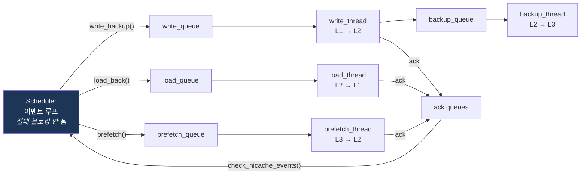

# SGLang 메모리 관리와 HiCache: 논리 포인터에서 물리 실리콘까지

Session 2에서 본 **논리적 트리**가 실제로 어떤 물리 메모리를 가리키는지,
그리고 그 메모리가 GPU 밖으로 어떻게 확장되는지에 대한 코드 레벨 워크스루.

> Session 2 (`radix_tree_construction.md`) → 트리의 **구조**
> Session 3 (`session3_part2_codebase_ko.md`) → 그 메모리를 **쓰는 주체**
> Session 4 (이 문서) → 그 메모리의 **정체와 확장**

---

## 0. 시작하기 전에

### 0.1 이 문서의 검증 수준 — 반드시 읽을 것

이 문서의 **설계 설명과 파라미터**는 SGLang 공식 문서
(`docs.sglang.io/advanced_features/hicache_design.html`)와 LMSYS HiCache 블로그(2025-09-10)를
직접 대조해 작성했다. 따라서 다음은 신뢰해도 된다:

- 3-tier 구조, 로컬 매칭/프리페치/라이트백 워크플로
- 모든 `--hicache-*` 플래그의 의미와 기본값
- 프리페치 임계값(256 토큰)과 타임아웃 공식
- `layer_first` / `page_first` / `page_first_direct`의 정확한 차이
- `all_reduce(op=min)`이 쓰이는 두 지점
- MLA 단일 랭크 라이트백 최적화

반면 **코드 블록은 구조를 보여주기 위한 재구성**이다. 클래스명과 함수명은 실제와 맞지만,
시그니처와 내부 구현은 브랜치마다 다르다. HiCache는 지금도 활발히 개발 중이라
Session 2, 3보다 변동폭이 크다. **아래 grep을 먼저 돌려서 본인 체크아웃과 대조하자.**

### 0.2 코드 탐색용 grep

```bash
cd python/sglang/srt

# 물리 메모리 풀
grep -n "class ReqToTokenPool\|class KVCache\|class MHATokenToKVPool\|class MLATokenToKVPool" mem_cache/memory_pool.py
grep -n "def alloc\|def free\|def write\|def available_size" mem_cache/memory_pool.py
grep -n "class BaseTokenToKVPoolAllocator\|class TokenToKVPoolAllocator\|class PagedTokenToKVPoolAllocator" mem_cache/allocator.py

# L2 호스트 풀
grep -n "class HostKVCache\|class MHATokenToKVPoolHost\|class MLATokenToKVPoolHost" mem_cache/memory_pool_host.py
grep -n "layer_first\|page_first\|page_first_direct" mem_cache/memory_pool_host.py

# HiRadixTree
grep -n "class HiRadixCache\|def init_load_back\|def write_backup\|def check_hicache_events" mem_cache/hiradix_cache.py
grep -n "host_value\|hash_value\|loading\|writing" mem_cache/hiradix_cache.py

# 캐시 컨트롤러 (비동기 전송의 심장)
grep -n "class HiCacheController\|class CacheOperation\|class StorageOperation\|class PrefetchOperation\|class TransferBuffer" managers/cache_controller.py
grep -n "write_thread_func\|load_thread_func\|prefetch_thread_func\|backup_thread_func" managers/cache_controller.py
grep -n "write_queue\|load_queue\|prefetch_queue\|backup_queue\|ack_" managers/cache_controller.py

# L3 스토리지
grep -n "class HiCacheStorage" mem_cache/hicache_storage.py
ls mem_cache/storage/                 # mooncake_store, hf3fs, nixl, aibrix_kvcache, lmcache, file

# 스케줄러 배선
grep -n "def init_memory_pool_and_cache\|HiRadixCache(" managers/scheduler.py
```

### 0.3 파일 지도

| 파일 | 들어 있는 것 |
|---|---|
| `mem_cache/memory_pool.py` | `ReqToTokenPool`, `KVCache` 및 서브클래스 (L1 물리 텐서) |
| `mem_cache/allocator.py` | `TokenToKVPoolAllocator`, `PagedTokenToKVPoolAllocator` (인덱스 할당) |
| `mem_cache/memory_pool_host.py` | `HostKVCache`, `MHATokenToKVPoolHost` (L2 핀 메모리 + 레이아웃) |
| `mem_cache/radix_cache.py` | `RadixCache`, `TreeNode` (Session 2) |
| `mem_cache/hiradix_cache.py` | `HiRadixCache` — 3-tier로 확장된 트리 |
| `managers/cache_controller.py` | `HiCacheController` — 백그라운드 전송 스레드/큐 |
| `mem_cache/hicache_storage.py` | `HiCacheStorage` ABC — L3 통합 인터페이스 |
| `mem_cache/storage/` | mooncake / hf3fs / nixl / aibrix / file 백엔드 구현 |
| `managers/scheduler.py` | `init_memory_pool_and_cache` — 모든 것을 배선하는 곳 |
| `server_args.py` | `--hicache-*` 플래그 파싱 및 검증 |

---

## 1. 두 단계 메모리 풀 (12분)

### 1.1 `memory_pool.py`가 스스로 밝히는 설계

파일 상단 docstring이 구조를 그대로 요약한다: 풀은 두 단계이며,
`ReqToTokenPool`은 요청을 토큰 위치로, `TokenToKVPoolAllocator`는 그 인덱스를 관리하고,
`KVCache`가 실제 물리 KV를 들고 있다.

```
┌────────────────────────────────────────────────────────────────┐
│  Req(rid, req_pool_idx=7)                                      │
└───────────────────────────┬────────────────────────────────────┘
                            │ req_pool_idx
                            ▼
┌────────────────────────────────────────────────────────────────┐
│  ReqToTokenPool                                                │
│    req_to_token: int32[max_num_reqs, max_context_len]          │
│    req_to_token[7] = [901, 902, 903, ... , 1924]               │
└───────────────────────────┬────────────────────────────────────┘
                            │ KV 인덱스 (정수!)
                            ▼
┌────────────────────────────────────────────────────────────────┐
│  TokenToKVPoolAllocator                                        │
│    free_slots — 이 정수를 발급하고 회수한다                       │
│    alloc(n) / free(indices) / available_size()                 │
└───────────────────────────┬────────────────────────────────────┘
                            │
                            ▼
┌────────────────────────────────────────────────────────────────┐
│  KVCache (MHATokenToKVPool)                                    │
│    k_buffer[layer][906] -> Tensor[kv_heads, head_dim]          │
│    v_buffer[layer][906] -> Tensor[kv_heads, head_dim]          │
│    ← 여기가 진짜 float 텐서. HBM 위에 있다.                       │
└────────────────────────────────────────────────────────────────┘
```

### 1.2 `ReqToTokenPool` — 요청 쪽 매핑

**파일**: `python/sglang/srt/mem_cache/memory_pool.py`
(DeepWiki 기준 클래스 정의 126~188행, `alloc` 155~179행, `write` 149~150행 — 직접 확인 요망)

```python
class ReqToTokenPool:
    def __init__(self, size, max_context_len, device, enable_memory_saver):
        # (요청 슬롯, 토큰 위치) -> KV 캐시 인덱스
        self.req_to_token = torch.zeros(
            (size, max_context_len), dtype=torch.int32, device=device
        )
        self.free_slots = list(range(size))

    def write(self, indices, values):
        self.req_to_token[indices] = values

    def alloc(self, need_size):
        # 청크 프리필이나 이미 커밋된 KV가 있는 경우
        # 기존 인덱스를 재사용하는 경로도 있다
        ...

    def free(self, free_index):
        self.free_slots.extend(...)
```

**초보자를 위한 정리**:

1. 이건 **2차원 표**다. 행 = 요청 슬롯, 열 = 토큰 위치, 값 = KV 풀 인덱스.
2. 실행 중인 요청 하나가 정확히 한 행을 차지한다.
3. 그 행은 Session 3 §5.9의 `prepare_for_extend`에서 `alloc_req_slots`로 얻고,
   요청 종료(`release_kv_cache`) 또는 리트랙션(`reset_for_retract`에서 `req_pool_idx = None`)
   때 반납된다.

> ⚠️ **숨은 비용**: 이 표 자체가 `max_num_reqs × max_context_len × 4 bytes`를 먹는다.
> 256 요청 × 128K 컨텍스트 = **128 MB**. KV 한 바이트도 담기 전에 GPU 메모리가 나간다.
> `--max-running-requests`나 `--context-length`를 올릴 때 아무도 얘기 안 해 주는 비용이다.

### 1.3 `TokenToKVPoolAllocator` — 토큰 쪽 할당자

**파일**: `python/sglang/srt/mem_cache/allocator.py`
(`PagedTokenToKVPoolAllocator`는 227~248행 근방)

```python
class TokenToKVPoolAllocator(BaseTokenToKVPoolAllocator):
    def available_size(self) -> int:
        return len(self.free_slots)           # ← Session 3 예산의 출발점

    def alloc(self, need_size: int) -> torch.Tensor:
        if need_size > len(self.free_slots):
            return None
        select_index = self.free_slots[:need_size]
        self.free_slots = self.free_slots[need_size:]
        return select_index

    def free(self, free_index: torch.Tensor):
        self.free_slots = torch.cat([self.free_slots, free_index])

    def free_group_begin(self): ...           # free 호출을 모아서 처리
    def free_group_end(self): ...
```

> **Session 3와의 연결점**. `PrefillAdder.rem_total_tokens`의
> `self.token_to_kv_pool_allocator.available_size()`가 바로 이 `len(self.free_slots)`다.
> Session 3에서 "토큰 예산"이라고 부른 추상적인 숫자의 정체는 **이 리스트의 길이**다.

페이지 버전(`PagedTokenToKVPoolAllocator`)은 개별 토큰이 아니라 페이지 단위로 발급한다.
그래서 Session 3의 `ceil_paged_tokens`와 `new_page_count_next_decode()`가 존재한다.

### 1.4 `KVCache` — 진짜 텐서

```python
class MHATokenToKVPool(KVCache):
    def __init__(self, size, page_size, dtype, head_num, head_dim,
                 layer_num, device, start_layer, ...):
        # 레이어마다 버퍼 하나씩
        self.k_buffer = [
            torch.zeros((size + page_size, head_num, head_dim),
                        dtype=dtype, device=device)
            for _ in range(layer_num)
        ]
        self.v_buffer = [...]

    def get_kv_buffer(self, layer_id):
        return self.k_buffer[layer_id], self.v_buffer[layer_id]

    def set_kv_buffer(self, layer, loc, cache_k, cache_v):
        self.k_buffer[layer.layer_id][loc] = cache_k
        self.v_buffer[layer.layer_id][loc] = cache_v
```

**주목할 점 두 가지**:

1. `size + page_size` — 뒤에 여분이 붙는다. 인덱스 0은 보통 패딩 슬롯으로 예약되어,
   유효하지 않은 위치를 안전하게 가리킬 수 있게 한다.
2. **레이어별 리스트**다. 하나의 거대한 4D 텐서가 아니다.
   이게 §5의 `layer_first` 레이아웃이 "GPU의 자연스러운 형태"인 이유이고,
   레이어 단위 오버랩(§6.3)이 가능한 이유다.

MLA 버전은 K/V를 나누지 않고 압축된 latent 버퍼 하나만 갖는다:

```python
class MLATokenToKVPool(KVCache):
    def __init__(self, ..., kv_lora_rank, qk_rope_head_dim, ...):
        self.kv_buffer = [
            torch.zeros((size + page_size, 1, kv_lora_rank + qk_rope_head_dim),
                        dtype=dtype, device=device)
            for _ in range(layer_num)
        ]
```

이 형태 차이가 §7.4의 MLA 전용 라이트백 최적화로 이어진다.

### 1.5 트레이스 A — 인덱스 3단 추적

요청 하나가 프리필될 때 실제로 무슨 일이 벌어지는지, Session 3 §5.9와 이어서 보자.

```
상황: 요청 X, 프롬프트 1024 토큰, radix tree에 앞 512 토큰이 캐시되어 있음

[1] Session 2: match_prefix()
    -> device_indices = [901, 902, ..., 1412]   (512개, 이미 존재하는 KV 인덱스)
    -> req.prefix_indices = 이 512개
    -> req.extend_input_len = 1024 - 512 = 512

[2] Session 3: prepare_for_extend()
    req_pool_indices = self.alloc_req_slots(1)        -> req.req_pool_idx = 7

    # (a) 캐시된 prefix를 이 요청의 행에 "복사"한다 (정수 복사, 텐서 복사 아님!)
    self.req_to_token_pool.write(
        (7, slice(0, 512)), req.prefix_indices
    )
    # 이제 req_to_token[7, 0:512] = [901, 902, ..., 1412]
    #      ^^^ 다른 요청과 "같은 정수"를 가리킨다. 이게 prefix sharing의 실체.

    # (b) 계산해야 하는 512개만 새로 할당
    out_cache_loc = self.alloc_token_slots(512)       -> [5000, 5001, ..., 5511]
    # req_to_token[7, 512:1024] = [5000, ..., 5511]

[3] 포워드 패스 (Session 5 영역)
    attention 커널이 req_to_token[7, :]을 page table로 읽어서
    k_buffer[layer][901], k_buffer[layer][902], ... 를 gather 한다

[4] Session 3 §8: 종료 시 release_kv_cache()
    -> cache_finished_req() -> insert() -> tree에 [5000..5511] 등록
    -> 중복 인덱스와 정렬 안 된 tail은 allocator.free()로 반납
```

**세미나에서 반드시 짚을 것**: (2a)에서 복사되는 것은 **정수 512개**다.
512 × 128 KB = 64 MB의 텐서는 단 1바이트도 움직이지 않는다.
Session 2가 말한 "prefix 재사용"의 물리적 실체가 정확히 이것이다.

---

## 2. `page_size`: 매칭과 I/O의 충돌 (5분)

```
page_size = 1                          page_size = 64
------------------------------         ------------------------------
+ 토큰 단위 정확한 prefix 매칭            + 인덱스 엔트리 64배 감소
+ 다양한 prefix에서 최고 히트율            + I/O 효율 극대화 (§5, §6)
- 토큰당 인덱스 1개                       + 메타데이터 연산 감소
- L2/L3로 보낼 때 잘게 흩어진 I/O          - 63토큰 매칭은 0페이지로 내림
                                       - 페이지 내부 tail 낭비
```

코드에서 이 반올림이 일어나는 지점들:

| 위치 | 함수 | 하는 일 |
|---|---|---|
| Session 2 | `RadixKey.page_aligned(page_size)` | 매칭 키를 페이지 경계로 절단 |
| Session 2 | `RadixKey.child_key(page_size)` | 첫 `page_size` 토큰을 dict 키로 |
| Session 3 | `PrefillAdder.ceil_paged_tokens()` | 예산 계산 시 올림 |
| Session 3 | `ScheduleBatch.new_page_count_next_decode()` | 다음 디코드에 필요한 페이지 수 |

> **핵심**: 매칭은 작은 페이지를 원하고, 데이터 이동은 큰 페이지를 원한다.
> HiCache가 없으면 매칭만 신경 쓰면 되므로 `page_size=1`이 합리적이다.
> **L3를 붙이는 순간 `page_size=1`은 "토큰 하나당 네트워크 객체 하나"를 의미하게 되어
> 재앙이 된다.** HiCache 배포에서 `--page-size 64`를 쓰는 이유다.

---

## 3. `HiRadixCache`: 트리를 3단으로 확장 (12분)

### 3.1 노드가 페이지 테이블이 된다

**파일**: `python/sglang/srt/mem_cache/hiradix_cache.py`

Session 2의 `TreeNode`는 `value`에 **device 인덱스**만 들고 있었다. 즉 노드는
"이 데이터는 GPU에 있다"를 암묵적으로 단언한다.

HiRadixTree의 노드는 **어느 계층에 있는지를 명시적으로 기록**한다:

```python
# 개념적 확장 (실제 필드명은 grep으로 확인)
class TreeNode:
    key         # 토큰 ID 시퀀스              (Session 2와 동일)
    value       # L1 device 인덱스, 없으면 None
    host_value  # L2 host 인덱스,   없으면 None      <-- 신규
    hash_value  # L3 조회용 페이지 해시 리스트          <-- 신규
    lock_ref    # 사용 중인 요청 수            (Session 2와 동일)
    loading     # L2 -> L1 로드 진행 중          <-- 신규
    writing     # L1 -> L2 백업 진행 중          <-- 신규
    last_access_time
```

노드가 가질 수 있는 상태:

```
  L1만        ████░░░░░░   방금 계산됨, 아직 백업 안 됨
  L1 + L2     ████████░░   write_through 완료. GPU에서 축출해도 "공짜"
  L2만        ░░░░████░░   GPU에서 축출됨, 호스트에는 남아 있음
  L2 + L3     ░░░░████████ 클러스터 스토리지까지 백업됨
  L3만        ░░░░░░░░████ 콜드. 쓰려면 프리페치 필요
```

> **이 표에서 가장 중요한 줄은 `L1 + L2`다.**
> 노드가 호스트에 미러링되어 있으면 GPU에서 축출하는 비용이 **0**이다.
> 재계산도, 데이터 손실도 없고 포인터만 바뀐다.
> Session 3 §4의 축출이 "미래 캐시 히트를 잃는 것"에서 "계층을 강등하는 것"으로 바뀐다.

### 3.2 L3는 일부러 트리에 넣지 않는다

공식 문서가 명시하는 설계 결정: HiRadixTree는 **L3 메타데이터를 저장하거나 지속적으로
동기화하지 않는다.** 대신 L3에 접근해야 할 때 백엔드에 실시간으로 질의한다.

이유 세 가지:

1. L3는 클러스터 전체가 공유하며 다른 인스턴스의 쓰기로 계속 변한다. 로컬 미러는 즉시 낡는다.
2. 수 TB짜리 공유 저장소의 인덱스를 로컬에 들고 있으면 메모리와 동기화 트래픽이 낭비된다.
   그것도 영원히 안 건드릴 데이터에 대해서.
3. 백엔드가 이미 메타데이터를 갖고 있다. 물어보면 된다.

**그 대가**: L3 히트인지 아닌지 확인하는 것만으로도 **네트워크 왕복**이 든다.
그래서 프리페치 경로에 임계값(§6.2, 기본 256토큰)이 있다.
20토큰 매칭을 위해 L3에 질의하고 가져오는 건 수지가 안 맞는다.

### 3.3 로컬 매칭은 두 구간을 반환한다

매칭 알고리즘 자체는 Session 2와 동일하다 — 루트에서 내려가며, 부분 매칭이면 노드를 split하고,
`page_size > 1`이면 페이지 단위로 비교한다. 다른 것은 **반환값**이다.

```
요청 토큰:      [==================== 4096 토큰 ====================]

매칭 결과:      [==== 1200 in L1 ====][==== 1800 in L2 ====][== 1096 miss ==]
                 ▲                     ▲                     ▲
                 즉시 사용 가능           로드 필요              L3 프리페치 시도,
                                        host -> device        실패하면 재계산
```

**연속된 하나의 prefix**를 반환하되, 앞부분은 L1에 뒷부분은 L2에 있다.
L1과 L2가 뒤섞이는 일은 없다 — 축출이 항상 트리의 hot path 앞쪽에서 아래로만 진행되기 때문이다.

로컬 매칭은 로컬 메타데이터만 순회하고 데이터를 전혀 복사하지 않으므로 **매우 빠르다.**
Session 3 §5.2에서 스케줄러가 대기 요청마다 매 이터레이션 호출하던 그 마이크로초급 연산 그대로다.

### 3.4 스케줄러 배선

**파일**: `python/sglang/srt/managers/scheduler.py` — `init_memory_pool_and_cache()`

```python
def init_memory_pool_and_cache(self):
    # ... req_to_token_pool, token_to_kv_pool_allocator 생성 ...

    if self.server_args.enable_hierarchical_cache:
        self.tree_cache = HiRadixCache(
            req_to_token_pool=self.req_to_token_pool,
            token_to_kv_pool_allocator=self.token_to_kv_pool_allocator,
            tp_cache_group=...,
            page_size=self.page_size,
            hicache_ratio=self.server_args.hicache_ratio,
            hicache_size=self.server_args.hicache_size,
            hicache_write_policy=self.server_args.hicache_write_policy,
            hicache_io_backend=self.server_args.hicache_io_backend,
            hicache_mem_layout=self.server_args.hicache_mem_layout,
            hicache_storage_backend=self.server_args.hicache_storage_backend,
            ...
        )
    else:
        self.tree_cache = RadixCache(...)
```

그리고 `HiRadixCache.__init__` 안에서 L2 풀과 컨트롤러가 생성된다:

```python
class HiRadixCache(RadixCache):
    def __init__(self, ...):
        # L2: 핀 메모리 호스트 풀
        self.token_to_kv_pool_host = MHATokenToKVPoolHost(
            device_pool=token_to_kv_pool_allocator.get_kvcache(),
            host_to_device_ratio=hicache_ratio,
            host_size=hicache_size,
            page_size=page_size,
            layout=hicache_mem_layout,
        )

        # 비동기 전송 담당
        self.cache_controller = HiCacheController(
            token_to_kv_pool_allocator,
            self.token_to_kv_pool_host,
            page_size,
            tp_cache_group,
            load_cache_event=self.load_cache_event,
            write_policy=hicache_write_policy,
            io_backend=hicache_io_backend,
            storage_backend=hicache_storage_backend,
            ...
        )
        super().__init__(...)
```

> **스케줄러 입장에서는 아무것도 안 바뀐다.** `self.tree_cache`의 타입만 달라질 뿐,
> Session 3에서 본 `match_prefix`, `insert`, `evict`, `inc_lock_ref` 인터페이스는 동일하다.
> `BasePrefixCache` ABC가 이 교체를 가능하게 한다. 좋은 추상화의 교과서적 사례다.

---

## 4. L2 호스트 풀과 메모리 레이아웃 (10분)

**파일**: `python/sglang/srt/mem_cache/memory_pool_host.py`
(`HostKVCache` 기본 클래스 136~163행 근방)

### 4.1 왜 핀(pinned) 메모리인가

```python
class HostKVCache(abc.ABC):
    def __init__(self, device_pool, host_to_device_ratio, host_size,
                 page_size, layout, ...):
        # 크기 결정: hicache_size(GB)가 있으면 그것을, 없으면 ratio × device 크기
        if host_size > 0:
            self.size = int(host_size * 1e9) // self.get_size_per_token()
        else:
            self.size = int(device_pool.size * host_to_device_ratio)

        self.layout = layout
        self.kv_buffer = self.init_kv_buffer()    # pin_memory=True
        self.free_slots = ...                     # device 풀과 같은 방식의 인덱스 관리
```

핀 메모리(page-locked)를 쓰는 이유:

1. **DMA 가능**. 페이지 아웃되지 않으므로 GPU가 CPU 개입 없이 직접 읽어갈 수 있다.
2. **RDMA 등록 가능**. NIC가 이 주소를 직접 다룰 수 있어 §7의 zero-copy가 성립한다.

대가: OS가 이 메모리를 스왑할 수 없다. `--hicache-size`를 크게 잡으면 시스템 전체가 위험하다.
특히 `--hicache-size`는 **랭크당** 값이다. TP=8에 30을 주면 총 240 GB가 핀된다.

> ⚠️ eRDMA 등 일부 패브릭은 RDMA 등록 가능한 총량에 상한이 있다. 초과하면 등록이 실패한다.
> Mooncake 문서는 이 경우 `MOONCAKE_GLOBAL_SEGMENT_SIZE`를 낮추거나 HiCache 호스트 풀을
> 줄이라고 안내한다. 하드웨어 제약이 설정 파일로 새어 나오는 좋은 예다.

### 4.2 세 가지 레이아웃

이게 §4의 핵심이다. L2는 **두 방향의 전송**에 동시에 봉사해야 하는데, 두 방향이 원하는 것이
정반대다.

```
   L3  ←──────────→  L2  ←──────────→  L1
       (네트워크,           (PCIe,
        RDMA)               cudaMemcpy 또는 커스텀 커널)

   원하는 것: 크고 연속된      원하는 것: 레이어 단위 접근.
             객체, zero-copy          GPU가 그렇게 계산하니까
```

**`layer_first`** — GPU의 자연스러운 형태

```
  layer 0 : [tok0][tok1][tok2] ... [tokN]
  layer 1 : [tok0][tok1][tok2] ... [tokN]
  ...
  layer L : [tok0][tok1][tok2] ... [tokN]
            └────── 레이어 내에서 연속 ──────┘
```

§1.4에서 본 `k_buffer`가 레이어별 리스트인 것과 정확히 대응한다.
레이어 N+1을 로드하면서 레이어 N을 계산하는 오버랩(§6.3)이 가능한 이유다.
**L3 백엔드가 없으면 이게 정답이다.**

**`page_first`** — 스토리지의 형태

```
  page 0 : [L0][L1][L2] ... [LN]     ← 이 페이지의 모든 레이어가 연속
  page 1 : [L0][L1][L2] ... [LN]
           └── 객체 하나, L3로 zero-copy 전송 한 번 ──┘
```

이제 페이지 하나가 단일 연속 객체다. HiCache가 주소와 크기를 백엔드에 그대로 넘기면
RDMA가 중간 복사 없이 옮긴다.

**하지만 GPU 방향이 망가진다.** `page_first`에서 L2 → GPU 전송은
"레이어당 토큰 하나" 단위로 잘게 쪼개진다. Part 1 §2.4가 경고한, 대역폭 마진을 다 까먹는
바로 그 패턴이다.

**`page_first_direct`** — 절충안

```
  page 0 : [L0: tok0 tok1 ... tokP][L1: tok0 tok1 ... tokP] ... [LN: ...]
            └── 이 페이지 안에서 레이어 0의 토큰들이 모여 있다 ──┘
```

페이지 전체는 연속이므로 L3에 좋고(zero-copy 유지), 동시에 L2→GPU 전송을
**page-layer 단위로 집계**할 수 있어 PCIe에도 좋다.

| 레이아웃 | L2 → L3 | L2 → GPU | 언제 쓰나 |
|---|---|---|---|
| `layer_first` | 나쁨 (페이지가 흩어짐) | 최선 (GPU와 일치) | L3 백엔드 없음 |
| `page_first` | 최선 (페이지당 객체 1개) | 나쁨 (토큰 단위) | L3 중심, 네트워크가 지배적 |
| `page_first_direct` | 좋음 | 좋음 (page-layer 집계) | L3 있음 — 균형점 |

> **깊은 포인트**: HiCache는 **호스트 풀의 레이아웃을 GPU 레이아웃과 분리**했다.
> L2가 L1의 배치를 그대로 따라야 할 이유는 없다. 이 분리가 3지선다를 가능하게 한 전제다.

---

## 5. `HiCacheController`: 비동기 전송의 심장 (12분)

**파일**: `python/sglang/srt/managers/cache_controller.py`
(`CacheOperation` 100~110행, `TransferBuffer` 147~159행, `PrefetchOperation` 215~224행,
`HiCacheController.__init__` 275행 근방 — 전부 확인 요망)

### 5.1 왜 별도 스레드가 필요한가

Session 3 §1에서 확인한 사실: **스케줄러 프로세스는 싱글 스레드이고,
매 이터레이션이 수백 마이크로초 안에 끝나야 한다.**

그런데 128 MB를 PCIe로 옮기는 데는 수 밀리초가 걸린다. 이걸 이벤트 루프 안에서 동기로
하면 서버가 죽는다. 그래서 컨트롤러는 **백그라운드 스레드 + 큐** 구조를 쓴다.



핵심 원칙:

> **스케줄러는 작업을 큐에 넣고 즉시 리턴한다. 완료 여부는 나중에 ack 큐를 폴링해서 확인한다.**
> Session 3의 오버랩 스케줄링과 같은 철학이다 — 절대 동기 대기하지 않는다.

### 5.2 연산 객체들

```python
class CacheOperation:
    """L1 <-> L2 전송 한 건"""
    def __init__(self, host_indices, device_indices, node_id, priority=None):
        self.host_indices = host_indices       # L2 쪽 인덱스
        self.device_indices = device_indices   # L1 쪽 인덱스
        self.node_id = node_id                 # 완료 후 어느 트리 노드를 갱신할지
        self.data = None


class StorageOperation:
    """L2 <-> L3 전송 한 건"""
    def __init__(self, host_indices, token_ids, hash_value=None):
        self.host_indices = host_indices
        self.token_ids = token_ids
        self.hash_value = hash_value           # L3 조회 키 (페이지 해시)
        self.completed_tokens = 0


class PrefetchOperation(StorageOperation):
    """L3 -> L2 프리페치. 중간에 중단 가능해야 한다."""
    def __init__(self, request_id, host_indices, token_ids, last_hash):
        self._done_flag = False
        self._lock = threading.Lock()
        ...

    def increment(self, num_tokens) -> bool:
        """진행 상황 보고. False를 반환하면 '그만'이라는 뜻."""
        with self._lock:
            if self._done_flag:
                return False
            self.completed_tokens += num_tokens
            return True

    def mark_done(self): ...
```

`PrefetchOperation.increment()`가 `bool`을 반환하는 게 핵심 설계다.
프리페치 스레드는 페이지를 하나 받을 때마다 `increment`를 호출하고,
`False`가 오면 **즉시 중단**한다. `best_effort`와 `timeout` 정책이 이걸로 구현된다
(스케줄러가 다른 스레드에서 `mark_done()`을 호출해 끊는다).

### 5.3 라이트백 경로 (L1 → L2)

```python
def write_backup(self, node, ...):
    """스케줄러가 호출. 즉시 리턴."""
    host_indices = self.mem_pool_host.alloc(len(node.value))
    if host_indices is None:
        return None                      # L2도 꽉 참 -> 백업 포기
    node.host_value = host_indices
    node.writing = True
    self.write_queue.put(
        CacheOperation(host_indices, node.value, node.id)
    )
    return host_indices


def write_thread_func(self):
    """백그라운드 스레드. 무한 루프."""
    while not self.stop_event.is_set():
        op = self.write_queue.get(timeout=1)
        # 실제 device -> host 복사
        self.mem_pool_host.backup_from_device_all_layer(
            self.mem_pool_device, op.host_indices, op.device_indices, self.io_backend
        )
        self.ack_write_queue.put(op.node_id)     # 완료 통보
```

그리고 스케줄러는 이벤트 루프에서 주기적으로:

```python
def check_hicache_events(self):
    """완료된 백업/로드를 수거해 트리 상태를 갱신"""
    while not self.cache_controller.ack_write_queue.empty():
        node_id = self.cache_controller.ack_write_queue.get()
        node = self.node_map[node_id]
        node.writing = False              # 이제 이 노드는 L1 + L2 상태
```

**`node.writing = False`가 되는 순간이 결정적이다.** 그때부터 이 노드는
"GPU에서 축출해도 공짜"인 상태가 된다.

### 5.4 세 가지 쓰기 정책이 코드에서 갈리는 곳

```python
# write_policy에 따라 write_backup을 언제 부를지가 달라진다
if self.write_policy == "write_through":
    # 계산 직후 즉시
    self.write_backup(node)

elif self.write_policy == "write_through_selective":
    # hit_count가 임계값을 넘은 노드만
    if node.hit_count >= self.write_through_threshold:
        self.write_backup(node)

elif self.write_policy == "write_back":
    # 축출 시점에만 (evict 경로 안에서)
    pass
```

> Session 2 §6.1에서 본 `TreeNode.hit_count`가 여기서 쓰인다.
> LFU 축출 정책의 통계로만 쓰이는 줄 알았던 필드가, HiCache에서는
> **"이 prefix가 백업할 가치가 있는가"** 판정에도 쓰인다.
> §9의 청크 플래그가 `_inc_hit_count`에 전달되는 이유도 여기서 더 분명해진다 —
> 통계가 오염되면 백업 결정까지 틀어진다.

### 5.5 로드 경로 (L2 → L1)와 `TransferBuffer`

```python
def load_back(self, node, ...):
    device_indices = self.mem_pool_device_allocator.alloc(len(node.host_value))
    if device_indices is None:
        return None                      # L1에 자리 없음
    node.loading = True
    self.load_queue.put(
        CacheOperation(node.host_value, device_indices, node.id)
    )
    return device_indices
```

`TransferBuffer`는 전송 중인 데이터를 담는 중간 버퍼로, I/O와 계산을 겹치게 하는 장치다.
버퍼가 있으면 스레드가 "다음 조각을 받는 동안 이전 조각을 GPU로 밀어 넣는" 파이프라인이 된다.

### 5.6 IO 백엔드: `direct` vs `kernel`

```python
# io_backend 인자가 실제 복사 방식을 고른다
if io_backend == "direct":
    # 표준 CUDA 메모리 복사
    device_buffer[device_indices] = host_buffer[host_indices].to(device, non_blocking=True)
else:  # "kernel"
    # sgl_kernel의 커스텀 warp 수준 병렬 IO 커널
    transfer_kv_all_layer(...)
```

**왜 커널이 `cudaMemcpyAsync`를 이기는가**:

복사 엔진은 **하나의 크고 연속된 영역**에 최적화되어 있다. 그런데 KV 전송은 본질적으로
**작고 비연속적인 조각 수천 개에 대한 gather/scatter**다 (§1.3에서 봤듯 인덱스는 설계상 흩어져 있다).

커스텀 커널은 GPU 스레드를 대량으로 띄워 각자 조각 하나씩을 병렬 처리한다.
GPU의 방대한 스레드 병렬성으로 조각당 지연을 숨겨서, **지연 바운드 문제를 대역폭 바운드로 바꾼다.**
공식 문서와 LMSYS 블로그가 보고한 결과는 최대 **3배** 처리량이다.

> §4.1의 배치 heapify와 구조적으로 같은 트릭이다:
> **하드웨어의 강점이 적용되도록 문제의 모양을 바꾼다.**

---

## 6. 프리페치: L3 읽기 경로 (8분)

### 6.1 트리거 조건

```python
# 로컬 매칭 후, L1/L2에서 못 찾은 부분에 대해
last_hash, hit_len = self.storage_backend.exists(hash_values)   # L3 질의 (네트워크 왕복!)

# TP 랭크 간 합의 (§8)
hit_len = all_reduce_min(hit_len)

if hit_len >= self.prefetch_threshold:      # 기본 256 토큰
    host_indices = self.mem_pool_host.alloc(hit_len)
    operation = PrefetchOperation(req.rid, host_indices, token_ids, last_hash)
    self.prefetch_queue.put(operation)
    req.hicache_prefetch_op = operation      # 스케줄러가 나중에 확인
```

임계값이 존재하는 이유는 §3.2에서 설명한 그대로다 — **L3 히트 여부를 아는 것 자체가
네트워크 왕복**이므로, 작은 매칭에는 수지가 안 맞는다. 기본 256 토큰이고
`--hicache-storage-backend-extra-config '{"prefetch_threshold": 512}'`로 조정 가능하다.

### 6.2 세 가지 종료 정책

```python
def check_prefetch_progress(self, req):
    op = req.hicache_prefetch_op
    policy = self.prefetch_policy

    if policy == "best_effort":
        # GPU가 프리필을 시작할 수 있으면 즉시 중단
        op.mark_done()

    elif policy == "wait_complete":
        if not op.is_done():
            return False                 # 계속 대기 (요청은 아직 스케줄 불가)

    elif policy == "timeout":
        timeout = min(
            self.prefetch_timeout_max,                                   # 기본 30초
            self.prefetch_timeout_base                                   # 기본 2초
            + self.prefetch_timeout_per_ki_token * num_token_to_fetch / 1024,  # 기본 0.1초/1Ki
        )
        if time.monotonic() - op.start_time > timeout:
            op.mark_done()               # 여기까지 온 것만 쓴다

    completed = all_reduce_min(op.completed_tokens)   # 랭크 합의 (§8)
    # 못 가져온 부분은 그냥 재계산한다
    return True
```

| 정책 | 동작 | 선택 기준 |
|---|---|---|
| `best_effort` | GPU가 프리필 가능해지면 즉시 종료, 대기 없음 | 지연이 절대적으로 중요 |
| `wait_complete` | 프리페치 전부 완료까지 대기 | 히트율이 절대적으로 중요, 처리량 지향 |
| `timeout` | 지정 시간 또는 완료 시 종료 | **프로덕션 권장** — 테일을 묶는다 |

타임아웃 공식의 설계를 짚어 보자: **고정 오버헤드를 위한 base 항 + 데이터 양에 비례하는
선형 항 + 무한 대기를 막는 상한.** TCP 재전송 타임아웃과 같은 모양이다.

**부분 프리페치도 이득이다.** 마감까지 도착한 만큼은 쓰고 나머지만 재계산한다.

### 6.3 계산-전송 오버랩

```
오버랩 없음
-----------
  [── 모든 레이어를 호스트에서 로드 ──][── 레이어 0..L 계산 ──]
   로드 중 GPU는 논다                    계산 중 버스는 논다

레이어 단위 오버랩
------------------
  로드:     [L0][L1][L2][L3][L4] ...
  계산:         [L0][L1][L2][L3] ...
                 ▲
                 레이어 N을 계산하는 동안 레이어 N+1이 흘러 들어온다
   → 전송 지연이 계산 뒤에 숨는다. 노출되는 건 L0 로드뿐.
```

프리필 단계에서 HiCache는 레이어 N을 계산하는 동안 레이어 N+1의 KV를 동시에 로드한다.

> **Session 3 §6과 구조적으로 동일하다.** 같은 아이디어(직렬화될 두 자원을 파이프라이닝),
> 다른 자원(CPU/GPU 대신 PCIe/SM).
> 두 세션을 관통하는 패턴이니 세미나에서 이름을 붙여 주자:
> **"서로 다른 시점에 노는 두 자원이 있으면, 한쪽의 일을 다른 쪽의 유휴 구간으로 밀어 넣는다."**

---

## 7. L3 스토리지 백엔드 (7분)

### 7.1 통합 인터페이스

**파일**: `python/sglang/srt/mem_cache/hicache_storage.py`

```python
class HiCacheStorage(ABC):
    @abstractmethod
    def get(self, key, target_location=None, target_sizes=None): ...

    @abstractmethod
    def batch_get(self, keys, target_locations=None, target_sizes=None): ...

    @abstractmethod
    def set(self, key, value=None, target_location=None, target_sizes=None): ...

    @abstractmethod
    def batch_set(self, keys, values=None, ...): ...

    @abstractmethod
    def exists(self, key) -> bool | dict: ...
```

모든 L3 읽기/쓰기/조회가 이 ABC 뒤에 있다. 백엔드를 추가한다는 건 이 인터페이스를
구현한다는 뜻이고, 그 위의 코드는 아무것도 바뀌지 않는다.

`target_location`과 `target_sizes` 인자가 **zero-copy의 열쇠**다.
데이터를 반환받는 게 아니라, "여기에 직접 써 달라"고 목적지 주소를 넘긴다.

| 백엔드 | 정체 | 적합한 곳 |
|---|---|---|
| `file` | 단순 로컬 파일 | 데모, 학습, L3 경로 검증 |
| `mooncake` | RDMA 기반 분산 KV 스토어, 멀티 NIC, zero-copy | RDMA 패브릭이 있는 대규모 클러스터 |
| `hf3fs` | DeepSeek 3FS, K8s 네이티브 분산 파일시스템 | K8s 배포, 대규모 히스토리 캐시 |
| `nixl` | 플러그인 통합 API (3FS, GDS, S3 호환) | 이기종/클라우드 스토리지 |
| `aibrix` | 프로덕션 오프로딩 프레임워크 | 멀티 엔진 환경 |

(`--enable-lmcache`의 LMCache는 L3 백엔드가 아니라 **HiCache의 대안**인 별도 계층 캐시 솔루션이다.)

### 7.2 페이지 해시가 L3의 키다

L3는 트리 구조를 모른다. 페이지 단위 key-value 저장소일 뿐이다.
그래서 노드의 `hash_value`가 필요하다:

```
토큰 시퀀스를 page_size 단위로 자르고, 각 페이지에 대해
"루트부터 여기까지의 누적 해시"를 계산한다.

  page 0: hash(prev=None, tokens[0:64])   -> h0
  page 1: hash(prev=h0,   tokens[64:128]) -> h1
  page 2: hash(prev=h1,   tokens[128:192])-> h2
             ▲
             체인. 앞이 다르면 뒤도 반드시 다르다.
```

이 체이닝이 있어야 **prefix 의미론**이 보존된다. `h2`가 존재한다는 것은
"이 노드까지의 전체 prefix가 동일한 KV가 저장되어 있다"를 의미한다.
페이지 내용만 해싱하면 서로 다른 문맥의 같은 페이지가 충돌해 버린다.

> Session 2의 `TreeNode.hash_value`와 `split_node_hash_value()`가 여기서 쓰인다.
> 노드가 split될 때 해시도 함께 쪼개져야 하는 이유가 이제 분명해진다.

### 7.3 zero-copy RDMA

```
   전통적 경로                                RDMA zero-copy 경로
   -------------------------------           -------------------------------
   원격 DRAM                                  원격 DRAM
     → NIC → 커널 소켓 버퍼                     → NIC ──────────┐
     → 유저 버퍼                                               │ (OS 커널 우회,
     → 핀 호스트 버퍼                                           │  CPU 미개입)
     → GPU                                     핀 호스트 버퍼 (L2)
                                                 → GPU
   4회 이상 복사, CPU가 루프 안에               네트워크 전송 1회, CPU는 논다
```

HiCache는 원시 주소와 크기를 백엔드에 그대로 넘기고, 백엔드는 그걸 NIC에 넘긴다.
**§4.2의 `page_first` 계열 레이아웃이 그 주소가 "하나의 연속 객체"를 가리키게 만들어 주는 전제다.**
`layer_first`였다면 넘길 연속 객체 자체가 없다.

### 7.4 MLA 라이트백 최적화

```
MHA + TP=8:  각 랭크가 토큰 KV의 1/8을 보유  →  8개 랭크 모두 라이트백 필요
             ┌──┬──┬──┬──┬──┬──┬──┬──┐
             │r0│r1│r2│r3│r4│r5│r6│r7│   부분 쓰기 8회, 전부 필요
             └──┴──┴──┴──┴──┴──┴──┴──┘

MLA + TP=8:  모든 랭크가 "동일한" 완전한 latent 보유
             ┌────────────────────────┐
             │      identical ×8      │   → 한 랭크만 라이트백
             └────────────────────────┘     트래픽 7/8 제거
```

§1.4에서 본 `MLATokenToKVPool`의 형태 차이가 그대로 시스템 최적화로 이어진다.
DeepSeek급 배포에서는 8배 트래픽 감소이므로 마이크로 최적화가 아니다.

---

## 8. TP 랭크 동기화 (5분)

Session 3 §2.1에서 확인한 원칙: **모든 TP 랭크가 같은 입력으로 같은 스케줄링 코드를 실행하고,
결정론이 일관성을 보장한다.**

HiCache는 이 원칙을 깬다. 랭크마다 **세계가 다를 수 있기** 때문이다:

- 랭크 3의 호스트 풀에는 있는 prefix가 랭크 5에는 없을 수 있다 (`alloc` 실패 시점이 다름)
- L3 질의가 한 랭크에서는 성공하고 다른 랭크에서는 타임아웃될 수 있다

랭크들이 캐시 길이에 대해 불일치하면 **서로 다른 배치 shape**을 만들게 되고,
모델 내부의 collective 연산이 데드락하거나 데이터가 깨진다.

해결책은 **최솟값에 의한 합의**다:

```
        rank 0 : L3가 3072 토큰 보유한다고 응답
        rank 1 : 3072
        rank 2 : 2048     ← 가장 느리거나 부분 실패
        rank 3 : 3072
                    │
                    ▼  all_reduce(op=min)
        전 랭크 합의:  2048
```

공식 문서가 명시하는 사용 지점 두 곳:

1. **프리페치 전** — 모든 랭크가 같은 L3 히트 수를 얻도록. 그래야 "임계값을 넘었는가"에 대한
   판단이 갈리지 않는다.
2. **프리페치 완료/종료 후** — 실제로 가져온 prefix 길이에 대한 합의.

**왜 `max`나 rank 0 브로드캐스트가 아니라 `min`인가**:

`min`만이 **안전**이 보장된다. 실제로 갖고 있지 않은데 더 많이 갖고 있다고 주장하는 랭크는
쓰레기 메모리를 읽는다. 최솟값을 취한다는 것은 합의된 길이를 **모든 랭크가 실제로 제공할 수
있다**는 뜻이다. 캐시 히트 몇 토큰을 포기하고 정확성을 사는 것 — 언제나 옳은 거래다.

> **세미나 질문**: `max`를 쓰면 정확히 어떤 장애가 나는가?
> (랭크 2가 갖고 있지 않은 1024 토큰 구간을 "캐시됨"으로 간주하고 프리필을 건너뛴다.
> 그 구간의 KV 슬롯에는 이전 요청의 잔여 데이터가 들어 있다. 조용히 틀린 답이 나온다.
> 크래시보다 나쁘다.)

---

## 9. 전체 콜 체인 요약

### 9.1 요청 도착 → 3-tier 매칭 → 프리필

```
클라이언트 요청 도착
↓
Scheduler._add_request_to_queue(req)                      [scheduler.py]
    → _prefetch_kvcache(req)   ← Session 3에서 지나쳤던 이 줄이 오늘의 주제다
↓
get_new_batch_prefill()                                   [scheduler.py]
→ req.init_next_round_input(self.tree_cache)              [schedule_batch.py]
    → HiRadixCache.match_prefix(MatchPrefixParams)        [hiradix_cache.py]
        → _match_prefix_helper(root, key)                  (Session 2와 동일한 순회)
        → 반환: L1 구간 + L2 구간
        → L2 구간이 있으면:
            → cache_controller.load_back(node)             [cache_controller.py]
                → mem_pool_device_allocator.alloc()
                → load_queue.put(CacheOperation(...))
                → node.loading = True
              (백그라운드) load_thread_func()
                → mem_pool_host.load_to_device_all_layer(io_backend)
                    → io_backend == "kernel" ? 커스텀 warp 커널 : cudaMemcpyAsync
                → ack_load_queue.put(node_id)
        → 로컬에서 못 찾은 부분:
            → storage_backend.exists(hash_values)          [storage/*.py]  ← 네트워크 왕복
            → all_reduce(op=min)  ← 랭크 합의 (§8)
            → hit_len >= prefetch_threshold(256) 이면:
                → prefetch_queue.put(PrefetchOperation(...))
                  (백그라운드) prefetch_thread_func()
                    → storage_backend.batch_get(hash_values, host_ptrs)  ← zero-copy
                    → operation.increment(page_size)  → False면 중단
↓
스케줄러가 매 이터레이션 진행 상황 확인
→ check_prefetch_progress(req)
    → 정책에 따라 best_effort / wait_complete / timeout
    → all_reduce(op=min)  ← 두 번째 랭크 합의
    → 못 가져온 부분은 그냥 재계산
↓
PrefillAdder.add_one_req(req)                             [schedule_policy.py]
    → extend_input_len이 L1+L2+L3 히트만큼 줄어 있다  ← HiCache의 최종 효과
↓
prepare_for_extend()                                       [schedule_batch.py]
    → req_to_token_pool.write((idx, 0:pre_len), prefix_indices)
    → alloc_token_slots(extend_input_len)
↓
포워드 패스 (Session 5)
```

### 9.2 프리필 완료 → 라이트백 → 축출/강등

```
process_batch_result_prefill()             [scheduler_components/batch_result_processor.py]
→ release_kv_cache() / maybe_cache_unfinished_req()        [mem_cache/common.py]
    → HiRadixCache.cache_finished_req()                     [hiradix_cache.py]
        → insert() → _insert_helper()                       (Session 2와 동일)
        → write_policy 분기:
            write_through            → 즉시 write_backup(node)
            write_through_selective  → node.hit_count >= threshold 일 때만
            write_back               → 아무것도 안 함 (축출 때 처리)
        → write_backup(node)                                [cache_controller.py]
            → mem_pool_host.alloc()   ← L2에 자리 없으면 백업 포기
            → node.host_value = host_indices; node.writing = True
            → write_queue.put(CacheOperation(...))
          (백그라운드) write_thread_func()
            → mem_pool_host.backup_from_device_all_layer(io_backend)
            → ack_write_queue.put(node_id)
            → (L3 사용 시) backup_queue.put(StorageOperation(...))
              (백그라운드) backup_thread_func()
                → storage_backend.batch_set(hash_values, host_ptrs)
                → 이미 L3에 있는 페이지는 전송하지 않는다 (중복 제거)
↓
스케줄러 이벤트 루프
→ check_hicache_events()
    → ack_write_queue 수거 → node.writing = False
      ← 이 순간부터 이 노드는 "L1 + L2" 상태.  축출이 공짜가 된다.
↓
【메모리 압박 시】 Session 3 §7.1
check_decode_mem() → tree_cache.evict(num_tokens)
    → HiRadixCache의 축출은 삭제가 아니라 강등이다:
        node.host_value 가 있는가?
          예   → device 인덱스만 free  ← 데이터 손실 0!
          아니오 → write_policy == write_back 이면 먼저 L2로 흘려보내고 free
                 아니면 그냥 free (손실 감수)
```

### 9.3 Session 2/3/4가 만나는 지점

| 코드 지점 | Session 2 | Session 3 | Session 4 |
|---|---|---|---|
| `match_prefix()` | 트리 순회, split | 어드미션 직전 호출 | L1/L2 두 구간 반환 + L3 질의 |
| `insert()` | 노드 생성 | 포워드 후 호출 | 라이트백 트리거 |
| `evict()` | leaf만, heap 순서 | 리트랙션 전 첫 시도 | 삭제가 아닌 **강등** |
| `inc_lock_ref()` | evictable → protected | 예산을 줄임 | 전송 중 노드도 보호해야 함 |
| `TreeNode.hit_count` | LFU 통계 | — | `write_through_selective` 판정 |
| `TreeNode.hash_value` | split 시 분할 | — | **L3 조회 키** |

---

## 10. 설정과 로그 (5분)

### 10.1 단계별 설정

```bash
# Level 0 — HiCache 없음. 항상 이것부터 측정한다.
python -m sglang.launch_server --model-path <model>

# Level 1 — L2만 (호스트 DRAM). HiCache가 도움이 되는지 가장 빨리 확인하는 방법.
python -m sglang.launch_server --model-path <model> \
  --enable-hierarchical-cache \
  --hicache-ratio 2 \
  --hicache-io-backend kernel

# Level 2 — L2 + L3 (로컬 파일). 클러스터 없이 L3 경로를 검증한다.
python -m sglang.launch_server --model-path <model> \
  --enable-hierarchical-cache --hicache-ratio 2 \
  --hicache-io-backend kernel \
  --page-size 64 \
  --hicache-mem-layout page_first_direct \
  --hicache-storage-backend file \
  --hicache-storage-prefetch-policy timeout

# Level 3 — 프로덕션 클러스터 (Mooncake over RDMA)
python -m sglang.launch_server --model-path <model> --tp 8 \
  --enable-hierarchical-cache --hicache-ratio 2 \
  --hicache-io-backend kernel \
  --page-size 64 \
  --hicache-mem-layout page_first_direct \
  --hicache-write-policy write_through \
  --hicache-storage-backend mooncake \
  --hicache-storage-prefetch-policy timeout
```

| 플래그 | 의미 | 가이드 |
|---|---|---|
| `--enable-hierarchical-cache` | 마스터 스위치 | 나머지 전부의 전제 |
| `--hicache-ratio R` | L2 크기 = R × L1 | **반드시 > 1**. 기본 동작은 2 |
| `--hicache-size G` | L2 크기(GB), **랭크당** | ratio를 덮어씀. TP=8에 30 → 총 240 GB |
| `--page-size P` | 페이지당 토큰 | 순수 GPU면 1, L3 있으면 64 |
| `--hicache-write-policy` | 언제 아래로 내리나 | §5.4 |
| `--hicache-io-backend` | `direct` / `kernel` | 깨지지 않는 한 `kernel` |
| `--hicache-mem-layout` | 호스트 풀 레이아웃 | L3 있으면 `page_first_direct` |
| `--hicache-storage-backend` | L3 구현 | 학습은 `file`, 프로덕션은 `mooncake`/`hf3fs` |
| `--hicache-storage-prefetch-policy` | 프리페치 종료 조건 | 프로덕션은 `timeout` |
| `--hicache-storage-backend-extra-config` | JSON 문자열 또는 `@파일` | `prefetch_threshold` 등 튜닝 |

> **사이징에 대해**: L2가 크면 히트율이 오르지만 **선형이 아니다.**
> 핫 워킹셋이 다 들어가고 나면 추가 용량은 거의 도움이 안 된다.
> RAM을 더 사기 전에 두 가지 크기에서 히트율을 측정하자.

### 10.2 검증 체크리스트

```bash
# 1. 서버 기동 로그에서 L2 풀 크기 확인
grep -i "hicache\|host.*pool\|KVCache is allocated" server.log

# 2. 스토리지 백엔드 초기화 확인
grep -i "storage backend\|mooncake\|hf3fs\|HiCacheFile" server.log

# 3. 프리필 로그의 #cached-token이 L1 용량을 넘어서는지 확인
#    (넘어선다면 L2/L3에서 온 것이다 — HiCache가 실제로 동작한다는 증거)
grep "Prefill batch" server.log | tail -20
```

Session 3의 `lab_sched.py` 파서를 그대로 쓸 수 있다. 관전 포인트는 하나 늘었다:
**`#cached-token`이 GPU KV 풀 총량보다 커지는 순간**이 HiCache의 효과가 눈에 보이는 지점이다.
RadixAttention만으로는 물리적으로 불가능한 값이기 때문이다.

---

## 11. 파일/클래스 인덱스

| 대상 | 파일 | 역할 |
|---|---|---|
| `ReqToTokenPool` | `mem_cache/memory_pool.py` | (요청, 위치) → KV 인덱스 |
| `KVCache` / `MHATokenToKVPool` / `MLATokenToKVPool` | `mem_cache/memory_pool.py` | L1 물리 텐서 |
| `TokenToKVPoolAllocator` | `mem_cache/allocator.py` | 인덱스 발급/회수, `available_size()` |
| `PagedTokenToKVPoolAllocator` | `mem_cache/allocator.py` | 페이지 단위 할당 |
| `HostKVCache` / `MHATokenToKVPoolHost` | `mem_cache/memory_pool_host.py` | L2 핀 메모리 풀 + 레이아웃 |
| `RadixCache` / `TreeNode` | `mem_cache/radix_cache.py` | Session 2의 논리 트리 |
| `HiRadixCache` | `mem_cache/hiradix_cache.py` | 3-tier 트리, 로드/백업 제어 |
| `HiCacheController` | `managers/cache_controller.py` | 백그라운드 전송 스레드와 큐 |
| `CacheOperation` | `managers/cache_controller.py` | L1 ↔ L2 전송 단위 |
| `StorageOperation` / `PrefetchOperation` | `managers/cache_controller.py` | L2 ↔ L3 전송 단위 |
| `TransferBuffer` | `managers/cache_controller.py` | I/O와 계산 중첩용 중간 버퍼 |
| `HiCacheStorage` (ABC) | `mem_cache/hicache_storage.py` | L3 통합 인터페이스 |
| 백엔드 구현들 | `mem_cache/storage/{mooncake_store,hf3fs,nixl,aibrix_kvcache}` | Mooncake / 3FS / NIXL / AIBrix |
| `init_memory_pool_and_cache` | `managers/scheduler.py` | 전체 배선 지점 |

---

## 12. 요약

**Session 2의 트리는 텐서를 담지 않는다. 정수를 담는다.**
그 정수는 `ReqToTokenPool`을 거쳐 `TokenToKVPoolAllocator`가 발급한 인덱스이고,
최종적으로 `KVCache`의 레이어별 버퍼를 가리킨다. 이 간접 참조 한 겹이
prefix 공유, 즉시 재사용, 임의 노드 축출을 전부 가능하게 한다.

**HiCache는 그 트리를 GPU 밖으로 확장한다.**

1. **노드가 페이지 테이블이 된다** — `value`(L1) 옆에 `host_value`(L2)와
   `hash_value`(L3 키)가 붙는다. `L1 + L2` 상태에서 축출은 손실이 아니라 강등이다.
2. **L3는 트리에 없다** — 공유 저장소는 실시간 질의로 다룬다. 그래서 왕복 비용이 있고,
   그래서 프리페치에 임계값(256토큰)이 있다.
3. **모든 전송은 비동기다** — 스케줄러는 큐에 넣고 즉시 리턴하며, ack 큐를 폴링한다.
   싱글 스레드 이벤트 루프를 절대 막지 않는다.
4. **레이아웃이 전부다** — GPU는 `layer_first`를, 스토리지는 `page_first`를 원한다.
   `page_first_direct`가 절충안이고, 호스트 풀 레이아웃을 GPU와 **분리**한 것이 그 전제다.
5. **커널이 마진을 지킨다** — 이론상 전송은 재계산보다 20배 빠르지만, 흩어진 작은 복사가
   그 마진을 다 먹는다. warp 수준 병렬 IO 커널이 최대 3배로 되돌린다.
6. **`min`으로 합의한다** — TP 랭크 간 캐시 상태 불일치는 `all_reduce(op=min)`으로 해소한다.
   안전한 유일한 선택지다.

**네 개 세션을 관통하는 한 문장**:

> Session 2는 **한 GPU 위 요청들 사이**에서 prefix를 공유했다.
> Session 4는 **클러스터의 노드들 사이에서, 그리고 재시작을 넘어서** 공유한다.
> 같은 트리, 같은 match/insert, 다섯 자릿수 늘어난 용량.

---

## 13. Session 5 예고

Session 3이 `get_model_worker_batch()`에서 넘긴 상자, 그리고 오늘 §1.5의 3단 간접 참조를
실제로 순회하는 주체가 아직 남아 있다:

> **포워드 패스 그 자체** — `ModelWorkerBatch` → `ForwardBatch` → attention 백엔드
> (FlashInfer / FA3 / Triton) → `out_cache_loc`와 `req_to_token`이 커널 내부에서
> page table이 되는 과정 → 디코드용 CUDA graph 캡처와 replay.

오늘 배운 인덱스 체인이 바로 그 커널이 매 레이어 순회해야 하는 대상이므로,
Session 4는 Session 5의 필수 선수과목이다.
